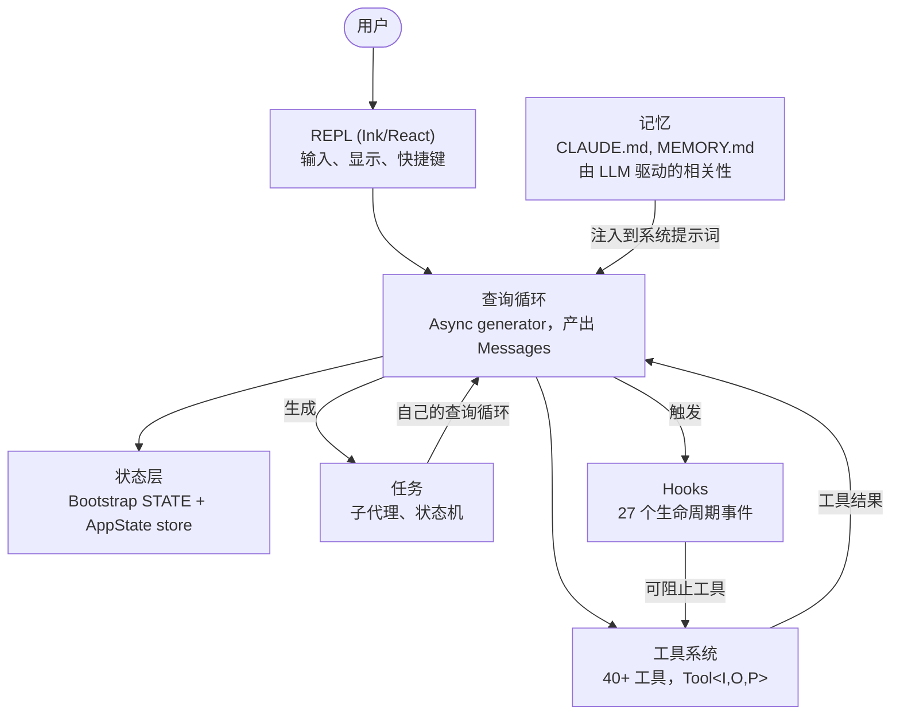
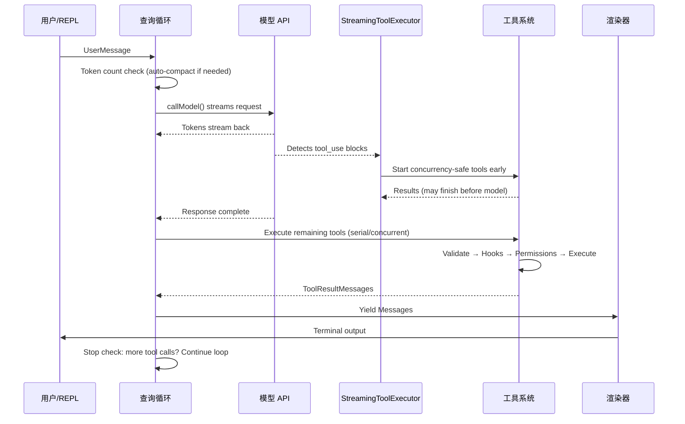
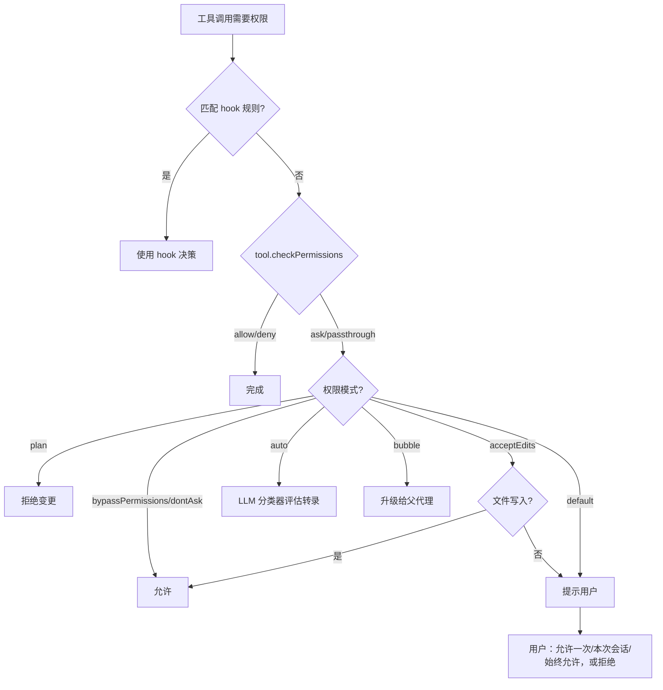
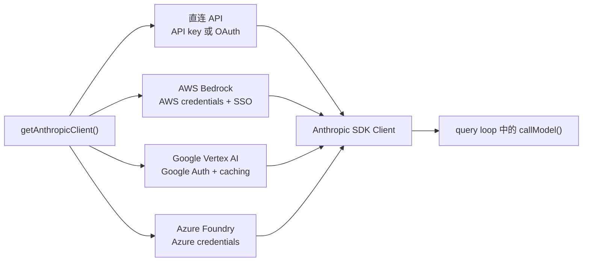
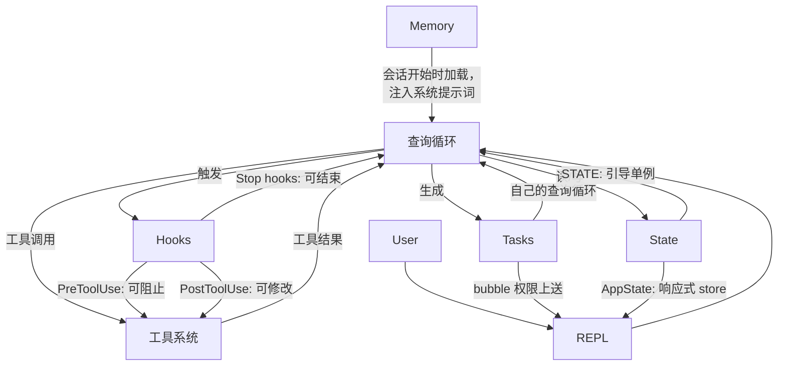

# 第 1 章：AI 代理的架构

## 你看到的是什么

传统 CLI 是一个函数：接收参数，执行工作，然后退出。`grep` 不会决定再去跑一次 `sed`。`curl` 也不会下载一个文件后，再根据下载结果去打开并打补丁。它的契约很简单：一个命令，一次动作，确定性的输出。

代理式 CLI 打破了这个契约的每一部分。它接收自然语言提示，决定使用哪些工具，按场景需要的顺序执行它们，评估结果，并不断循环，直到任务完成或用户中止。这个“程序”并不是一串固定指令，而是围绕语言模型构建的一个循环，由模型在运行时自己生成后续指令序列。工具调用是副作用，模型的推理则是控制流。

Claude Code 是 Anthropic 对这一理念的生产级实现：一个近两千个文件的 TypeScript 单体应用，把终端变成一个由 Claude 驱动的完整开发环境。它已经交付给数十万开发者，因此每一个架构决策都会带来现实影响。本章会给你一张心智地图。六个抽象定义了整个系统。一条数据流把它们连接起来。只要你把从按键到最终输出的黄金路径内化，后面的每一章都只是对这条路径某一段的放大。

下面的拆解是回顾式的。这六个抽象并不是一开始就在白板上设计好的，而是在把一个生产级代理推向大规模用户的压力下逐渐形成的。把它们理解为“现在就是这样”，而不是“原本计划如此”，会让你对后面的内容建立正确预期。

---

## 六个关键抽象

Claude Code 建立在六个核心抽象之上。其余一切，比如 400 多个工具文件、定制的终端渲染器、vim 模拟、成本跟踪器，都是为了支撑这六项而存在。



下面逐一说明它们的职责，以及为什么要存在。

**1. 查询循环** (`query.ts`，约 1,700 行)。这是贯穿整个系统的心跳：一个 async generator。它流式接收模型响应，收集工具调用，执行工具，把结果追加到消息历史，再继续循环。每一次交互，无论是 REPL、SDK、子代理还是无头 `--print`，都走这一个函数。它返回 `Message` 对象，供 UI 消费。它的返回类型是一个名为 `Terminal` 的判别联合类型，精确编码了循环停止的原因：正常完成、用户中止、token 预算耗尽、stop hook 干预、最大轮次、或者不可恢复错误。与回调或事件发射器相比，generator 模式天然具备背压、干净的取消机制和类型化的终止状态。第 5 章会完整拆解它的内部实现。

**2. 工具系统** (`Tool.ts`, `tools.ts`, `services/tools/`)。工具就是代理能在现实世界里做的事：读文件、执行 shell 命令、修改代码、搜索网页。这个定义虽然简单，但背后机制相当复杂。每个工具都实现了一套完整接口，涵盖身份、schema、执行、权限和渲染。工具不只是函数，它们携带自己的权限逻辑、并发声明、进度报告和 UI 渲染。系统会把工具调用拆分为并发批次和串行批次，而流式执行器会在模型还没结束输出前，就提前启动并发安全的工具。第 6 章会详细讲解完整的工具接口和执行管线。

**3. 任务** (`Task.ts`, `tasks/`)。任务是后台工作单元，主要是子代理。它们遵循一个状态机：`pending -> running -> completed | failed | killed`。`AgentTool` 会启动一个新的 `query()` generator，带上自己的消息历史、工具集和权限模式。任务让 Claude Code 拥有递归能力：一个代理可以把工作委派给子代理，而子代理还能继续委派。

**4. 状态**（双层）。系统在两个层面维护状态。一个可变单例 (`STATE`) 保存约 80 个会话级基础设施字段：工作目录、模型配置、成本跟踪、遥测计数器、会话 ID。它只在启动时设定一次，之后直接变更，没有响应式机制。另一个极简的响应式存储（34 行，Zustand 风格）驱动 UI：消息、输入模式、工具审批、进度指示。这样的分层是有意为之的：基础设施状态变化很少，不需要触发重渲染；UI 状态变化频繁，必须触发。第 3 章会深入讲解这套双层架构。

**5. 记忆** (`memdir/`)。代理跨会话的持久上下文。它分三层：项目级（仓库中的 `CLAUDE.md` 文件）、用户级（`~/.claude/MEMORY.md`）、团队级（通过符号链接共享）。会话开始时，系统会扫描所有记忆文件，解析 frontmatter，再由一个 LLM 选择哪些记忆与当前对话相关。记忆机制让 Claude Code “记得”你的代码库约定、架构决策和调试历史。

**6. Hooks** (`hooks/`, `utils/hooks/`)。用户定义的生命周期拦截器，会在 4 类执行类型下的 27 个不同事件中触发：shell 命令、单次 LLM 提示、多轮代理对话，以及 HTTP webhook。Hooks 可以阻止工具执行、修改输入、注入额外上下文，或者直接截断整个查询循环。权限系统本身也部分通过 hooks 实现 - `PreToolUse` hooks 可以在交互式权限提示出现之前就拒绝工具调用。

---

## 黄金路径：从按键到输出

跟踪一次请求穿过整个系统。用户输入“给登录函数加上错误处理”，然后按下回车。



需要注意这条流程中的三点。

第一，查询循环是 generator，不是回调链。REPL 通过 `for await` 从中拉取消息，因此天然具备背压 - 如果 UI 跟不上，generator 就会暂停。这是对事件发射器或 observable 流的一种有意取舍。

第二，工具执行与模型流式输出是重叠的。`StreamingToolExecutor` 不会等模型完全结束后再启动并发安全的工具。一个 `Read` 调用可以在模型还在生成剩余响应时就完成并返回结果。这叫投机执行 - 如果模型的最终输出否定了这次工具调用（虽然少见，但可能发生），结果会被丢弃。

第三，整个循环是可重入的。模型发出工具调用后，结果会被追加到消息历史里，然后循环用更新后的上下文再次调用模型。这里没有单独的“工具结果处理”阶段 - 全部都在一个循环里。模型只要不再发出工具调用，就表示它已经完成。

---

## 权限系统

Claude Code 会在你的机器上执行任意 shell 命令。它会修改文件，启动子进程，发起网络请求，还能改写 git 历史。没有权限系统，这就是一场安全灾难。

系统定义了 7 种权限模式，按权限从高到低排列：

| 模式 | 行为 |
|------|------|
| `bypassPermissions` | 一切允许，不做检查。仅供内部/测试。 |
| `dontAsk` | 全部允许，但仍记录日志，不弹用户提示。 |
| `auto` | 由转录分类器（LLM）决定允许/拒绝。 |
| `acceptEdits` | 文件修改自动批准，其余变更需要提示。 |
| `default` | 标准交互模式，用户逐项批准每个动作。 |
| `plan` | 只读，所有变更都被阻止。 |
| `bubble` | 将决策上升给父代理（子代理模式）。 |

当某个工具调用需要权限时，决策会沿着严格的链路进行：



`auto` 模式尤其值得注意。它会额外发起一次轻量级 LLM 调用，把工具调用与对话转录一起分类。分类器会查看一个压缩后的工具输入表示，并判断这个动作是否与用户请求一致。这正是 Claude Code 能半自主工作的原因 - 它会自动批准常规操作，同时对看起来偏离用户意图的动作发出警惕。

子代理默认使用 `bubble` 模式，这意味着它们不能自己批准危险操作。权限请求会向上转发给父代理，最终必要时由用户决定。这样可以防止子代理悄悄执行用户没有看到的破坏性命令。

---

## 多提供方架构

Claude Code 通过 4 条不同的基础设施路径与 Claude 对话，而对系统其他部分来说，这一切都是透明的。



关键洞见是：Anthropic SDK 为每个云提供方都提供了包装类，而它们暴露的接口与直接 API 客户端是一样的。`getAnthropicClient()` 工厂会读取环境变量和配置，判断应该使用哪家提供方，构造对应客户端并返回。从那以后，`callModel()` 和其他所有消费者都把它当作一个通用的 Anthropic 客户端。

提供方选择在启动时确定，并存储在 `STATE` 中。查询循环从不检查当前激活的是哪家提供方。这意味着从直连 API 切到 Bedrock 是配置变更，不是代码变更 - 代理循环、工具系统和权限模型都与提供方无关。

---

## 构建系统

Claude Code 既作为 Anthropic 内部工具发布，也作为公共 npm 包发布。同一套代码库同时服务两种场景，通过编译期特性标记来控制包含哪些内容。

```typescript
// Conditional imports guarded by feature flags
const reactiveCompact = feature('REACTIVE_COMPACT')
  ? require('./services/compact/reactiveCompact.js')
  : null
```

`feature()` 函数来自 `bun:bundle`，这是 Bun 内置的打包 API。构建时，每个特性标记都会解析成一个布尔字面量。随后，打包器的死代码消除会在标记为 false 时把 `require()` 调用整个删掉 - 模块不会被加载，不会进入 bundle，也不会被发布。

这个模式始终如一：顶层 `feature()` 守卫包裹着一个 `require()` 调用。之所以用 `require` 而不是 `import`，是因为当守卫为 false 时，动态 `require()` 能被打包器完全消除，而动态 `import()` 不行（它会返回一个 Promise，打包器必须保留它）。

这里有个值得注意的讽刺。早期 npm 发布版中的源码映射包含了 `sourcesContent`，也就是完整的原始 TypeScript 源码，包括仅内部可见的代码路径。特性标记确实把运行时代码剥离了，却把源代码留在了映射里。Claude Code 的源码就是这样变得公开可读的。

---

## 各部分如何连接

这六个抽象构成一张依赖图：



记忆作为系统提示词的一部分流入查询循环。查询循环驱动工具执行。工具结果再以消息形式回到查询循环。任务是带有隔离消息历史的递归查询循环。Hooks 在预定义位置拦截查询循环。状态由所有系统读写，而响应式存储则作为 UI 的桥梁。

查询循环与工具系统之间的循环依赖，是整个系统最具定义性的特征。模型生成工具调用。工具执行并产生结果。结果被追加到消息历史。模型读取这些结果并决定下一步。这个循环一直持续到模型不再生成工具调用，或者外部约束（token 预算、最大轮次、用户中止）终止它。

下面是它们如何连接到后续章节：从输入到输出的黄金路径，是贯穿整本书的主线。第 2 章会追踪系统如何启动，直到这条路径可以开始运行。第 3 章会解释这条路径读写的双层状态架构。第 4 章会讲查询循环调用的 API 层。后面的每一章，都会把你刚刚看到的这条路径放大到其中一个片段。

---

## 应用到实践中

如果你在构建一个代理式系统 - 任何让 LLM 在运行时决定采取哪些动作的系统 - 下面这些来自 Claude Code 架构的模式是可以迁移的。

**把 generator 循环当作代理循环。** 用 async generator 作为代理主循环，而不是回调或事件发射器。generator 天然提供背压（消费者按自己的节奏拉取）、干净的取消（对 generator 调用 `.return()`），以及用于终止状态的类型化返回值。它解决的问题是：在基于回调的代理循环里，很难知道循环到底什么时候“结束”以及为什么结束。generator 把终止变成了类型系统中的一等公民。

**使用自描述工具接口。** 每个工具都应该声明自己的并发安全性、权限需求和渲染行为。不要把这些逻辑塞进一个“认识所有工具”的中心编排器里。它解决的问题是：中心编排器会变成一个上帝对象，每新增一个工具都要改它。自描述工具则是线性扩展的 - 增加第 N+1 个工具，不需要改动现有代码。

**把基础设施状态和响应式状态分开。** 并不是所有状态都需要触发 UI 更新。会话配置、成本跟踪和遥测适合放在普通可变对象里。消息历史、进度指示和审批队列则属于响应式存储。它解决的问题是：把一切都做成响应式，会给一次性在启动时变化、但后面会被读取上千次的状态增加订阅开销和复杂度。两层架构正好匹配两种访问模式。

**权限模式，而不是权限判断。** 定义一小组命名模式（plan、default、auto、bypass），并让每一次权限决策都通过这个模式来解析。不要在工具实现里散落 `if (isAllowed)` 判断。它解决的问题是权限执行不一致。只要每个工具都走同一条基于模式的决策链，你就能通过当前模式来推断系统的安全态势。

**通过任务实现递归代理架构。** 子代理应该是同一个代理循环的新实例，带有自己的消息历史，而不是特殊分支代码路径。权限升级通过 `bubble` 模式向上流动。它解决的问题是：子代理逻辑偏离主代理循环，导致行为和错误处理出现微妙差异。如果子代理就是同一个循环，它就会继承同样的保障。
