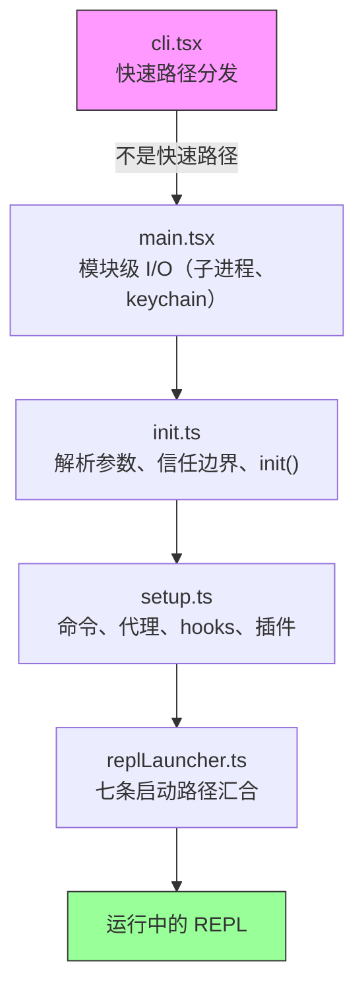
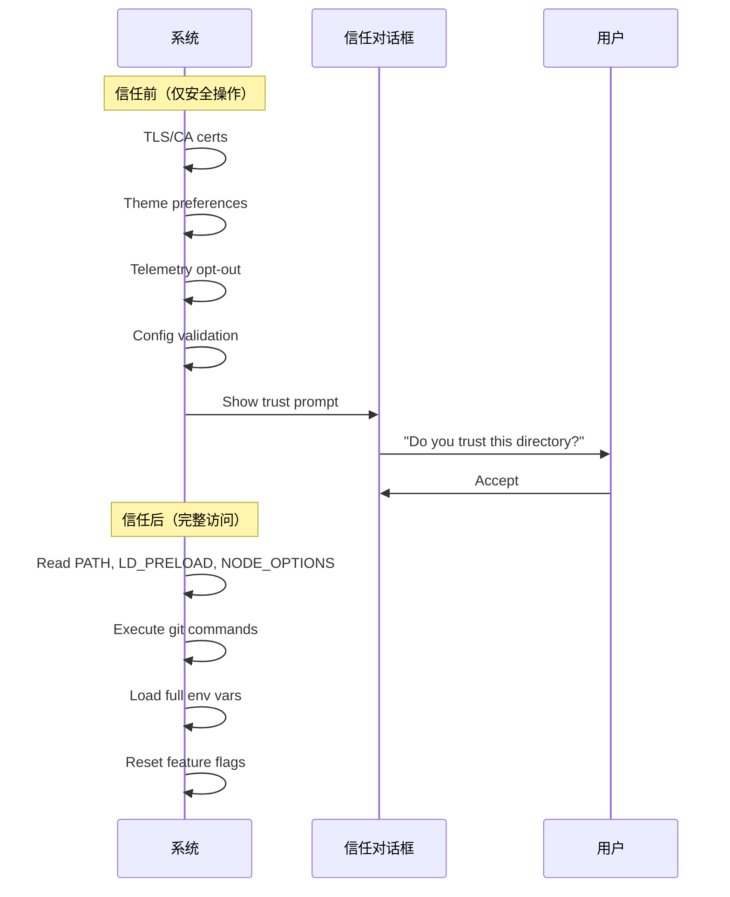

# 第 2 章：快速启动 - 引导管线

如果第 1 章给你的是 Claude Code 架构地图，那么这一章给你的就是它如何抵达可工作的状态的路线图。来自六个抽象的每个组件 - 查询循环、工具系统、状态层、hooks、记忆 - 都必须在用户看到光标之前初始化完成。总预算：300 毫秒。

300 毫秒是人类感知“瞬时”的阈值。超过这个值，CLI 就会显得迟钝；偏离太多，开发者就不会继续用它。本章里的所有设计，都是为了把启动时间压在这条线以下。

引导阶段必须完成四件事：验证环境、建立安全边界、配置通信层、渲染 UI。并且必须全部在 300ms 内完成。这里的架构洞见在于：这四项任务可以部分重叠、谨慎排序、并且积极裁剪，从而塞进一个看似不可能的预算里。

先说明方法：本章中的时间戳是近似值，来自代码库自身的性能剖点。它们代表的是现代硬件上的典型热启动时间。冷启动会更慢。绝对数值不如相对结构重要：哪些操作重叠，哪些会阻塞，哪些会被延后。

---

## 管线的形状

启动管线分布在 5 个文件里，按顺序执行。每个文件都会先把系统下一步需要做的事情收窄：



每个文件都会只做推进到下一个阶段所必需的最少工作。`cli.tsx` 会尽量在不导入任何重模块的情况下退出。`main.tsx` 会在导入求值期间，以副作用形式触发慢操作。`init.ts` 负责解析配置并建立信任边界。`setup.ts` 注册能力。`replLauncher.ts` 选择正确入口并启动 UI。

让这一切变快的有三种并行策略：

1. **模块级子进程分发。** 在 *导入求值期间* 触发 keychain 和 MDM 读取。子进程会与剩余约 135ms 的静态导入并行运行。
2. **setup 中的 Promise 并行。** socket 绑定、hook 快照、命令加载和代理定义加载全部并发执行。
3. **渲染后延迟预取。** 用户在输入第一条消息之前不需要的一切 - git status、模型能力、AWS 凭证 - 都在提示符可见之后运行。

还有第四种策略不太显眼，但同样重要：**使用动态导入延后模块求值**。代码库在至少十几个地方使用 `await import('./module.js')`，把模块推迟到真正需要时再加载。OpenTelemetry（400KB + 700KB gRPC）只会在遥测初始化时加载。React 组件只在渲染时加载。每一次动态导入，都是用冷路径延迟（首次使用时触发模块求值）换取热路径速度（启动时不为可能永远不会用到的模块付费）。

---

## 阶段 0：快速路径分发（cli.tsx）

进程进入的第一个文件是 `cli.tsx`，它只有一件事要做：判断是否真的需要完整的引导管线。很多调用 - `claude --version`、`claude --help`、`claude mcp list` - 只需要一个特定答案，不需要别的。加载 React、初始化遥测、读取 keychain、搭建工具系统，都会是纯粹浪费。

模式是：检查 `argv`，只动态导入你需要的处理器，然后在其余系统加载之前退出。

```typescript
// Pseudocode for the fast-path pattern
if (args.length === 1 && args[0] === '--version') {
  const { printVersion } = await import('./commands/version.js')
  await printVersion()
  process.exit(0)
}
```

大约有十几条快速路径，覆盖版本、帮助、配置、MCP 服务器管理和更新检查。具体细节并不重要，模式才重要。每条路径都会只动态导入一个模块，调用一个函数，然后退出。其余代码库完全不会加载。

这是引导阶段反复出现的一个原则的第一次体现：**通过更准确地理解意图来少做事。** `argv` 数组暴露了用户意图。如果意图很窄，执行路径也应该很窄。

如果没有任何快速路径匹配，`cli.tsx` 就会落到完整的 `main.tsx` 导入，真正的启动开始。

---

## 阶段 1：模块级 I/O（main.tsx）

当 `main.tsx` 被导入时，它的模块级副作用会在求值期间触发 - 也就是在文件里的任何函数被调用之前。这是整个引导流程里最关键的性能技巧：

```typescript
// These run at import time, not at call time
const mdmPromise = startMDMSubprocess()
const keychainPromise = readKeychainCredentials()
```

在 JavaScript 引擎求值 `main.tsx` 及其传递性导入的其余部分时（约 138ms 的模块求值时间），这两个 Promise 已经在飞行中。MDM（移动设备管理）子进程用于检查组织的安全策略。keychain 读取用于获取已存储的凭证。它们都是 I/O 密集型操作，否则就会在关键路径上串行化。

洞见在于：模块求值不是空闲时间，而是可以与 I/O 重叠的时间。等到 `main.tsx` 导出的函数第一次被调用时，这些 Promise 往往已经完成了。

这个技巧需要在相关文件里抑制 ESLint 的 `top-level-await` 和 `side-effect-in-module-scope` 规则。代码库里还有一条自定义 ESLint 规则，专门处理 `process.env` 访问模式，允许在模块作用域进行受控副作用，同时防止在其他地方出现失控副作用。

---

## 阶段 2：解析与信任（init.ts）

`init()` 函数是带缓存的 - 调用多次是安全的，并且会返回同一个结果。这一点很重要，因为多个入口点（REPL、打印模式、SDK 模式）都可能调用 `init()`，而缓存保证它只运行一次。

这个函数通过 Commander 解析命令行参数，从多个来源加载配置（全局设置、项目设置、环境变量），然后来到管线中最重要的边界。

### 信任边界

在信任边界之前，系统运行在受限模式。过了边界，完整能力才可用。之所以存在这条边界，是因为 Claude Code 会读取环境变量，而环境变量可能被污染。



信任边界并不是在问用户是否信任 Claude Code，而是在问 Claude Code 是否应该信任 *环境*。恶意的 `.bashrc` 可能把 `LD_PRELOAD` 设成一个值，从而给每个子进程注入代码。信任对话框确保用户明确同意在一个可能由别人配置过的目录里操作。

系统里有 10 个明确的信任敏感操作。在用户接受信任对话框之前，只有安全操作会运行：TLS 证书配置、主题偏好、遥测退出。信任之后，系统才会读取潜在危险的环境变量（PATH、LD_PRELOAD、NODE_OPTIONS），执行 git 命令，并应用完整的环境配置。

### preAction Hook

Commander 的 `preAction` hook 是架构上的枢纽。Commander 会先解析命令结构（标志、子命令、位置参数），*而不执行任何东西*。`preAction` hook 在解析之后、匹配到的命令处理器运行之前触发：

```typescript
program.hook('preAction', async (thisCommand) => {
  await init(thisCommand)
})
```

这种拆分意味着快速路径命令（在 `cli.tsx` 中、Commander 加载之前处理）永远不会支付 `init()` 的成本。只有需要完整环境的命令才会触发初始化。

---

## 阶段 3：Setup（setup.ts）

`init()` 完成之后，`setup()` 会注册系统需要的所有能力：

```mermaid
gantt
    title 第 3 阶段：并行 Setup
    dateFormat X
    axisFormat %Lms

    section 顺序
    Commands registration   :0, 5
    section 并行
    Agent definitions      :5, 15
    Hook registration      :5, 12
    Plugin initialization  :5, 20
    MCP server connections :5, 25
```



命令、代理、hooks 和插件都会尽可能并行注册。setup 阶段是系统从“我知道我的配置”过渡到“我拥有全部能力”的阶段。setup 完成后，每个工具都已注册，每个 hook 都已接好，系统已经准备好处理用户输入。

setup 还负责处理安全 hook 快照。hook 配置会从磁盘读取一次，冻结成不可变快照，并在整个会话期间使用。之后磁盘上 hook 配置文件的任何修改都会被忽略。这样可以防止攻击者在会话开始后修改 hook 规则 - 冻结的快照才是权限决策的唯一真实来源。

---

## 阶段 4：启动（replLauncher.ts）

有 7 条不同的代码路径会汇合到 `replLauncher.ts`：交互式 REPL、打印模式（`--print`）、SDK 模式、恢复（`--resume`）、继续（`--continue`）、管道模式，以及无头模式。启动器会检查 `init()` 产生的配置，然后分派到正确入口。

两个例子可以说明这种覆盖面：

**交互式 REPL** - 标准场景。启动器挂载 React/Ink 组件树，启动终端渲染器，并进入事件循环。用户看到提示符，可以开始输入。

**打印模式**（`--print`） - 从 `argv` 读取单个提示词。启动器创建一个没有 React 树的无头查询循环，运行到完成，把输出流到 stdout，然后退出。同一个代理循环，不同的呈现方式。

关键细节在于：这 7 条路径最终都会调用 `query()` - 也就是第 1 章里的同一个代理循环。启动路径决定的是循环 *如何呈现*（交互式终端、单次执行、SDK 协议），而不是 *做什么*。这种汇合让架构变得可测试、可预测：无论用户如何调用 Claude Code，核心行为都是一致的。

---

## 启动时间线

完整管线在时间维度上是这样的：

```mermaid
gantt
    title 引导时间线（约 240ms）
    dateFormat X
    axisFormat %Lms

    section 阶段 0
    快速路径检查              :0, 5

    section 阶段 1
    模块求值                  :5, 143
    MDM 子进程（并行）        :8, 60
    keychain 读取（并行）     :8, 50

    section 阶段 2
    Commander 解析            :143, 146
    init()                    :146, 160
    信任边界                  :160, 175

    section 阶段 3
    setup() + 并行注册        :175, 210

    section 阶段 4
    启动路径选择              :210, 215
    首次渲染                  :215, 240
```



关键路径穿过模块求值（约 138ms 的单一最长阶段），然后是 Commander 解析、init 和 setup。并行 I/O 操作（MDM、keychain）与模块求值重叠，通常在真正需要它们之前就已经完成。

### 性能预算

| 阶段 | 时间 | 发生了什么 |
|-------|------|-------------|
| 快速路径检查 | ~5ms | 检查 argv，若可能则提前退出 |
| 模块求值 | ~138ms | 导入树，触发并行 I/O |
| Commander 解析 | ~3ms | 解析标志和子命令 |
| `init()` | ~14ms | 配置解析、信任边界 |
| `setup()` | ~35ms | 命令、代理、hooks、插件 |
| 启动 + 首次渲染 | ~25ms | 选择路径，挂载 React，首次绘制 |
| **总计** | **~240ms** | 低于 300ms 预算 |

现代机器上的总耗时大约是 240ms，也就是距离 300ms 预算还有 60ms 余量。冷启动（重启后首次运行、操作系统缓存为空）会把模块求值推到 200ms 以上，使总时间更接近上限。

---

## 迁移系统

再提一个在 init 期间运行的子系统：schema 迁移。Claude Code 把配置和会话数据存储在本地文件和目录里。当版本之间的格式发生变化时，迁移会在启动时自动运行。

每个迁移都是一个带版本号的函数。系统会把当前 schema 版本与最高迁移版本比较，按顺序执行待处理迁移，然后更新版本。迁移是幂等的，而且很快（操作的是本地小文件，而不是数据库）。整个迁移流程通常在 5ms 以内完成。如果某个迁移失败，它会记录错误并继续 - 对本地配置来说，可用性比严格一致性更重要。

---

## 启动告诉我们的系统设计

引导管线是一场关于“收窄作用域”的研究。每个阶段都会减少可能性的空间：

- 第 0 阶段把“任意 CLI 调用”收窄为“需要完整引导”
- 第 1 阶段把“所有东西都必须加载”收窄为“与 I/O 并行加载”
- 第 2 阶段把“未知环境”收窄为“受信任、已配置的环境”
- 第 3 阶段把“没有能力”收窄为“已完全注册”
- 第 4 阶段把“七种可能模式”收窄为“一条具体启动路径”

当 REPL 渲染出来时，每个决策都已经做完了。查询循环拿到的是一个完全配置好的环境，没有关于当前模式、可用工具或适用权限的歧义。300ms 预算不只是性能目标 - 它还是一种强制机制，防止引导阶段退化成一种懒加载系统，让决策被延后并散落到整个代码库中。

---

## 应用到实践中

**把 I/O 与初始化重叠。** 在模块求值阶段就发起慢操作（子进程启动、凭证读取、网络检查），在真正需要它们之前先启动。JavaScript 引擎本来就在做同步工作 - 用这段时间并行跑 I/O。模式是：在文件顶部写 `const promise = startSlowThing()`，在使用点再 `await promise`。

**尽早收窄作用域。** 引导管线的 5 个文件构成一个漏斗：每个阶段都会消除后续阶段不需要处理的工作。快速路径分发是最戏剧性的例子，但这个原则适用于所有地方。如果在解析阶段就能确定某条代码路径不需要执行，那就跳过它。

**明确建立信任边界。** 如果你的应用要读取一个自己不控制的环境（环境变量、配置文件、shell 设置），就应该清楚划分“用户同意前可以安全读取”和“必须在同意后才读取”的边界。信任边界可以阻止一类攻击：恶意环境在用户来得及判断之前就污染应用。

**把 init 函数做成幂等。** 让初始化可重复执行 - 调用两次得到相同结果。这样可以消除多个入口点都可能触发初始化时的顺序性 bug。这个缓存模式很简单，但能消灭一整类双重初始化问题。

**在让出控制权之前先捕获早期输入。** 在事件驱动系统里，初始化期间到达的用户输入可能会丢失。Claude Code 会在任何异步工作开始之前先从 `argv` 捕获初始提示词，确保 `claude "fix the bug"` 不会因为初始化时间过长而丢失提示。
