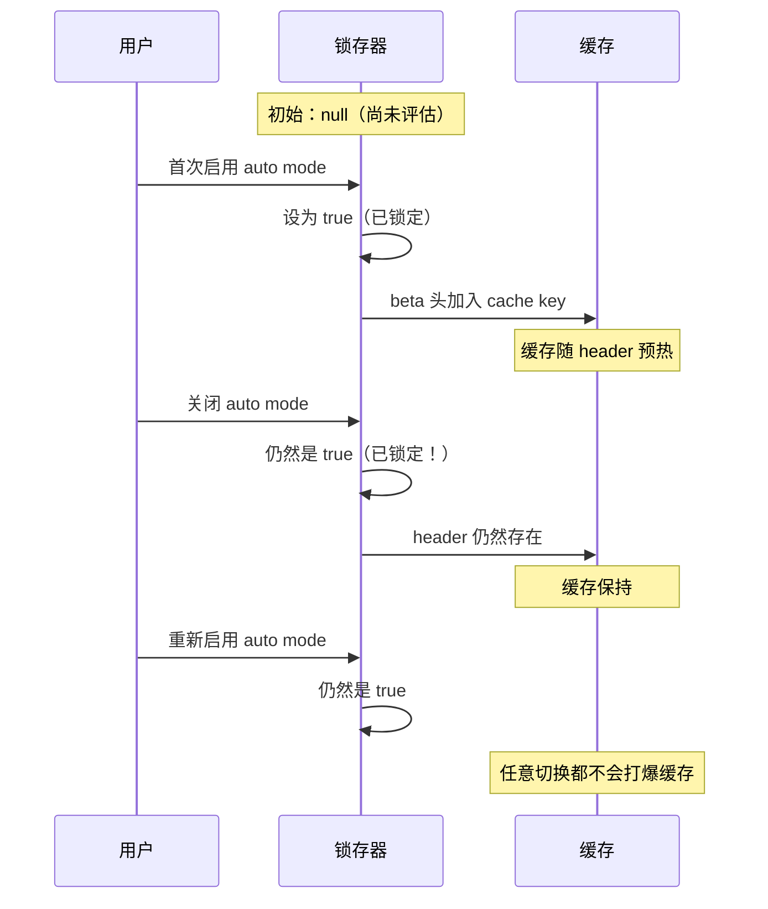
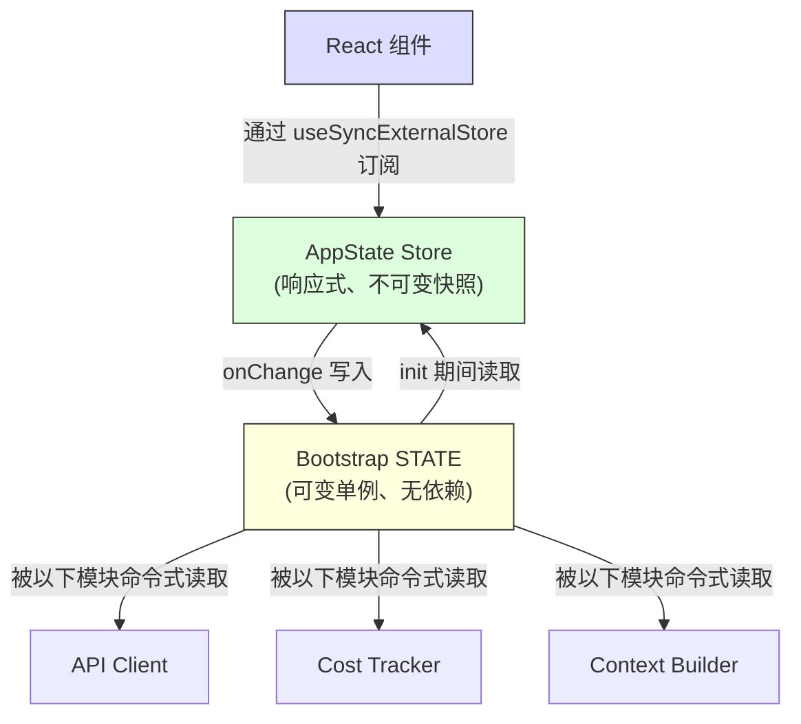

# 第 3 章：状态 - 双层架构

第 2 章追踪了从进程启动到首次渲染的引导管线。到那一步，系统已经拥有了完整配置的环境。但配置的 *是什么*？会话 ID 放在哪里？当前模型放在哪里？消息历史呢？成本跟踪器呢？权限模式呢？状态应该放在哪里，为什么放在那里？

任何长期运行的应用最终都会面对这个问题。对一个简单 CLI 工具来说，答案很直接 - `main()` 里的几个变量就够了。但 Claude Code 不是一个简单 CLI 工具。它是一个通过 Ink 渲染的 React 应用，进程生命周期可能持续数小时，插件系统会在任意时刻加载，API 层必须从缓存上下文构建提示词，成本跟踪器要跨进程重启保持状态，而几十个基础设施模块又需要在彼此不导入的前提下读写共享数据。

天真的做法 - 单一全局存储 - 会立刻失败。如果成本跟踪器更新的是和 React 重渲染共用的那个 store，那么每一次 API 调用都会触发整棵组件树的协调。基础设施模块（引导、上下文构建、成本跟踪、遥测）又不能导入 React。它们在 React 挂载之前运行，也在 React 卸载之后运行，还会在根本没有组件树的上下文里运行。把一切都塞进一个感知 React 的 store，会在整个导入图里制造循环依赖。

Claude Code 用双层架构解决这个问题：一个可变的进程单例负责基础设施状态，一个极简的响应式 store 负责 UI 状态。本章会解释这两层、连接它们的副作用系统，以及依赖这套基础的支撑子系统。后面的每一章都默认你已经理解了状态放在哪里，以及为什么放在那里。

---

## 3.1 Bootstrap State - 进程单例

### 为什么是可变单例

bootstrap 状态模块 (`bootstrap/state.ts`) 是一个在进程启动时创建的、单一可变对象：

```typescript
const STATE: State = getInitialState()
```

这一行上方的注释写着：`AND ESPECIALLY HERE`。类型定义上方两行写着：`DO NOT ADD MORE STATE HERE - BE JUDICIOUS WITH GLOBAL STATE`。这些注释的语气很像那些亲手为无约束全局对象付过学费的工程师。

这里选择可变单例有三个原因。第一，bootstrap 状态必须在任何框架初始化之前就可用 - 在 React 挂载之前、store 创建之前、插件加载之前。模块作用域初始化是唯一能保证在导入时可用的机制。第二，这些数据天然是进程级的：会话 ID、遥测计数器、成本累加器、缓存路径。它们没有有意义的“上一个状态”可以 diff，没有订阅者要通知，也没有撤销历史。第三，这个模块必须是导入依赖图里的叶子节点。如果它导入 React、store 或任何服务模块，就会制造打断第 2 章所述引导序列的循环。因为它除了工具类型和 `node:crypto` 什么都不依赖，所以可以在任何地方导入。

### 约 80 个字段

`State` 类型大约包含 80 个字段。随便看几组就能感受到覆盖面：

**身份与路径** - `originalCwd`、`projectRoot`、`cwd`、`sessionId`、`parentSessionId`。`originalCwd` 在进程启动时通过 `realpathSync` 解析并做 NFC 规范化。它永远不会改变。

**成本与指标** - `totalCostUSD`、`totalAPIDuration`、`totalLinesAdded`、`totalLinesRemoved`。这些值会在整个会话期间单调累加，并在退出时持久化到磁盘。

**遥测** - `meter`、`sessionCounter`、`costCounter`、`tokenCounter`。这些都是 OpenTelemetry 句柄，且都可为空（遥测初始化前为 null）。

**模型配置** - `mainLoopModelOverride`、`initialMainLoopModel`。当用户在会话中途切换模型时，override 会被写入。

**会话标志** - `isInteractive`、`kairosActive`、`sessionTrustAccepted`、`hasExitedPlanMode`。这些布尔值决定整个会话期间的行为。

**缓存优化** - `promptCache1hAllowlist`、`promptCache1hEligible`、`systemPromptSectionCache`、`cachedClaudeMdContent`。这些字段用于防止重复计算和提示缓存失效。

### Getter/Setter 模式

`STATE` 对象从不直接导出。所有访问都要经过大约 100 个单独的 getter 和 setter 函数：

```typescript
// Pseudocode — illustrates the pattern
export function getProjectRoot(): string {
  return STATE.projectRoot
}

export function setProjectRoot(dir: string): void {
  STATE.projectRoot = dir.normalize('NFC')  // NFC normalization on every path setter
}
```

这个模式强制封装、在每个路径 setter 上做 NFC 规范化（防止 macOS 上的 Unicode 不匹配）、类型收窄以及引导隔离。代价是冗长 - 80 个字段配 100 个函数。但在一个稍有不慎就可能打爆 50,000 token 提示缓存的代码库里，明确性胜出。

### Signal 模式

bootstrap 不能导入监听器（它是 DAG 的叶子），所以它使用一个叫 `createSignal` 的极简发布/订阅原语。`sessionSwitched` signal 只有一个消费者：`concurrentSessions.ts`，它负责同步 PID 文件。这个 signal 以 `onSessionSwitch = sessionSwitched.subscribe` 的形式暴露，让调用方可以注册自己，而无需 bootstrap 知道它们是谁。

### 五个粘性锁存器

bootstrap 状态里最微妙的字段，是 5 个遵循相同模式的布尔锁存器：一旦某个功能在会话中首次被激活，对应标志在整个会话期间都会保持 `true`。它们存在的唯一原因是：保护提示缓存。



Claude 的 API 支持服务器端提示缓存。当连续请求共享同一个系统提示前缀时，服务器会复用缓存的计算结果。但缓存键包括 HTTP 头和请求体字段。如果请求 N 带有某个 beta header，而请求 N+1 没有，即使提示内容完全相同，缓存也会失效。对于一个超过 50,000 token 的系统提示，这种缓存失效代价非常高。

这 5 个锁存器分别是：

| 锁存器 | 它防止什么 |
|-------|-------------|
| `afkModeHeaderLatched` | Shift+Tab 自动模式切换导致 AFK beta header 反复开关 |
| `fastModeHeaderLatched` | 快速模式冷却进入/退出导致 fast mode header 反复开关 |
| `cacheEditingHeaderLatched` | 远程特性标记变化导致每个活跃用户的缓存失效 |
| `thinkingClearLatched` | 在确认缓存未命中（>1h idle）时触发。防止重新启用 thinking blocks 时破坏刚刚热起来的缓存 |
| `pendingPostCompaction` | 一次性消费标志，用于遥测：区分压缩引起的缓存失效和 TTL 到期导致的失效 |

这 5 个都使用同一种三态类型：`boolean | null`。初始值 `null` 表示“尚未评估”。`true` 表示“已经锁定开启”。一旦被设为 `true`，它们就再也不会回到 `null` 或 `false`。这就是锁存器的定义性特征。

实现模式如下：

```typescript
function shouldSendBetaHeader(featureCurrentlyActive: boolean): boolean {
  const latched = getAfkModeHeaderLatched()
  if (latched === true) return true       // Already latched -- always send
  if (featureCurrentlyActive) {
    setAfkModeHeaderLatched(true)          // First activation -- latch it
    return true
  }
  return false                             // Never activated -- don't send
}
```

为什么不直接把所有 beta header 永远都发送出去？因为 header 本身就是缓存键的一部分。发送一个系统不识别的 header，会创建一个不同的缓存命名空间。锁存器确保你只在真正需要时进入某个缓存命名空间，然后在整个会话期间一直留在那里。

---

## 3.2 AppState - 响应式存储

### 34 行实现

UI 状态存储位于 `state/store.ts`：

这个 store 的实现大约 30 行：一个闭包包住一个 `state` 变量、一个 `Object.is` 相等性检查来避免伪更新、同步监听器通知，以及一个用于副作用的 `onChange` 回调。骨架大致如下：

```typescript
// Pseudocode — illustrates the pattern
function makeStore(initial, onTransition) {
  let current = initial
  const subs = new Set()
  return {
    read:      () => current,
    update:    (fn) => { /* Object.is guard, then notify */ },
    subscribe: (cb) => { subs.add(cb); return () => subs.delete(cb) },
  }
}
```

34 行。没有中间件，没有 devtools，没有时间旅行调试，没有 action type。只有一个可变变量的闭包、一个监听器 Set、以及一个 `Object.is` 相等性检查。这就是不带库的 Zustand。

值得关注的设计决策有这些：

**更新器函数模式。** 没有 `setState(newValue)`，只有 `setState((prev) => next)`。每一次变更都接收当前状态并必须生成下一状态，从而消除并发修改导致的陈旧状态 bug。

**`Object.is` 相等性检查。** 如果更新器返回的是同一个引用，这次变更就是 no-op。不会触发监听器，也不会运行副作用。对性能很关键 - 那些只是 spread 一下却没有改变值的组件，不会产生重渲染。

**`onChange` 先于监听器触发。** 可选的 `onChange` 回调同时接收旧状态和新状态，并且在任何订阅者收到通知之前同步触发。它用于那些必须在 UI 重渲染之前完成的副作用（第 3.4 节）。

**没有 middleware，没有 devtools。** 这不是疏漏。当你的 store 只需要三件事（get、set、subscribe），再加一个 `Object.is` 检查和一个同步 `onChange` hook 时，自己写的 34 行代码比一个依赖包更好。你能完全掌控语义，而且 30 秒就能读完实现。

### AppState 类型

`AppState` 类型（约 452 行）是 UI 渲染所需一切状态的形状。它的大多数字段都包在 `DeepImmutable<>` 里，但包含函数类型的字段会被明确排除：

```typescript
export type AppState = DeepImmutable<{
  settings: SettingsJson
  verbose: boolean
  // ... ~150 more fields
}> & {
  tasks: { [taskId: string]: TaskState }  // Contains abort controllers
  agentNameRegistry: Map<string, AgentId>
}
```

这种交叉类型让大部分字段保持深度不可变，同时为持有函数、Map 和可变 ref 的字段留出豁免。默认是完全不可变，只在类型系统会与运行时语义冲突的地方留有外科手术式的逃生口。

### React 集成

store 通过 `useSyncExternalStore` 与 React 集成：

```typescript
// Standard React pattern — useSyncExternalStore with a selector
export function useAppState<T>(selector: (state: AppState) => T): T {
  const store = useContext(AppStoreContext)
  return useSyncExternalStore(
    store.subscribe,
    () => selector(store.getState()),
  )
}
```

selector 必须返回一个已有的子对象引用，而不是新构造的对象，这样 `Object.is` 才能避免不必要的重渲染。如果你写 `useAppState(s => ({ a: s.a, b: s.b }))`，每次渲染都会生成一个新的对象引用，组件就会在每次状态变化时重渲染。这和 Zustand 用户面对的是同一个约束 - 比较更便宜，但 selector 的作者必须理解引用身份。

---

## 3.3 两层如何关联

这两层通过显式且狭窄的接口通信。



bootstrap 状态会在初始化过程中流入 AppState：`getDefaultAppState()` 会从磁盘读取设置（这些设置的路径是 bootstrap 帮忙定位的），检查 feature flags（这些标记是 bootstrap 评估的），并设置初始模型（这个模型来自 CLI 参数和设置的解析结果）。

AppState 则通过副作用回流到 bootstrap 状态：当用户切换模型时，`onChangeAppState` 会调用 bootstrap 里的 `setMainLoopModelOverride()`。当设置变化时，bootstrap 里的凭证缓存会被清空。

但这两层永远不会共享引用。导入 bootstrap 状态的模块不需要知道 React。读取 AppState 的组件也不需要知道进程单例。

一个具体例子可以说明数据流。用户输入 `/model claude-sonnet-4` 时：

1. 命令处理器调用 `store.setState(prev => ({ ...prev, mainLoopModel: 'claude-sonnet-4' }))`
2. store 的 `Object.is` 检查检测到变化
3. `onChangeAppState` 触发，检测到模型变化，调用 `setMainLoopModelOverride()`（更新 bootstrap）以及 `updateSettingsForSource()`（持久化到磁盘）
4. 所有 store 订阅者触发 - React 组件重新渲染，显示新的模型名
5. 下一次 API 调用从 bootstrap 状态里的 `getMainLoopModelOverride()` 读取模型

第 1-4 步是同步的。第 5 步的 API 客户端可能在几秒后才运行。但它读取的是 bootstrap 状态（第 3 步已更新），而不是 AppState。这就是双层交接：UI store 是用户所选内容的事实来源，而 bootstrap 状态是 API 客户端实际使用内容的事实来源。

这个 DAG 属性 - bootstrap 依赖零，AppState 依赖 bootstrap 进行初始化，React 依赖 AppState - 由一条 ESLint 规则强制保证，该规则禁止 `bootstrap/state.ts` 导入允许列表之外的模块。

---

## 3.4 副作用：onChangeAppState

`onChange` 回调是两层同步的地方。每次 `setState` 调用都会触发 `onChangeAppState`，它接收前后状态并决定要触发哪些外部副作用。

**权限模式同步** 是主要用例。在这个集中式处理器出现之前，权限模式通过远程会话（CCR）同步时，只有 8+ 条变更路径里的 2 条会通知它。其余 6 条 - Shift+Tab 循环、对话框选项、斜杠命令、rewind、bridge 回调 - 都在不通知 CCR 的情况下修改了 AppState。外部元数据因此逐渐漂移，变得不同步。

修复方式是：停止在各个变更点散落通知，而是把 diff 钩在一个地方。源码里的注释列出了所有曾经出问题的变更路径，并说明“上面那些分散的 callsite 完全不需要改动”。这就是集中式副作用的架构收益 - 覆盖是结构性的，而不是手工维护的。

**模型变化** 会让 bootstrap 状态与 UI 渲染保持一致。**设置变化** 会清空凭证缓存并重新应用环境变量。**verbose 切换** 和 **expanded view** 会持久化到全局配置。

这种模式 - 在可 diff 的状态迁移上集中处理副作用 - 本质上就是 Observer 模式，只不过粒度是状态 diff，而不是单个事件。它比散落的事件发射更可扩展，因为副作用数量增长得比变更点数量慢得多。

---

## 3.5 上下文构建

`context.ts` 里的三个带缓存的 async 函数会构建每次对话前置到系统提示词中的上下文。每个函数在每个会话里只计算一次，而不是每轮都计算。

`getGitStatus` 并行运行 5 个 git 命令（`Promise.all`），生成一个包含当前分支、默认分支、最近提交和工作树状态的块。`--no-optional-locks` 参数可以防止 git 获取写锁，从而避免和另一个终端里的并发 git 操作冲突。

`getUserContext` 读取 `CLAUDE.md` 内容，并通过 `setCachedClaudeMdContent` 把它缓存到 bootstrap 状态里。这个缓存打破了一个循环依赖：auto 模式分类器需要 `CLAUDE.md` 内容，但 `CLAUDE.md` 的加载要经过文件系统，而文件系统访问又要经过权限，权限判断又会调用分类器。通过把缓存放到 bootstrap 状态（DAG 叶子），这个循环被打断了。

这三个上下文函数都使用 Lodash 的 `memoize`（计算一次，永久缓存），而不是基于 TTL 的缓存。理由是：如果每 5 分钟重新计算一次 git status，那么这个变化会打破服务器端提示缓存。系统提示词甚至会直接告诉模型：“这是对话开始时的 git status。注意，这个状态只是一个时间点快照。”

---

## 3.6 成本跟踪

每一次 API 响应都会经过 `addToTotalSessionCost`，它会累加按模型使用情况、更新 bootstrap 状态、上报到 OpenTelemetry，并递归处理 advisor 工具的使用情况（即响应内部的嵌套模型调用）。

成本状态通过保存并恢复到项目配置文件的方式跨进程重启保留。会话 ID 用作保护条件 - 只有持久化的会话 ID 与正在恢复的会话匹配时，才会恢复成本。

直方图使用 reservoir sampling（算法 R）来维持有界内存，同时准确表示分布。1,024 条目大小的 reservoir 可以生成 p50、p95 和 p99 百分位。为什么不用简单的 running average？因为平均值会掩盖分布形状。一个会话里 95% 的 API 调用要 200ms、5% 要 10 秒，和所有调用都要 690ms 的会话有相同平均值，但用户体验完全不同。

---

## 3.7 我们学到了什么

这个代码库已经从一个简单 CLI 增长成了一个拥有约 450 行状态类型定义、约 80 个进程状态字段、副作用系统、多个持久化边界和缓存优化锁存器的系统。这些都不是一开始设计好的。sticky latches 是在缓存失效变成可测量的成本问题时加上的。`onChange` 处理器是在发现 8 条权限同步路径里有 6 条坏掉时集中起来的。`CLAUDE.md` 缓存是在出现循环依赖时加上的。

这就是复杂应用中状态自然增长的方式。双层架构提供了足够的结构来容纳增长 - 新的 bootstrap 字段不会影响 React 渲染，新的 AppState 字段不会制造导入循环 - 同时又足够灵活，能够容纳原始设计时没有预料到的模式。

---

## 3.8 状态架构总结

| 属性 | Bootstrap State | AppState |
|---|---|---|
| **位置** | 模块作用域单例 | React context |
| **可变性** | 通过 setter 可变 | 通过 updater 得到不可变快照 |
| **订阅者** | 针对特定事件的 signal（发布/订阅） | 供 React 使用的 `useSyncExternalStore` |
| **可用时机** | 导入时（在 React 之前） | Provider 挂载后 |
| **持久化** | 通过进程退出处理器 | 通过 onChange 写入磁盘 |
| **相等性** | N/A（命令式读取） | `Object.is` 引用检查 |
| **依赖** | DAG 叶子（不导入任何东西） | 从代码库各处导入类型 |
| **测试重置** | `resetStateForTests()` | 创建新的 store 实例 |
| **主要消费者** | API client、成本跟踪器、上下文构建器 | React 组件、副作用 |

---

## 应用到实践中

**按访问模式分状态，而不是按领域分状态。** 会话 ID 应该放在单例里，不是因为抽象意义上它属于“基础设施”，而是因为它必须在 React 挂载前可读，并且在不通知订阅者的情况下可写。权限模式应该放在响应式 store 里，因为改变它必须触发重渲染和副作用。让访问模式来决定层级，架构会自然形成。

**sticky latch 模式。** 任何与缓存交互的系统（提示缓存、CDN、查询缓存）都会遇到同一个问题：中途改变 cache key 的 feature toggle 会导致失效。一旦某个功能被激活，它对 cache key 的贡献在整个会话期间都应该保持激活。三态类型（`boolean | null`，表示“未评估 / 开启 / 从不关闭”）让意图一目了然。尤其适合缓存不由你掌控的场景。

**把副作用集中在状态 diff 上。** 当多个代码路径都能改同一份状态时，不要在各个变更点散落通知。把 store 的 `onChange` 回调挂起来，检测哪些字段变化了。这样覆盖就是结构性的（任何变更都会触发效果），而不是手工的（每个变更点都要记得通知）。

**优先选择你自己写的 34 行，而不是你不掌控的库。** 当你的需求恰好就是 get、set、subscribe 和一个变更回调时，最小实现能让你完全控制语义。在状态管理 bug 会带来真实金钱成本的系统里，这种透明度很有价值。关键洞见是识别出你什么时候 *不需要* 一个库。

**有意地把进程退出当作持久化边界。** 多个子系统会在进程退出时持久化状态。取舍是明确的：非正常终止（SIGKILL、OOM）会丢失累积数据。但这可以接受，因为这些数据是诊断性的，而不是事务性的；而对那些每个会话会递增几百次的计数器来说，每次状态变化都写磁盘太贵了。

---

本章建立的双层架构 - 用 bootstrap 单例承载基础设施，用响应式 store 承载 UI，再用副作用把它们桥接起来 - 是后续每一章的基础。对话循环（第 4 章）会从这些带缓存的构建器里读取上下文。工具系统（第 5 章）会从 AppState 里检查权限。代理系统（第 8 章）会在 AppState 里创建任务条目，同时在 bootstrap 状态里跟踪成本。理解状态放在哪里，以及为什么放在那里，是理解这些系统如何工作的前提。

有些字段跨越了边界。主循环模型同时存在于两个层：AppState 里的 `mainLoopModel`（用于 UI 渲染）和 bootstrap 状态里的 `mainLoopModelOverride`（供 API client 消费）。`onChangeAppState` 处理器负责让它们同步。这种重复是双层拆分的代价。但与之相对的替代方案 - 让 API client 导入 React store，或者让 React 组件直接读取进程单例 - 会破坏维持架构健康的依赖方向。少量受控重复，再加上一个中心化同步点，远比一张纠缠的依赖图更可取。
