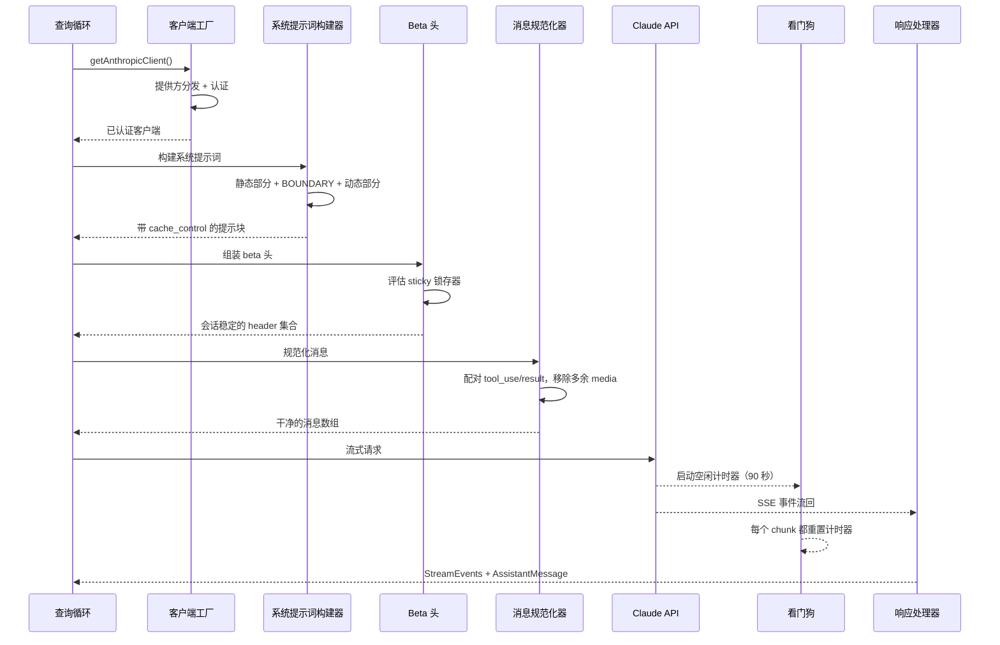
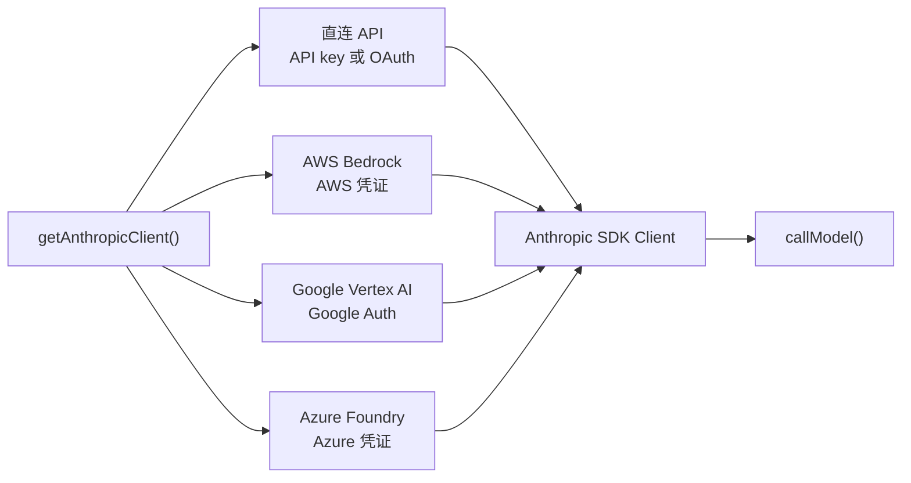
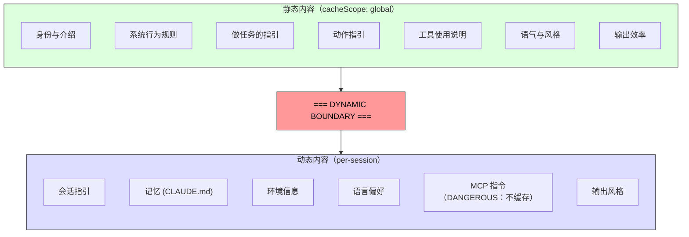

# 第 4 章：与 Claude 对话 - API 层

第 3 章已经说明了状态放在哪里，以及两层如何通信。现在我们来追踪当这些状态真正被用起来时会发生什么：系统需要与语言模型对话。Claude Code 里的所有东西 - 引导序列、状态系统、权限框架 - 都是为了服务这一刻而存在。

这一层处理的失败模式，比系统其他任何部分都更多。它必须通过一个透明接口路由到 4 家云提供方。它必须构建系统提示词，并且要以字节级的精度理解服务器提示缓存的工作方式，因为哪怕一个 section 放错了位置，都可能让一个价值 50,000+ token 的缓存失效。它必须以主动故障检测的方式流式接收响应，因为 TCP 连接会悄无声息地断掉。它还必须维持会话稳定的不变量，确保会话中途的 feature flag 变化不会带来不可见的性能断崖。

下面我们追踪一次 API 调用，从开始到结束。

---

## 多提供方客户端工厂

`getAnthropicClient()` 是所有模型通信的唯一工厂。它返回一个 Anthropic SDK 客户端，并根据部署目标配置成对应的提供方：

分发完全由环境变量驱动，并按固定优先级顺序求值。4 个提供方特定的 SDK 类都会通过 `as unknown as Anthropic` 被强转成 `Anthropic`。源码里的注释非常坦率：“我们一直都在对返回类型撒谎。” 这种有意的类型抹除意味着每个消费者看到的都是统一接口。代码库其他部分从不按提供方分支。

每个提供方 SDK 都是动态导入的 - `AnthropicBedrock`、`AnthropicFoundry`、`AnthropicVertex` 都是带有各自依赖树的重模块。动态导入确保未使用的提供方永远不会加载。

提供方选择在启动时确定，并存储在 bootstrap 的 `STATE` 里。查询循环从不检查当前激活的是哪家提供方。从直连 API 切到 Bedrock 是配置变更，不是代码变更。

### buildFetch 包装器

每一次对外 fetch 都会被包装，以注入一个 `x-client-request-id` header - 一个按请求生成的 UUID。当请求超时时，服务器不会给响应分配 request ID。没有客户端侧 ID，API 团队就没法把超时与服务器日志关联起来。这个 header 就是用来弥补这道缺口的。它只会发送到 Anthropic 的第一方端点 - 第三方提供方可能会拒绝未知 header。

---

## 系统提示词构建

系统提示词是整个系统里最敏感于缓存的产物。Claude 的 API 提供服务器端提示缓存：跨请求完全相同的提示前缀可以被缓存，从而节省延迟和成本。一个 200K token 的对话里，可能有 50-70K token 与上一轮完全相同。把这个缓存打掉，就等于逼服务器把这些内容全部重新处理一遍。

### 动态边界标记

提示词被构造成一个字符串 section 数组，中间有一条至关重要的分界线：

边界之前的所有内容，在会话、用户和组织之间都完全相同 - 它会获得最高等级的服务器端缓存。边界之后的内容包含用户特定信息，因此只会降级到会话级缓存。

section 的命名约定刻意做得很“响”。新增一个 section 时，必须在 `systemPromptSection`（安全、可缓存）和 `DANGEROUS_uncachedSystemPromptSection`（会破坏缓存、并且需要一个理由字符串）之间做选择。`_reason` 参数在运行时不会被使用，但它承担着强制文档化的作用 - 每个会破坏缓存的 section 在源码里都带着自己的理由。

### 2^N 问题

`prompts.ts` 里的一个注释解释了为什么条件 section 必须放在边界之后：

> 每一个放在这里的条件，都是一个运行时比特；否则它会把 Blake2b 前缀哈希的变体数乘上去（2^N）。

边界之前每多一个布尔条件，全球缓存条目的唯一组合数就会翻倍。3 个条件会产生 8 个变体，5 个条件会产生 32 个。静态 section 被刻意设计成无条件。编译期 feature flag（由打包器解析）可以放在边界之前；运行时检查（这是 Haiku 吗？用户是否处于 auto mode？）必须放在边界之后。

这类约束在你违反它之前是看不见的。一个心怀善意的工程师如果把一个依赖用户设置的 section 放到边界之前，可能会在不知不觉间把全局缓存切碎，让整个平台的提示处理成本翻倍。

---

## 流式传输

### 直接用 SSE，而不是 SDK 抽象层

流式实现使用的是原始的 `Stream<BetaRawMessageStreamEvent>`，而不是 SDK 更高层的 `BetaMessageStream`。原因是：`BetaMessageStream` 会在每一个 `input_json_delta` 事件上调用 `partialParse()`。对于带有大 JSON 输入的工具调用（比如几百行的文件修改），它会在每个 chunk 上重新从头解析不断增长的 JSON 字符串，变成 O(n^2) 行为。Claude Code 会自己处理工具输入累积，所以这种部分解析纯属浪费。

### 空闲看门狗

TCP 连接可能在没有通知的情况下就断掉。服务器可能崩溃，负载均衡器可能悄悄丢弃连接，公司代理可能超时。SDK 的请求超时只覆盖最初那次 fetch - 一旦 HTTP 200 返回，超时条件就已经满足了。流式 body 如果之后停了，没人会发现。

watchdog 的做法是：一个 `setTimeout`，每收到一个 chunk 就重置一次。如果 90 秒内没有任何 chunk 到达，流就会被中止，系统回退到非流式重试。45 秒时会发出警告。watchdog 触发时，会连同客户端 request ID 一起记录日志，方便关联。

### 非流式回退

当流式在响应中途失败（网络错误、卡顿、截断）时，系统会回退到同步的 `messages.create()` 调用。这能处理代理失败模式：比如代理返回 HTTP 200，但 body 不是 SSE；或者 SSE 流被截断到一半。

当流式工具执行处于激活状态时，这个回退可以被禁用，因为回退会重新执行整个请求，进而可能把工具跑两次。

---

## 提示缓存系统

### 三个层级

提示缓存分三层运行：

**短暂缓存**（默认）：会话级缓存，使用服务器定义的 TTL（约 5 分钟）。所有用户都能用。

**1 小时 TTL**：符合条件的用户可以获得更长缓存。资格由订阅状态决定，并通过 bootstrap 状态中的锁存器保存 - 第 3 章里的 `promptCache1hEligible` sticky latch 可以确保会话中途的 overage 切换不会改变 TTL。

**全局作用域**：系统提示词缓存条目可以跨会话、跨组织共享。Claude Code 用户的提示静态部分都相同，因此一份缓存副本就能服务所有人。当存在 MCP 工具时，全局作用域会被禁用，因为 MCP 工具定义是用户特定的，会把缓存碎成数百万个唯一前缀。

### 粘性锁存器的实际作用

第 3 章中的 5 个粘性锁存器会在这里、也就是请求构建过程中被评估。每个锁存器一开始都是 `null`，一旦设为 `true`，在整个会话期间都会保持 `true`。锁存器块上方的注释写得很准确：“用于动态 beta 头的 sticky-on 锁存器。每个 header 一旦第一次发送，就会在本会话剩余时间里继续发送，这样中途切换就不会改变服务器端缓存键、打爆约 50-70K token。”

第 3 章第 3.1 节已经完整解释了锁存器模式、这 5 个具体锁存器，以及为什么“始终发送所有 header”不是正确解法。

---

## `queryModel` 生成器

`queryModel()` 函数是一个 async generator（约 700 行），它编排整个 API 调用生命周期。它会产出 `StreamEvent`、`AssistantMessage` 和 `SystemAPIErrorMessage` 对象。

请求组装遵循一套精心排序的步骤：

1. **Kill switch 检查** - 用于最昂贵模型层的安全阀
2. **beta 头组装** - 按模型定制，并应用 sticky latch
3. **工具 schema 构建** - 通过 `Promise.all()` 并行，延迟工具在被发现之前被排除
4. **消息规范化** - 修复孤立的 `tool_use`/`tool_result` 不匹配，去掉多余 media，移除过期 block
5. **系统提示词 block 构建** - 在动态边界处分割，并分配 cache scope
6. **带重试的流式传输** - 处理 529（过载）、模型回退、thinking 降级、OAuth 刷新

### 输出 token 上限

默认输出上限是 8,000 token，而不是常见的 32K 或 64K。生产数据表明，p99 输出是 4,911 token - 标准上限普遍预留了 8-16 倍的空间。响应一旦撞到上限（<1% 的请求），就会以 64K 进行一次干净重试。这样能在大规模场景下节省相当可观的成本。

### 错误处理与重试

`withRetry()` 函数本身也是一个 async generator，它会产出 `SystemAPIErrorMessage` 事件，让 UI 可以显示重试状态。重试策略包括：

- **529（过载）**：等待后重试，必要时降级 fast mode
- **模型回退**：主模型失败时改试 fallback（例如 Opus 回 Sonnet）
- **thinking 降级**：上下文窗口溢出时降低 thinking 预算
- **OAuth 401**：刷新 token 后重试一次

generator 模式意味着重试进度（“服务器过载，5 秒后重试……”）会作为事件流的自然一部分出现，而不是作为旁路通知。

---

## 应用到实践中

**把提示缓存当作架构约束，而不是功能开关。** 大多数 LLM 应用只是“开启”缓存。Claude Code 把它当作会影响提示顺序、section 缓存、header 锁存和配置管理的设计约束。一个结构良好的提示词（50K token 命中缓存）和一个结构糟糕的提示词（每轮都全量重算）之间的差异，是系统里最大的成本杠杆。

**对昂贵的逃生口使用 DANGEROUS 命名约定。** 当代码库里有一个容易被误触的不可变式时，用一个醒目的前缀给逃生口命名，有三重作用：让 code review 里更容易看见违规，强制补文档（必需的 reason 参数），并对安全默认值形成心理阻力。这个原则不仅适用于缓存，也适用于任何带有隐性成本的操作。

**构建流式传输时要有 watchdog，而不只是 timeout。** SDK 的请求超时在 HTTP 200 到达时就结束了，但响应体随时都可能停止流动。一个在每个 chunk 到达时重置的 `setTimeout` 可以发现这一点。非流式回退可以处理代理失败模式（HTTP 200 但 body 不是 SSE、中途截断），这些在企业环境里比你想象得更常见。

**让重试策略以 yield 为中心，而不是以异常为中心。** 把重试包装器做成一个会产出状态事件的 async generator，调用方就能把重试进度作为事件流的自然部分显示出来。模型回退模式（Opus 失败，改试 Sonnet）在生产韧性上尤其有用。

**把快路径和完整管线分开。** 并不是每一次 API 调用都需要工具搜索、advisor 集成、thinking 预算和流式基础设施。Claude Code 的 `queryHaiku()` 函数为内部操作（压缩、分类）提供了一条精简路径，跳过所有 agentic 关注点。一个接口更简单的独立函数，可以避免意外把复杂度泄漏进去。

---

## 展望

API 层是后续一切的基础。第 5 章会展示查询循环如何利用流式响应来驱动工具执行 - 包括工具如何在模型完成响应之前就开始执行。第 6 章会解释当对话接近上下文上限时，压缩系统如何保持缓存效率。第 7 章会说明每个代理线程如何拥有自己的消息数组和请求链。

后面的这些系统都继承了这里建立的约束：把缓存稳定性当作架构不变量，通过客户端工厂实现提供方透明性，以及通过锁存器系统维持会话稳定配置。API 层不只是发送请求 - 它定义了其他所有系统运行的规则。
