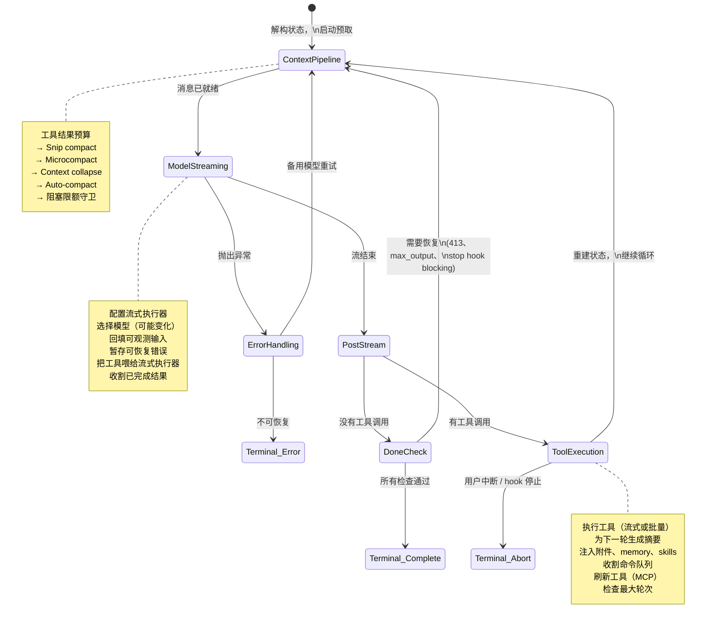
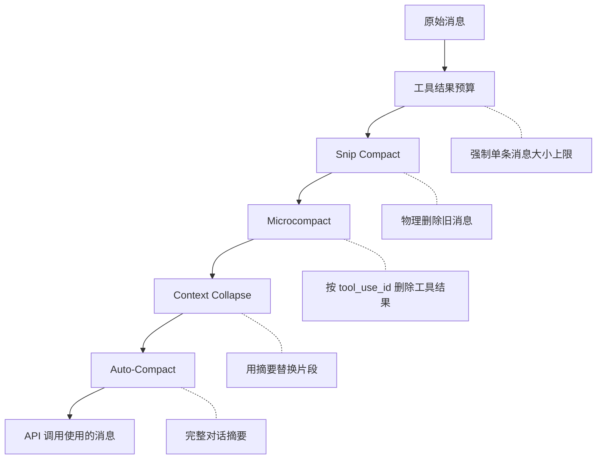
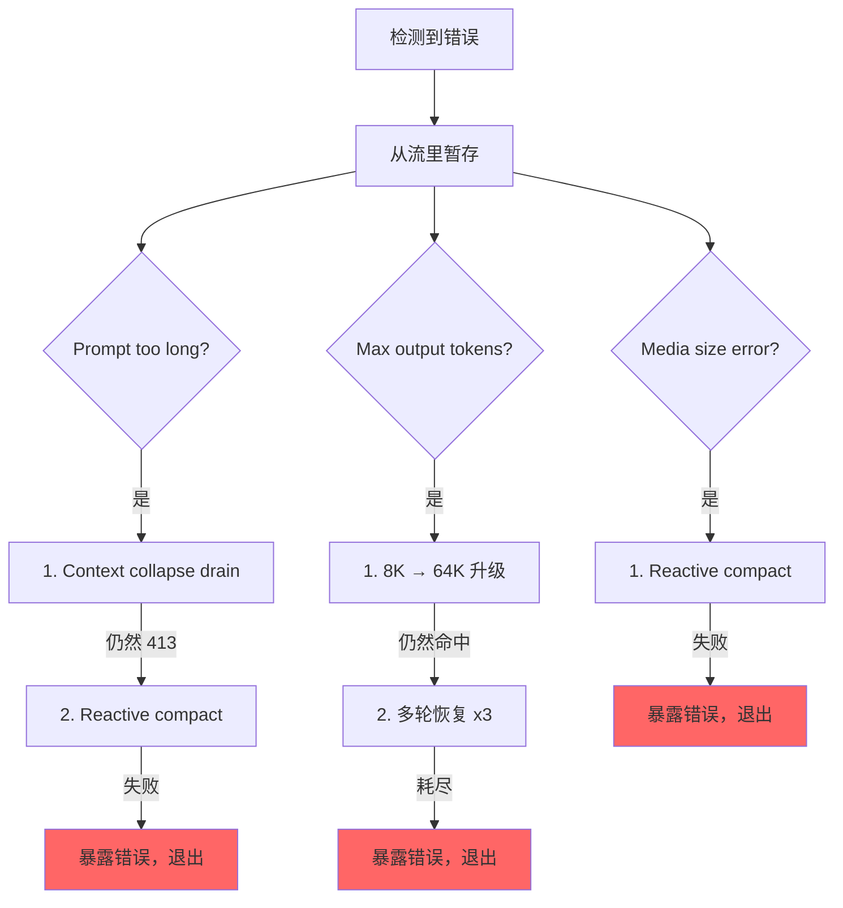

# 第 5 章：代理循环

## 跳动的核心

第 4 章展示了 API 层如何把配置转换为流式 HTTP 请求，以及客户端如何构建、系统提示如何组装、响应如何以 server-sent events 的形式到达。那一层处理的是与模型对话的*机制*。但一次 API 调用并不是一个代理。代理是一个循环：调用模型、执行工具、把结果喂回去、再调用模型，直到工作完成。

每个系统都有自己的重心。数据库的重心是存储引擎，编译器的重心是中间表示，而 Claude Code 的重心是 `query.ts`。这是一个长达 1,730 行的单文件，包含驱动每次交互的 async generator，从 REPL 里的第一下按键，到无头 `--print` 调用的最后一次工具调用，都经过这里。

这不是夸张。与模型对话、执行工具、管理上下文、恢复错误、决定何时停止，这些事只有一条代码路径在做。那条路径就是 `query()`。REPL 会调用它，SDK 会调用它，子智能体也会调用它，无头运行器同样会调用它。只要你在用 Claude Code，你就在 `query()` 里面。

这个文件很密，但它并不是那种继承层级缠成一团的复杂。它更像一艘潜艇那样复杂：一个外壳里塞进了很多冗余系统，每一个都是因为海里总能找到进水的办法。每个 `if` 分支背后都有一段事故史。每条被吞掉的错误消息，都对应着一个真实 bug：某个 SDK 消费者在恢复途中断开了连接。每个断路器阈值，都是拿真实会话反复调出来的，那些会话曾在无限循环里烧掉成千上万次 API 调用。

本章会从头到尾追踪整个循环。读完之后，你不只会知道发生了什么，还会明白每个机制为什么存在，以及少了它会坏成什么样。

---

## 为什么用 Async Generator

第一个架构问题是：为什么代理循环要做成 generator，而不是基于回调的事件发射器？

```typescript
// Simplified — shows the concept, not the exact types
async function* agentLoop(params: LoopParams): AsyncGenerator<Message | Event, TerminalReason>
```

真实签名会 yield 多种 message 和 event 类型，并返回一个 discriminated union，用来精确说明循环为什么停止。

理由有三个，按重要性排序。

**背压。** 事件发射器不管消费者是否准备好，都会继续发。generator 只有在消费者调用 `.next()` 时才会继续 yield。当 REPL 的 React 渲染器忙着绘制上一帧时，generator 会自然暂停。当 SDK 消费者正在处理工具结果时，generator 也会等待。不会缓冲溢出，不会丢消息，也不会出现“快生产者 / 慢消费者”的问题。

**返回值语义。** generator 的返回类型是 `Terminal`，也就是一个 discriminated union，精确编码循环停止的原因。是正常完成？用户中断？令牌预算耗尽？stop hook 插手？达到最大轮次？还是模型出现不可恢复错误？总共有 10 种终止状态。调用者不需要订阅一个 `end` 事件，然后祈祷 payload 里刚好带着原因。他们通过 `for await...of` 或 `yield*` 就能拿到类型化的返回值。

**通过 `yield*` 组合。** 外层的 `query()` 用 `yield*` 委托给 `queryLoop()`，这会无缝转发每一个 yield 的值和最终 return。像 `handleStopHooks()` 这样的子 generator 也用同样模式。这样就形成了一条干净的责任链，没有回调、没有把 promise 再包一层 promise、没有转发事件的样板代码。

这个选择也有代价。JavaScript 里的 async generator 不能“回放”或分叉。但代理循环并不需要这两者。它是一个严格向前推进的状态机。

还有一个细节：`function*` 语法让函数变成*惰性*的。函数体不会在第一次 `.next()` 之前执行。这意味着 `query()` 会立刻返回，所有重量级初始化，比如配置快照、memory 预取、预算追踪，都只会在消费者开始拉取值时发生。在 REPL 里，这表示 React 渲染管线会在循环开始前就准备好。

---

## 调用方要提供什么

在追踪循环之前，先看看输入是什么：

```typescript
// Simplified — illustrates the key fields
type LoopParams = {
  messages: Message[]
  prompt: SystemPrompt
  permissionCheck: CanUseToolFn
  context: ToolUseContext
  source: QuerySource         // 'repl', 'sdk', 'agent:xyz', 'compact', etc.
  maxTurns?: number
  budget?: { total: number }  // API-level task budget
  deps?: LoopDeps             // Injected for testing
}
```

几个关键字段：

- **`querySource`**：类似 `'repl_main_thread'`、`'sdk'`、`'agent:xyz'`、`'compact'`、`'session_memory'` 这样的字符串判别值。许多条件分支都会看它。压缩代理会把 `querySource` 设成 `'compact'`，这样阻塞限额守卫就不会把自己卡死，因为压缩代理本来就是为了*减少*令牌数而运行的。

- **`taskBudget`**：API 层面的任务预算（`output_config.task_budget`）。它和 `+500k` 的自动续跑令牌预算功能不是一回事。`total` 是整个代理轮次的预算，`remaining` 会根据累计 API 消耗逐轮计算，并在压缩边界之间调整。

- **`deps`**：可选的依赖注入，默认是 `productionDeps()`。测试会在这里塞入假的模型调用、假的压缩器和确定性的 UUID。

- **`canUseTool`**：判断某个工具是否允许使用的函数。这是权限层，负责检查信任设置、hook 决策和当前权限模式。

---

## 两层入口

公共 API 只是对真实循环的一层薄包装：

外层函数包住内层循环，跟踪这次轮次里消耗了哪些排队命令。内层循环结束后，被消耗的命令会标记为 `'completed'`。如果循环抛错，或者 generator 通过 `.return()` 被关闭，完成通知就不会触发。失败的轮次不应该把命令标成已经成功处理。轮次中排队的命令（通过 `/` slash command 或任务通知进入）会在循环内标记为 `'started'`，在包装器里标记为 `'completed'`。如果循环抛错，或者 generator 通过 `.return()` 被关闭，完成通知就不会触发。这是刻意设计的，因为失败的轮次不该把命令当成已完成。

---

## 状态对象

循环把状态保存在一个类型化对象里：

```typescript
// Simplified — illustrates the key fields
type LoopState = {
  messages: Message[]
  context: ToolUseContext
  turnCount: number
  transition: Continue | undefined
  // ... plus recovery counters, compaction tracking, pending summaries, etc.
}
```

十个字段。每个都不是白放的：

| 字段 | 存在原因 |
|-------|----------|
| `messages` | 对话历史，每轮都会增长 |
| `toolUseContext` | 可变上下文：工具、abort controller、代理状态、选项 |
| `autoCompactTracking` | 跟踪压缩状态：轮次计数器、turn ID、连续失败次数、是否已压缩 |
| `maxOutputTokensRecoveryCount` | 输出令牌限制的多轮恢复尝试次数（最多 3 次） |
| `hasAttemptedReactiveCompact` | 防止反应式压缩陷入无限循环的一次性保护 |
| `maxOutputTokensOverride` | 升级时设为 64K，之后清空 |
| `pendingToolUseSummary` | 上一轮 Haiku 摘要的 promise，会在当前流式处理中解析 |
| `stopHookActive` | 防止在阻塞重试后再次运行 stop hook |
| `turnCount` | 单调递增计数器，用来检查 `maxTurns` |
| `transition` | 上一轮为什么继续，第一次迭代时为 `undefined` |

### 可变循环里的不可变迁移

下面是循环里每个 `continue` 位置都会出现的模式：

```typescript
const next: State = {
  messages: [...messagesForQuery, ...assistantMessages, ...toolResults],
  toolUseContext: toolUseContextWithQueryTracking,
  autoCompactTracking: tracking,
  turnCount: nextTurnCount,
  maxOutputTokensRecoveryCount: 0,
  hasAttemptedReactiveCompact: false,
  pendingToolUseSummary: nextPendingToolUseSummary,
  maxOutputTokensOverride: undefined,
  stopHookActive,
  transition: { reason: 'next_turn' },
}
state = next
```

每个 `continue` 点都会重建一个完整的 `State` 对象。不是 `state.messages = newMessages`，也不是 `state.turnCount++`，而是完整重建。好处是每个迁移都能自解释。你看任何一个 `continue` 点，都能清楚知道哪些字段变了，哪些字段保留了。新状态上的 `transition` 字段记录了循环为什么继续，测试会据此断言正确的恢复路径是否被触发。

---

## 循环主体

下面是单次迭代完整执行流的骨架：



这就是整个循环。Claude Code 里从 memory 到子智能体，再到错误恢复的所有功能，最终都会流入或流出这一轮迭代结构。

---

## 上下文管理：四层压缩

每次 API 调用前，消息历史都会经过最多四个上下文管理阶段。它们的顺序是固定的，而且这个顺序很重要。



### 第 0 层：工具结果预算

在任何压缩之前，`applyToolResultBudget()` 会对工具结果施加单条消息大小限制。那些没有有限 `maxResultSizeChars` 的工具会被豁免。

### 第 1 层：Snip Compact

最轻量的操作。Snip 会直接从数组里物理删除旧消息，并返回一个边界消息，告诉 UI 发生了移除。它会报告释放了多少令牌，这个数字会被传给 auto-compact 的阈值判断。

### 第 2 层：Microcompact

Microcompact 会删除那些已经不再需要的工具结果，依据是 `tool_use_id`。对于缓存型 microcompact（会修改 API 缓存的那种），边界消息会延后到 API 响应之后再发。原因是客户端的令牌估算并不可靠。真正释放了多少，要看 API 响应里的 `cache_deleted_input_tokens`。

### 第 3 层：Context Collapse

Context collapse 会把对话中的一段段内容替换成摘要。它发生在 auto-compact 之前，这个顺序是刻意安排的：如果 collapse 把上下文压到 auto-compact 阈值以下，auto-compact 就会变成空操作。这样能尽量保留粒度更细的上下文，而不是一上来就把一切都压成一个大摘要。

### 第 4 层：Auto-Compact

最重的一层操作：它会 fork 整个 Claude 对话来总结历史。实现里有一个断路器，连续失败 3 次后就停止尝试。这避免了线上曾出现的灾难场景：会话卡在上下文上限之上，每天在无限的 compact-fail-retry 循环里烧掉 25 万次 API 调用。

### Auto-Compact 阈值

这些阈值由模型的上下文窗口推导出来：

```text
effectiveContextWindow = contextWindow - min(modelMaxOutput, 20000)

Thresholds (relative to effectiveContextWindow):
  Auto-compact fires:      effectiveWindow - 13,000
  Blocking limit (hard):    effectiveWindow - 3,000
```

| 常量 | 值 | 作用 |
|------|----|------|
| `AUTOCOMPACT_BUFFER_TOKENS` | 13,000 | 为 auto-compact 触发预留的有效窗口下方余量 |
| `MANUAL_COMPACT_BUFFER_TOKENS` | 3,000 | 给 `/compact` 留出空间 |
| `MAX_CONSECUTIVE_AUTOCOMPACT_FAILURES` | 3 | 断路器阈值 |

13,000 个令牌的缓冲意味着 auto-compact 会在硬上限之前很早触发。auto-compact 阈值和阻塞限额之间的区间，就是 reactive compact 发挥作用的地方。如果主动的 auto-compact 失败了，或者被禁用了，reactive compact 就会接住 413 错误并按需压缩。

### 令牌计数

规范函数 `tokenCountWithEstimation` 会把 API 返回的权威 token 计数和上一次响应之后新增消息的粗略估算合并起来。这个近似是保守的，它会偏向更高的计数，这样 auto-compact 会稍微早触发，而不是稍微晚触发。

---

## 模型流式处理

### `callModel()` 循环

API 调用发生在一个 `while(attemptWithFallback)` 循环中，用来支持模型 fallback：

```typescript
let attemptWithFallback = true
while (attemptWithFallback) {
  attemptWithFallback = false
  try {
    for await (const message of deps.callModel({ messages, systemPrompt, tools, signal })) {
      // Process each streamed message
    }
  } catch (innerError) {
    if (innerError instanceof FallbackTriggeredError && fallbackModel) {
      currentModel = fallbackModel
      attemptWithFallback = true
      continue
    }
    throw innerError
  }
}
```

启用后，`StreamingToolExecutor` 会在 `tool_use` 块流入的那一刻就开始执行工具，而不是等整段响应结束。工具如何被编排成并发批次，是第 7 章要讲的内容。

### 暂不暴露的模式

这是文件里最重要的模式之一。可恢复错误不会直接出现在 yield 流里：

```typescript
let withheld = false
if (contextCollapse?.isWithheldPromptTooLong(message)) withheld = true
if (reactiveCompact?.isWithheldPromptTooLong(message)) withheld = true
if (isWithheldMaxOutputTokens(message)) withheld = true
if (!withheld) yield yieldMessage
```

为什么要暂不暴露？因为 SDK 消费者，也就是桌面应用 `Cowork`，只要收到任何带 `error` 字段的消息就会终止会话。你如果先把一个 prompt-too-long 错误发出去，随后又通过 reactive compact 成功恢复，消费者其实已经断开了。恢复循环还在继续，但没人再听了。所以错误会被暂存，放进 `assistantMessages`，让后面的恢复检查还能找到它。只有当所有恢复路径都失败时，这个被暂存的消息才会真正暴露出来。

### 模型 fallback

捕获到 `FallbackTriggeredError` 时（主模型压力过高），循环会切换模型并重试。但 thinking signatures 是和模型绑定的，把一个模型的受保护 thinking block 重放到另一个 fallback 模型上，会触发 400 错误。所以重试前会先剥离 signature block。失败尝试里那些孤立的 assistant 消息会被 tombstone 掉，这样 UI 就会把它们移除。

---

## 错误恢复：升级梯子

`query.ts` 里的错误恢复不是单一策略，而是一个逐步升级的干预梯子，前一步失败了才会进入下一步。



### 死循环防护

最危险的故障模式是无限循环。代码里有多道防线：

1. **`hasAttemptedReactiveCompact`**：一次性标志。每种错误类型只会触发一次 reactive compact。
2. **`MAX_OUTPUT_TOKENS_RECOVERY_LIMIT = 3`**：多轮恢复尝试的硬上限。
3. **auto-compact 的断路器**：连续 3 次失败后，auto-compact 完全停止尝试。
4. **错误响应时不跑 stop hooks**：如果最后一条消息是 API 错误，代码会明确在到达 stop hooks 之前返回。注释里写得很直接：“error -> hook blocking -> retry -> error -> ...（hook 每一轮都会注入更多令牌）。”
5. **在 stop hook 重试之间保留 `hasAttemptedReactiveCompact`**：当 stop hook 返回阻塞错误并强制重试时，reactive compact 的保护标志会被保留。注释记录了那个 bug：“这里重置为 false 会导致无限循环，白白烧掉成千上万次 API 调用。”

每一条防线，都是因为线上有人真的撞到了那个失败模式。

---

## 实战例子：“修复 `auth.ts` 里的 bug”

为了让循环更具体，我们追踪一次真实交互，分三轮看。

**用户输入：** `Fix the null pointer bug in src/auth/validate.ts`

**第 1 轮：模型读取文件。**

循环进入。上下文管理开始运行（不需要压缩，对话很短）。模型流式输出：“让我看看这个文件。”它只发出一个 `tool_use` 块：`Read({ file_path: "src/auth/validate.ts" })`。流式执行器看到这是一个并发安全工具，立刻开始执行。等模型把响应文本说完时，文件内容已经在内存里了。

流结束后的处理：模型用了工具，所以进入 tool-use 路径。Read 结果（带行号的文件内容）被推入 `toolResults`。后台启动一个 Haiku 摘要 promise。状态被重建，带着新的消息和 `transition: { reason: 'next_turn' }`，循环继续。

**第 2 轮：模型修改文件。**

上下文管理再次运行（仍然低于阈值）。模型流式输出：“我在第 42 行看到了 bug，`userId` 可能为空。”它发出 `Edit({ file_path: "src/auth/validate.ts", old_string: "const user = getUser(userId)", new_string: "if (!userId) return { error: 'unauthorized' }\nconst user = getUser(userId)" })`。

Edit 不是并发安全的，所以流式执行器会把它排队，等响应结束后再执行。随后 14 步执行管线启动：Zod 校验通过，输入回填扩展了路径，PreToolUse hook 检查权限（用户批准），编辑被应用。第 1 轮里悬挂着的 Haiku 摘要会在流式处理中解析完成，它的结果会作为 `ToolUseSummaryMessage` 被 yield 出来。状态重建，循环继续。

**第 3 轮：模型宣布完成。**

模型流式输出：“我通过添加守卫子句修复了这个空指针 bug。”没有 `tool_use` 块。进入“完成”路径。Prompt-too-long 恢复？不需要。Max output tokens？没有。Stop hooks 运行，也没有阻塞错误。令牌预算检查通过。循环返回 `{ reason: 'completed' }`。

总计：三次 API 调用，两次工具执行，一次用户权限提示。这个循环把流式工具执行、与 API 调用并行进行的 Haiku 摘要，以及完整的权限管线，全都通过同一个 `while(true)` 结构串了起来。

---

## 令牌预算

用户可以为一次轮次请求令牌预算，比如 `+500k`。预算系统会在模型完成一次响应后，决定是继续还是停止。

`checkTokenBudget` 用三条规则做二元 continue/stop 判断：

1. **子智能体永远停止。** 预算只在顶层概念里存在。
2. **90% 完成阈值。** 如果 `turnTokens < budget * 0.9`，就继续。
3. **递减收益检测。** 在 3 次及以上续跑后，如果当前增量和前一次增量都低于 500 个令牌，就提前停止。模型每次续跑产出的内容越来越少了。

当判断结果是“继续”时，会插入一条提醒消息，告诉模型还剩多少预算。

---

## Stop Hooks：逼模型继续干活

当模型结束时没有请求任何工具调用，stop hooks 就会运行。模型以为自己已经完成了，但这些 hooks 会检查它是不是真的做完了。

流程会先做模板任务分类，启动后台任务（prompt 建议、memory 抽取），然后再执行真正的 stop hooks。当 stop hook 返回阻塞错误，比如“你说你做完了，但 lint 发现了 3 个错误”时，这些错误会被追加到消息历史里，循环会带着 `stopHookActive: true` 继续。这个标志可以阻止重试时再次运行同一批 hooks。

如果 stop hook 明确发出 `preventContinuation`，循环会立即退出，返回 `{ reason: 'stop_hook_prevented' }`。

---

## 状态迁移：完整目录

循环的每一种退出都属于两类之一：`Terminal`（循环返回）或 `Continue`（循环继续）。

### 终止状态（10 种原因）

| 原因 | 触发条件 |
|------|----------|
| `blocking_limit` | 令牌数达到硬上限，auto-compact 关闭 |
| `image_error` | ImageSizeError、ImageResizeError，或不可恢复的媒体错误 |
| `model_error` | 不可恢复的 API / 模型异常 |
| `aborted_streaming` | 模型流式处理中用户中断 |
| `prompt_too_long` | 所有恢复手段耗尽后仍然保留的 413 |
| `completed` | 正常完成（没有工具调用，或预算耗尽，或 API 错误） |
| `stop_hook_prevented` | stop hook 明确阻止继续 |
| `aborted_tools` | 工具执行期间用户中断 |
| `hook_stopped` | PreToolUse hook 停止了继续 |
| `max_turns` | 达到 `maxTurns` 限制 |

### 继续状态（7 种原因）

| 原因 | 触发条件 |
|------|----------|
| `collapse_drain_retry` | 413 后，context collapse 清空了已 staged 的折叠 |
| `reactive_compact_retry` | 413 或媒体错误后，reactive compact 成功 |
| `max_output_tokens_escalate` | 命中 8K 上限，升级到 64K |
| `max_output_tokens_recovery` | 64K 仍然命中，多轮恢复（最多 3 次） |
| `stop_hook_blocking` | stop hook 返回阻塞错误，必须重试 |
| `token_budget_continuation` | 令牌预算未耗尽，插入提醒消息 |
| `next_turn` | 正常的工具使用续跑 |

---

## 孤立工具结果：协议安全网

API 协议要求每个 `tool_use` 块后面都必须跟一个 `tool_result`。`yieldMissingToolResultBlocks` 会为模型发出的、但始终没有得到对应结果的每个 `tool_use` 块创建错误 `tool_result` 消息。没有这层安全网的话，流式处理中途崩溃会留下孤立的 `tool_use` 块，下一次 API 调用就会协议错误。

它会在三个地方触发：外层错误处理器（模型崩溃）、fallback 处理器（流中切换模型），以及中断处理器（用户打断）。每条路径的错误消息不同，但机制完全一样。

---

## 中断处理：两条路径

中断可能发生在两个时间点：流式处理中，或者工具执行期间。两者的行为不同。

**流式处理中断**：如果流式执行器正在工作，它会把剩余结果冲掉，为排队中的工具生成合成的 `tool_result`。如果没有执行器，`yieldMissingToolResultBlocks` 会补上空缺。`signal.reason` 会区分硬中断（Ctrl+C）和提交中断（用户输入了新消息）——提交中断会跳过中断提示，因为排队中的用户消息已经提供了上下文。

**工具执行中断**：逻辑类似，只是中断消息里会带上 `toolUse: true`，告诉 UI 当时确实有工具在运行。

---

## Thinking 规则

Claude 的 thinking / `redacted_thinking` 块有三条不可违背的规则：

1. 包含 thinking 块的消息，必须属于一个 `max_thinking_length > 0` 的查询
2. thinking 块后面不能再是该消息的最后一个块
3. thinking 块必须在 assistant 的整个轨迹期间被保留

违反任意一条都会得到晦涩的 API 错误。代码在多个地方处理这些问题：fallback 处理器会剥离 signature block（它们与模型绑定），压缩管线会保留受保护的尾部，microcompact 层则完全不会碰 thinking 块。

---

## 依赖注入

`QueryDeps` 类型刻意做得很窄，只有四个依赖，不是四十个：

四个注入依赖分别是：模型调用器、压缩器、微压缩器，以及 UUID 生成器。测试会把 `deps` 传进循环参数，直接注入假的实现。用 `typeof fn` 定义类型，可以让签名自动保持同步。除了可变的 `State` 和可注入的 `QueryDeps` 之外，`query()` 入口还会一次性快照一个不可变的 `QueryConfig`：特性标志、会话状态和环境变量只在入口读取一次，之后不再重读。这样的三分法——可变状态、不可变配置、可注入依赖——让循环容易测试，也让后续重构成纯 `step(state, event, config)` reducer 变得直接。

---

## 应用到你自己的代理循环

**用 generator，不要用回调。** 背压是免费的。返回值语义是免费的。通过 `yield*` 组合也是免费的。代理循环只会向前走，不需要回退，也不需要分叉。

**让状态迁移显式化。** 每个 `continue` 点都重建完整状态对象。啰嗦本身就是特性，它能避免局部更新 bug，也能让每次迁移自解释。

**把可恢复错误先暂存。** 如果你的消费者在错误时就断开连接，那就不要在确认恢复失败之前把错误发出去。先放进内部缓冲，尝试恢复，只有穷尽所有手段后再暴露。

**分层管理上下文。** 先做轻操作（删除），再做重操作（摘要）。这样能在可能时保留更细粒度的上下文，只有在必要时才退回到单一大摘要。

**给每次重试都加断路器。** `query.ts` 里的每种恢复机制都有显式上限：3 次 auto-compact 失败，3 次 max-output 恢复，1 次 reactive compact。没有这些上限，第一条触发“失败后重试”循环的线上会话就会在一夜之间烧光你的 API 预算。

如果你从零开始，最小代理循环骨架如下：

```text
async function* agentLoop(params) {
  let state = initState(params)
  while (true) {
    const context = compressIfNeeded(state.messages)
    const response = await callModel(context)
    if (response.error) {
      if (canRecover(response.error, state)) { state = recoverState(state); continue }
      return { reason: 'error' }
    }
    if (!response.toolCalls.length) return { reason: 'completed' }
    const results = await executeTools(response.toolCalls)
    state = { ...state, messages: [...context, response.message, ...results] }
  }
}
```

Claude Code 里的每个特性，都是这个骨架某一步的展开。四层压缩展开了第 3 步（compress）。暂不暴露模式展开了模型调用。升级梯子展开了错误恢复。Stop hooks 展开了“没有工具调用”的退出。先从这个骨架开始，只在你真的碰到相应问题时，再往上加每一层展开。

---

## 小结

代理循环是 1,730 行的单个 `while(true)`，却包办了一切。它流式处理模型响应、并发执行工具、通过四层压缩上下文、恢复五类错误、用递减收益检测跟踪令牌预算、运行能把模型拉回工作的 stop hooks、管理 memory 和 skills 的预取管线，并且返回一个类型化的 discriminated union，精确说明它为什么停止。

它是系统里最重要的文件，因为它是唯一一个触达所有其他子系统的文件。上下文管线把数据送进来，工具系统把结果送出去，错误恢复包在外面，hooks 在中途拦截，状态层在其中持久化，UI 从这里渲染。

理解了 `query()`，你就理解了 Claude Code。其他一切都只是外围。
