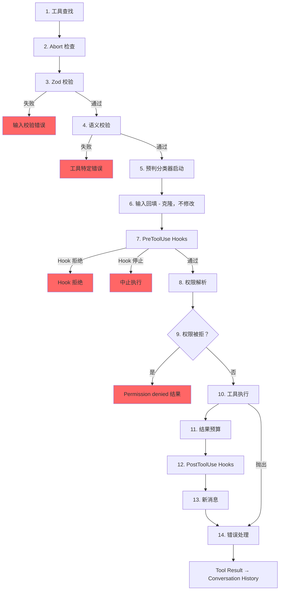

# 第 6 章：工具 - 从定义到执行

## 神经系统

第 5 章展示了代理循环，也就是那个流式接收模型响应、收集工具调用并把结果喂回去的 `while(true)`。循环是心跳。但如果没有把“模型想执行 `git status`”翻译成真实 shell 命令的神经系统，心跳本身就没有意义。这个神经系统还要负责权限检查、结果预算和错误处理。

工具系统就是这套神经系统。它覆盖 40 多个工具实现、一个带特性标志门控的集中式注册表、一个 14 步执行管线、一个拥有 7 种模式的权限解析器，以及一个在模型响应结束前就开始执行工具的流式执行器。

Claude Code 里的每一次工具调用，无论是读文件、执行 shell、grep 搜索，还是派发子智能体，都会经过同一条管线。统一性就是重点：无论工具是内建 Bash 执行器还是第三方 MCP server，它拿到的校验、权限检查、结果预算和错误分类都是一样的。

`Tool` 接口大约有 45 个成员。听起来很多，但真正决定系统如何运作的只有 5 个：

1. **`call()`** - 执行工具
2. **`inputSchema`** - 校验并解析输入
3. **`isConcurrencySafe()`** - 能不能并行运行
4. **`checkPermissions()`** - 允不允许
5. **`validateInput()`** - 输入在语义上是否合理

其余内容，比如 12 个渲染方法、分析钩子和搜索提示，都是为了支撑 UI 和 telemetry 层。先抓住这五个，其余的就会自然归位。

---

## 工具接口

### 三个类型参数

每个工具都带有三个类型参数：

```typescript
Tool<Input extends AnyObject, Output, P extends ToolProgressData>
```

`Input` 是一个 Zod object schema，兼具双重职责：它会生成发给 API 的 JSON Schema，让模型知道该提供哪些参数；同时它也会在运行时通过 `safeParse` 校验模型的返回值。`Output` 是工具结果的 TypeScript 类型。`P` 是工具运行时发出的进度事件类型，BashTool 会发 stdout chunk，GrepTool 会发 match count，AgentTool 会发子智能体转录。

### `buildTool()` 与 fail-closed 默认值

没有任何工具定义会直接构造 `Tool` 对象。每个工具都会经过 `buildTool()`，这个工厂会把一个默认值对象铺在工具特定定义下面：

```typescript
// Pseudocode — illustrates the fail-closed defaults pattern
const SAFE_DEFAULTS = {
  isEnabled:         () => true,
  isParallelSafe:    () => false,   // Fail-closed: new tools run serially
  isReadOnly:        () => false,   // Fail-closed: treated as writes
  isDestructive:     () => false,
  checkPermissions:  (input) => ({ behavior: 'allow', updatedInput: input }),
}

function buildTool(definition) {
  return { ...SAFE_DEFAULTS, ...definition }  // Definition overrides defaults
}
```

这些默认值在关键安全点上都刻意采用 fail-closed 策略。新工具如果忘了实现 `isConcurrencySafe`，默认就是 `false`，也就是串行运行，绝不会并行。工具如果忘了实现 `isReadOnly`，默认也是 `false`，系统会把它当成写操作。工具如果忘了实现 `toAutoClassifierInput`，会返回空字符串，auto 模式的安全分类器就会跳过它，也就是说，通用权限系统会接手，而不是自动绕过。

唯一一个不是 fail-closed 的默认值是 `checkPermissions`，它返回 `allow`。这看上去有点反直觉，直到你理解分层权限模型为止：`checkPermissions` 是工具级逻辑，它运行在通用权限系统已经评估过规则、hooks 和基于模式的策略之后。工具从 `checkPermissions` 返回 `allow`，意思是“我没有工具特定的反对意见”，并不意味着它在授予无条件访问。分组到子对象里（`options`、诸如 `readFileState` 这样的命名字段）提供了本来需要专门接口才能表达的结构，但又不必声明、实现并在 40 多个调用点之间传递五个独立接口类型。

### 并发性依赖输入

`isConcurrencySafe(input: z.infer<Input>): boolean` 之所以接收已解析输入，是因为同一个工具在不同输入下可能安全，也可能不安全。BashTool 就是典型例子：`ls -la` 只是只读，适合并行；`rm -rf /tmp/build` 就不是。工具会解析命令，把每个子命令和已知安全集合比对，只有所有非中性部分都是搜索或读取操作时，才返回 `true`。

### `ToolResult` 返回类型

每次 `call()` 都返回一个 `ToolResult<T>`：

```typescript
type ToolResult<T> = {
  data: T
  newMessages?: (UserMessage | AssistantMessage | AttachmentMessage | SystemMessage)[]
  contextModifier?: (context: ToolUseContext) => ToolUseContext
}
```

`data` 是会被序列化进 API `tool_result` content block 的类型化输出。`newMessages` 允许工具向对话里注入额外消息，AgentTool 就会借它附加子智能体转录。`contextModifier` 是一个会修改后续工具所用 `ToolUseContext` 的函数，`EnterPlanMode` 就是靠它切换权限模式。上下文修改器只对非并发安全工具生效；如果工具要并行运行，它的修改器会等整个批次结束后再应用。

---

## `ToolUseContext`：上帝对象

`ToolUseContext` 是贯穿每次工具调用的巨大上下文包，大约有 40 个字段。按任何合理标准看，它都是一个上帝对象。但它存在，是因为替代方案更糟。

像 BashTool 这样的工具需要 abort controller、文件状态缓存、应用状态、消息历史、工具集合、MCP 连接，以及一堆 UI 回调。如果把这些拆成单独参数，函数签名会膨胀到 15 个以上参数。更务实的做法是把它们集中成一个上下文对象，并按关注点分组：

**配置**（`options` 子对象）：工具集合、模型名、MCP 连接、调试标志。它们在 `query` 开始时设定一次，之后大多保持不变。

**执行状态**：用于取消的 `abortController`、用于 LRU 文件缓存的 `readFileState`、表示完整对话历史的 `messages`。这些会在执行过程中变化。

**UI 回调**：`setToolJSX`、`addNotification`、`requestPrompt`。它们只在交互式（REPL）环境里接线，SDK 和无头模式都不会提供。

**代理上下文**：`agentId`、`renderedSystemPrompt`（fork 子智能体的父级固定系统提示，重新渲染可能因为特性标志热身而偏离缓存）。

子智能体版本的 `ToolUseContext` 尤其能说明问题。`createSubagentContext()` 为子代理构建上下文时，会有意识地决定哪些字段共享、哪些字段隔离：`setAppState` 对异步代理会变成 no-op，`localDenialTracking` 会拿到一个新的对象，`contentReplacementState` 则从父级克隆。每个选择背后，都是线上 bug 教出来的经验。

---

## 注册表

### `getAllBaseTools()`：唯一事实来源

`getAllBaseTools()` 会返回当前进程里可能存在的所有工具的完整列表。始终存在的工具先列出来，然后是受特性标志门控的条件工具：

```typescript
const SleepTool = feature('PROACTIVE') || feature('KAIROS')
  ? require('./tools/SleepTool/SleepTool.js').SleepTool
  : null
```

从 `bun:bundle` 导入的 `feature()` 会在 bundle 时解析。当 `feature('AGENT_TRIGGERS')` 在静态分析里是 false 时，打包器就会把整个 `require()` 调用删掉，这种 dead code elimination 能让二进制更小。

### `assembleToolPool()`：合并内建工具与 MCP 工具

最终送到模型前的工具集合来自 `assembleToolPool()`：

1. 先拿内建工具（带 deny-rule 过滤、REPL 模式隐藏，以及 `isEnabled()` 检查）
2. 再按 deny rules 过滤 MCP 工具
3. 分别按名称字母序排序
4. 最后把内建工具（前缀）和 MCP 工具（后缀）拼接起来

“先排序再拼接”的做法不是审美选择。API server 会在最后一个内建工具后面放一个 prompt-cache 边界。如果把所有工具混在一起排序，MCP 工具就会插进内建列表里；一旦增删 MCP 工具，内建工具的位置也会被挪动，缓存就失效了。

---

## 14 步执行管线

`checkPermissionsAndCallTool()` 是意图变成行动的地方。每次工具调用都会经过这 14 步。



### 第 1-4 步：校验

**工具查找** 会在别名匹配时回退到 `getAllBaseTools()`，这样就能处理旧会话转录中工具已经改名的情况。**Abort 检查** 可以防止已经排队但 Ctrl+C 还没传播到的工具调用继续白白耗时。**Zod 校验** 捕获类型不匹配；对延迟加载的工具来说，错误里还会附上一个提示，建议先调用 ToolSearch。**语义校验** 比 schema 是否满足更进一步。比如 FileEditTool 会拒绝无操作编辑，BashTool 在 MonitorTool 可用时会阻止单独的 `sleep`。

### 第 5-6 步：准备

**预判分类器启动** 会为 Bash 命令并行拉起 auto 模式安全分类器，把常见路径的延迟削掉几百毫秒。**输入回填** 会克隆解析后的输入并补上派生字段（例如把 `~/foo.txt` 展开成绝对路径），供 hooks 和权限系统使用，同时保留原始值以维持转录稳定。

### 第 7-9 步：权限

**PreToolUse Hooks** 是扩展机制，它们可以做权限决定、修改输入、注入上下文，或者直接停止执行。**权限解析** 负责把 hooks 和通用权限系统衔接起来：如果 hook 已经做了决定，那就直接以它为准；否则 `canUseTool()` 会触发规则匹配、工具特定检查、基于模式的默认值和交互式提示。**Permission Denied 处理** 会构建错误消息并执行 `PermissionDenied` hooks。

### 第 10-14 步：执行与清理

**工具执行** 会用原始输入调用真正的 `call()`。**结果预算** 会把过大的输出持久化到 `~/.claude/tool-results/{hash}.txt`，再用预览替换它。**PostToolUse Hooks** 可以修改 MCP 输出，或者阻止继续。**新消息** 会被追加进去（子智能体转录、系统提醒）。**错误处理** 会为 telemetry 分类错误、从可能被压扁的名字里提取安全字符串，并发出 OTel 事件。

---

## 权限系统

### 七种模式

| 模式 | 行为 |
|------|------|
| `default` | 工具特定检查；对未识别操作提示用户 |
| `acceptEdits` | 文件编辑自动允许；其他操作提示 |
| `plan` | 只读 - 拒绝所有写操作 |
| `dontAsk` | 自动拒绝任何通常会弹窗的操作（后台代理） |
| `bypassPermissions` | 不提示，全部允许 |
| `auto` | 通过转录分类器决定（特性标志功能） |
| `bubble` | 子智能体用的内部模式，权限升级给父级 |

### 解析链

当工具调用进入权限解析时：

1. **Hook 决定**：如果 PreToolUse hook 已经返回 `allow` 或 `deny`，那就是最终结果。
2. **规则匹配**：三组规则集 -- `alwaysAllowRules`、`alwaysDenyRules`、`alwaysAskRules` -- 按工具名和可选内容模式匹配。`Bash(git *)` 可以匹配任何以 `git` 开头的 Bash 命令。
3. **工具特定检查**：工具自己的 `checkPermissions()` 方法。大多数都会返回 `passthrough`。
4. **基于模式的默认值**：`bypassPermissions` 什么都允许。`plan` 拒绝写操作。`dontAsk` 拒绝提示。
5. **交互式提示**：在 `default` 和 `acceptEdits` 模式下，未决决定会展示提示框。
6. **auto 模式分类器**：两阶段分类器（先快模型，再对模糊情况做扩展思考）。

`safetyCheck` 变体里有一个 `classifierApprovable` 布尔值：`.claude/` 和 `.git/` 下的编辑会被标成 `classifierApprovable: true`（不常见，但有时合法），而 Windows 路径绕过尝试则是 `classifierApprovable: false`（几乎总是恶意的）。

### 权限规则与匹配

权限规则以 `PermissionRule` 对象存储，包含三部分：`source` 用来追踪来源（userSettings、projectSettings、localSettings、cliArg、policySettings、session 等），`ruleBehavior`（allow、deny、ask），以及带工具名和可选内容模式的 `ruleValue`。

`ruleContent` 字段支持细粒度匹配。`Bash(git *)` 允许任何以 `git` 开头的 Bash 命令。`Edit(/src/**)` 只允许在 `/src` 内编辑。`Fetch(domain:example.com)` 只允许从某个域名抓取。没有 `ruleContent` 的规则会匹配该工具的所有调用。

BashTool 的权限匹配器会通过 `parseForSecurity()`（一个 bash AST 解析器）解析命令，并把复合命令拆成多个子命令。如果 AST 解析失败（例如 heredoc 或嵌套子 shell 等复杂语法），匹配器会返回 `() => true`，也就是 fail-safe，确保 hook 一定会跑。假设很简单：如果命令复杂到连解析都困难，那它也复杂到无法可靠地排除安全检查。

### 子智能体的 Bubble 模式

协同者-工作者模式里的子智能体不能弹权限提示，它们没有终端。`bubble` 模式会把权限请求向上传到父级上下文。协调者代理运行在带终端的主线程里，负责处理提示并把决定再传回去。

---

## 工具延迟加载

带有 `shouldDefer: true` 的工具会以 `defer_loading: true` 的形式发给 API，也就是只带名称和描述，不带完整参数 schema。这样可以缩小初始 prompt 体积。要使用延迟加载的工具，模型必须先调用 `ToolSearchTool` 来加载它的 schema。失败模式很有启发性：如果没先加载就调用延迟工具，Zod 校验会失败（所有类型化参数都会以字符串形式到达），系统会附上一条针对性的恢复提示。

延迟加载也能提升缓存命中率：以 `defer_loading: true` 发出的工具只会把名称贡献给 prompt，所以新增或移除一个延迟加载的 MCP 工具，只会让 prompt 改变几个 token，而不是几百个。

---

## 结果预算

### 每个工具的大小限制

每个工具都会声明 `maxResultSizeChars`：

| 工具 | maxResultSizeChars | 原因 |
|------|--------------------|------|
| BashTool | 30,000 | 足够容纳大多数有用输出 |
| FileEditTool | 100,000 | diff 可能很大，但模型需要它们 |
| GrepTool | 100,000 | 带上下文行的搜索结果会迅速膨胀 |
| FileReadTool | Infinity | 它会自己按 token 上限收束；若持久化会形成循环 Read |

当结果超过阈值时，完整内容会被保存到磁盘，并替换成一个 `<persisted-output>` 包装器，里面包含预览和文件路径。模型之后如果需要，可以通过 `Read` 取回完整输出。

### 对话级聚合预算

除了每个工具的上限之外，`ContentReplacementState` 还会跟踪整段对话的聚合预算，防止“千刀万剐”式的死亡：很多工具各自都只返回了各自上限的 90%，但加起来依然能把上下文窗口挤爆。

---

## 单个工具亮点

### BashTool：最复杂的工具

BashTool 远比系统里的其他工具复杂。它会解析复合命令，把子命令分类为只读或写操作，管理后台任务，通过魔数检测图像输出，还实现了一个 sed 模拟器，用来安全预览编辑。

复合命令解析尤其有意思。`splitCommandWithOperators()` 会把像 `cd /tmp && mkdir build && ls build` 这样的命令拆成独立子命令。每个子命令都会对照已知安全集合进行分类（`BASH_SEARCH_COMMANDS`、`BASH_READ_COMMANDS`、`BASH_LIST_COMMANDS`）。只有所有非中性部分都安全时，复合命令才算只读。中性集合（`echo`、`printf`）会被忽略 - 它们不让命令变成只读，但也不会把它变成写操作。

sed 模拟器（`_simulatedSedEdit`）值得单独一提。用户在权限对话框里批准一个 sed 命令后，系统会先在沙箱中跑一遍 sed，捕获输出并预先算出结果。这个预计算结果会作为 `_simulatedSedEdit` 注入输入。`call()` 真正执行时，会直接应用这个编辑，绕过 shell 执行。这样就能保证用户预览到的内容和最终写入的内容完全一致，而不是在预览和执行之间文件变化后重新跑出来的另一个结果。

### FileEditTool：陈旧性检测

FileEditTool 与 `readFileState` 集成，后者是贯穿整段对话维护的文件内容和时间戳 LRU 缓存。在应用编辑前，它会检查文件自模型上次读取后是否被修改过。如果文件已经陈旧——被后台进程、另一个工具或者用户改过——这次编辑就会被拒绝，并提示模型先重新读取文件。

`findActualString()` 里的模糊匹配解决了模型把空白字符写错一点点的常见情况。它会在匹配前规范化空白和引号样式，所以目标字符串 `old_string` 即使尾部有空格，也仍能匹配文件里的实际内容。`replace_all` 标志允许批量替换；如果不打开它，非唯一匹配会被拒绝，模型必须提供足够上下文来唯一定位。

### FileReadTool：全能读取器

FileReadTool 是唯一一个 `maxResultSizeChars` 设为 `Infinity` 的内建工具。如果 Read 输出被持久化到磁盘，模型就得去 Read 那个持久化文件，而那个文件本身又可能超限，于是会形成无限循环。这个工具改为在源头按 token 估算自我收束，并从一开始就截断。

这个工具非常全能：它能读带行号的文本文件、图片（返回 base64 的多模态内容块）、PDF（通过 `extractPDFPages()`）、Jupyter notebook（通过 `readNotebook()`），以及目录（退化成 `ls`）。它会阻止危险设备路径（`/dev/zero`、`/dev/random`、`/dev/stdin`），还处理 macOS 截图文件名里的细节问题（`Screen Shot` 文件名中的 U+202F narrow no-break space 与普通空格的差异）。

### GrepTool：通过 `head_limit` 做分页

GrepTool 对 `ripGrep()` 做了封装，并通过 `head_limit` 加入分页机制。默认值是 250 条，既足够给出有用结果，又不会让上下文体积失控。发生截断时，响应里会包含 `appliedLimit: 250`，提示模型在下一次调用里用 `offset` 继续分页。显式设置 `head_limit: 0` 则会完全关闭限制。

GrepTool 会自动排除 6 个 VCS 目录（`.git`、`.svn`、`.hg`、`.bzr`、`.jj`、`.sl`）。搜索 `.git/objects` 几乎从来不是模型真正想要的，而把二进制 pack 文件误扫进去会一下子吃掉很多 token 预算。

### AgentTool 与上下文修改器

AgentTool 会派生运行自己查询循环的子智能体。它的 `call()` 会返回包含子智能体转录的 `newMessages`，并且可选返回一个把状态变化传播回父级的 `contextModifier`。因为 AgentTool 默认不是并发安全的，所以同一轮响应里多个 Agent 调用会串行运行——每个子智能体的上下文修改器都会在下一个子智能体开始前应用。在协调者模式下，这个模式会反转：协调者把独立任务分派给子智能体，而 `isAgentSwarmsEnabled()` 检查会解锁并行代理执行。

---

## 工具如何与消息历史交互

工具结果不会只是把数据返回给模型。它们会作为结构化消息参与对话。

API 期望工具结果是 `ToolResultBlockParam` 对象，并通过 ID 引用原始 `tool_use` 块。大多数工具会序列化为文本。FileReadTool 可以把结果序列化成图片内容块（base64 编码），用于多模态响应。BashTool 则会检查 stdout 里的魔数来判断是否输出了图片，并相应切换成图片块。

`ToolResult.newMessages` 是工具扩展对话的方式，不只是简单的问答。**子智能体转录**：AgentTool 会把子智能体的消息历史作为附件消息注入。**系统提醒**：memory 工具会注入系统消息，这些消息会在工具结果之后出现 - 下一轮模型能看到，但会在 `normalizeMessagesForAPI` 边界被剥离。**附件消息**：hook 结果、额外上下文和错误细节都会带着结构化元数据，方便模型后续轮次引用。

`contextModifier` 函数是工具改变执行环境的机制。`EnterPlanMode` 执行时会返回一个把权限模式设为 `'plan'` 的修改器。`ExitWorktree` 执行时会修改工作目录。这些修改器是工具影响后续工具的唯一方式——`ToolUseContext` 不可能被直接原地修改，因为每次工具调用前它都会被展开复制。串行限制由编排层强制：如果两个并发工具都修改工作目录，最后到底谁赢？

---

## 应用到这里：设计一个工具系统

**Fail-closed 默认值。** 新工具在被明确标记之前，应该保持保守。忘了设 flag 的开发者拿到的是安全行为，而不是危险行为。

**依赖输入的安全性。** `isConcurrencySafe(input)` 和 `isReadOnly(input)` 接受解析后的输入，是因为同一个工具在不同输入下会有不同安全画像。把 BashTool 标成“永远串行”的注册表是正确的，但会浪费。

**分层权限。** 工具特定检查、基于规则的匹配、基于模式的默认值、交互式提示和自动分类器，各自负责不同情况。没有任何单一机制足够。

**预算的不只是输入，还有结果。** 输入令牌限制是标准做法。但工具结果可以任意大，而且会在多轮之间累积。每工具的限制可以避免单点爆炸，对话聚合限制可以防止累计溢出。

**让错误分类对 telemetry 安全。** 在压缩后的构建里，`error.constructor.name` 会被混淆。`classifyToolError()` 会提取最有信息量的安全字符串——telemetry-safe 消息、errno code、稳定的错误名——而不会把原始错误消息直接记到分析系统里。

---

## 下一章

本章追踪了单个工具调用如何从定义经过校验、权限、执行，一直到结果预算。但模型很少一次只请求一个工具。工具如何被编排成并发批次，是第 7 章的主题。
