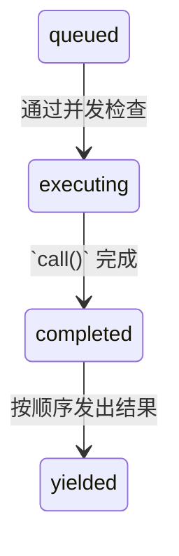

# 第 7 章：并发工具执行

## 等待的代价

第 6 章追踪了单次工具调用的生命周期，从 API 响应里的原始 `tool_use` 块，一路经过输入校验、权限检查、执行和结果格式化。那条管线处理的是一个工具。但模型很少只请求一个工具。

Claude Code 的典型交互里，每一轮都会有三到五个工具调用。“读这两个文件，grep 这个模式，然后改这个函数。” 模型会在同一个响应里把这些调用一次性发出来。如果每个工具要 200 毫秒，顺序执行就会多出整整 1 秒。如果 `Read` 和 `Grep` 彼此独立，而它们通常就是独立的，那么并行执行就能把时间压缩到 200 毫秒。五倍提升，等于白捡。

但并不是所有工具都彼此独立。修改 `config.ts` 的 `Edit` 不能和另一个也修改 `config.ts` 的 `Edit` 并发执行。创建目录的 Bash 命令，必须先于往这个目录里写文件的 Bash 命令完成。并发不是工具的全局属性，而是某个具体工具调用在具体输入下的属性。

这就是整个并发系统的核心洞见：**安全性按调用计算，不按工具类型计算。** `Bash("ls -la")` 可以并行，`Bash("rm -rf build/")` 不行。同一个工具，不同输入，不同并发分类。系统必须先看输入，再决定。

Claude Code 有两层并发优化。第一层是**批次编排**：模型响应完整收到后，把工具调用分成并发组和串行组，然后分别执行。第二层是**推测执行**：在模型还在流式输出响应时就先开始跑工具，等响应还没结束，结果可能已经回来了。这两层叠加，能把原本大部分耗在等待上的墙钟时间省掉。

---

## 分组算法

入口是 `toolOrchestration.ts` 里的 `partitionToolCalls()`。它接收一个有序的 `ToolUseBlock` 数组，并输出若干批次，每个批次要么是“全部可并发安全”，要么是“单个串行工具”。

```typescript
// Pseudocode — illustrates the partition algorithm
type Group = { parallel: boolean; calls: ToolCall[] }

function groupBySafety(calls: ToolCall[], registry: ToolRegistry): Group[] {
  return calls.reduce((groups, call) => {
    const def = registry.lookup(call.name)
    const input = def?.schema.safeParse(call.input)
    // Fail-closed: parse failure or exception → serial
    const safe = input?.success
      ? tryCatch(() => def.isParallelSafe(input.data), false)
      : false
    // Merge consecutive safe calls into one group
    if (safe && groups.at(-1)?.parallel) {
      groups.at(-1)!.calls.push(call)
    } else {
      groups.push({ parallel: safe, calls: [call] })
    }
    return groups
  }, [] as Group[])
}
```

算法会从左到右扫数组。每个工具调用都会经历这几步：

1. **按名称查找工具定义。**
2. **用工具的 Zod schema 通过 `safeParse()` 解析输入。** 如果解析失败，这个工具会保守地被判为不可并发安全。
3. **调用工具定义上的 `isConcurrencySafe(parsedInput)`。** 这一步就是按输入做分类的地方。Bash 工具会解析命令字符串，检查每个子命令是不是只读（`ls`、`grep`、`cat`、`git status`），只有整条复合命令都是纯读取时才返回 `true`。`Read` 工具永远返回 `true`。`Edit` 工具永远返回 `false`。这个调用会被 try-catch 包起来 - 如果 `isConcurrencySafe` 抛了异常（比如 Bash 命令字符串无法被 shell-quote 库解析），工具会退回到串行。
4. **合并或者新建批次。** 如果当前工具可并发安全，而且最近一个批次也是可并发安全，就追加进去；否则就新建一个批次。

结果是一串交替出现的批次：并发组、单个串行项、并发组、单个串行项。看一个具体例子：

```
Model requests: [Read, Read, Grep, Edit, Read]

Step 1: Read  → concurrent-safe → new batch {safe, [Read]}
Step 2: Read  → concurrent-safe → append   {safe, [Read, Read]}
Step 3: Grep  → concurrent-safe → append   {safe, [Read, Read, Grep]}
Step 4: Edit  → NOT safe        → new batch {serial, [Edit]}
Step 5: Read  → concurrent-safe → new batch {safe, [Read]}

Result: 3 batches
  Batch 1: [Read, Read, Grep]  — run concurrently
  Batch 2: [Edit]              — run alone
  Batch 3: [Read]              — run concurrently (just one tool)
```

分组策略是贪心且保序的。连续安全的工具会累积到同一个批次里。任何不安全的工具都会打断连续段并开启新批次。这意味着模型发出工具调用的顺序是有影响的 - 如果它在两个 Read 中间插了一个 Write，你得到的就会是三个批次，而不是两个。实际使用里，模型通常会把读操作聚在一起，这正是这个算法要优化的常见情况。

---

## 批次执行

`runTools()` generator 会遍历这些批次，并把每个批次派给合适的执行器。

### 并发批次

对于并发批次，`runToolsConcurrently()` 会用一个 `all()` 工具并行拉起所有工具，同时还会用一个上限控制活跃 generator 的数量：

```typescript
// Pseudocode — illustrates the concurrent dispatch pattern
async function* dispatchParallel(calls, context) {
  yield* boundedAll(
    calls.map(async function* (call) {
      context.markInProgress(call.id)
      yield* executeSingle(call, context)
      context.markComplete(call.id)
    }),
    MAX_CONCURRENCY,  // Default: 10
  )
}
```

并发上限默认是 10，可以通过 `CLAUDE_CODE_MAX_TOOL_USE_CONCURRENCY` 配置。10 已经很宽裕了 - 单次模型响应里你很少会看到超过 5 到 6 个工具调用。这个上限更像是给极端情况准备的安全阀，而不是日常约束。

`all()` 工具是 `Promise.all` 的 generator 版本，带有受限并发。它会同时启动最多 N 个 generator，谁先完成就先 yield 谁的结果，等一个结束了再启动下一个排队的 generator。机制上类似带信号量的任务池，只是适配了会产出中间结果的 async generator。

**上下文修改器排队** 是最微妙的部分。某些工具会产生*上下文修改器*，也就是会改变后续工具所见 `ToolUseContext` 的函数。当工具并发运行时，你不能立刻应用这些修改器，因为同一批里的其他工具还在读同一份上下文。于是修改器会按 tool use ID 收集到一个 map 里：

```typescript
const queuedContextModifiers: Record<
  string,
  ((context: ToolUseContext) => ToolUseContext)[]
> = {}
```

等整个并发批次结束后，这些修改器会按工具顺序而不是完成顺序应用，保证上下文演化是确定性的：

```typescript
for (const block of blocks) {
  const modifiers = queuedContextModifiers[block.id]
  if (!modifiers) continue
  for (const modifier of modifiers) {
    currentContext = modifier(currentContext)
  }
}
```

实际情况里，目前没有任何并发安全工具会产出上下文修改器 - 代码库里的注释也明确承认了这一点。但这个基础设施之所以存在，是因为工具可以由 MCP server 添加，而某个自定义的只读 MCP 工具完全可能希望修改上下文，比如更新一个“已见文件”集合。

### 串行批次

串行执行就直接得多。每个工具跑完后，它的上下文修改器会立刻应用，后面的工具会看到更新后的上下文：

```typescript
for (const toolUse of toolUseMessages) {
  for await (const update of runToolUse(toolUse, /* ... */)) {
    if (update.contextModifier) {
      currentContext = update.contextModifier.modifyContext(currentContext)
    }
    yield { message: update.message, newContext: currentContext }
  }
}
```

关键差别就在这里。串行工具可以改变世界，供后续工具使用。一个 Edit 会改文件，下一次 Read 会看到修改后的版本。一个 Bash 命令可以创建目录，下一条 Bash 命令就能往里面写。上下文修改器就是这种依赖关系的正式表达：它们告诉系统“执行环境已经变了，变化方式如下”。

---

## 流式工具执行器

批次编排解决的是模型响应到达之后多余的串行化问题。但更大的机会是：模型响应本身是流式到来的。一段典型的多工具响应可能要 2 到 3 秒才能完整到达，而第一条工具调用在 500 毫秒时就已经能解析了。为什么还要等剩下那 2 秒？

`StreamingToolExecutor` 类实现了推测执行。模型流式输出时，每个 `tool_use` 块一旦被完整解析，就立刻交给执行器。执行器会马上开始跑它 - 同时模型还在生成下一条工具调用。等响应流结束时，部分工具可能已经跑完了。

```mermaid
gantt
    title 顺序执行 vs 流式工具执行
    dateFormat X
    axisFormat %Ls

    section Sequential
    Model streams response     :a1, 0, 2500
    Tool 1 (0.2s)              :a2, after a1, 200
    Tool 2 (0.3s)              :a3, after a2, 300
    Tool 3 (0.1s)              :a4, after a3, 100

    section Streaming Executor
    Model streams response     :b1, 0, 2500
    Tool 1 starts at 0.5s      :b2, 500, 700
    Tool 2 starts at 1.2s      :b3, 1200, 1500
    Tool 3 drain after stream  :b4, 2500, 2600
```



顺序执行总耗时：3.1 秒。流式执行总耗时：2.6 秒 - 工具 1 和 2 都在流式输出期间完成了，省下了 16% 的墙钟时间。

省下来的时间会继续叠加。当模型请求五个只读工具，而响应又要流 3 秒时，这五个工具都可以在这 3 秒里启动并完成。流结束后的 drain 阶段几乎什么都不用做。用户会在模型最后一个字符出现后立刻看到结果。

### 工具生命周期

执行器跟踪的每个工具都会经历四个状态：



- **queued**：`tool_use` 块已经被解析并注册。等待并发条件允许执行。
- **executing**：工具的 `call()` 正在运行。结果先累积到缓冲区里。
- **completed**：执行完成。结果已经准备好发给对话。
- **yielded**：结果已经发出。终态。

### `addTool()`：在流式过程中排队

```typescript
addTool(block: ToolUseBlock, assistantMessage: AssistantMessage): void
```

流式响应解析器每次拿到一个完整 `tool_use` 块时，就会调用这个方法。它会：

1. 查找工具定义。如果没找到，会立刻创建一个 `completed` 条目并附上错误消息 - 没必要把一个不存在的工具继续排队。
2. 解析输入，并用和 `partitionToolCalls()` 相同的逻辑判断 `isConcurrencySafe`。
3. 推入一个状态为 `'queued'` 的 `TrackedTool`。
4. 调用 `processQueue()` - 它可能会马上启动这个工具。

对 `processQueue()` 的调用是 fire-and-forget（`void this.processQueue()`）。执行器不会等待它返回。这是故意的：`addTool()` 是在流式解析器的事件处理器里被调用的，如果在那里阻塞，响应解析就会停住。工具会在后台开始执行，而解析器继续吃流。

### `processQueue()`：准入检查

准入检查就是一个简单谓词：

```typescript
// Pseudocode — illustrates the mutual exclusion rule
canRun = noToolsRunning || (newToolIsSafe && allRunningAreSafe)
```

只有在以下条件之一满足时，工具才能开始执行：
- **当前没有任何工具在执行**（队列为空），或者
- **新工具以及所有正在执行的工具都安全可并发。**

这是一种互斥契约。不并发的工具需要独占访问 - 不能有别的东西同时跑。并发工具可以和其他并发工具共享跑道，但只要执行集合里出现一个非并发工具，所有人都得停。

`processQueue()` 会按顺序遍历所有工具。每个队列中的工具都会检查 `canExecuteTool()`。如果工具可以运行，就启动。如果一个非并发工具还不能运行，循环会 *break* - 直接停止检查后面的工具，因为非并发工具必须保持顺序。如果一个并发工具暂时不能运行（被正在执行的非并发工具挡住了），循环会 *continue* - 但实际中这通常没多大帮助，因为非并发阻塞后面的并发工具，多半本来就依赖它的结果。

### `executeTool()`：核心执行循环

这个方法里才是真正复杂的地方。它负责 abort controller、错误级联、进度报告和上下文修改器。

**子 abort controller。** 每个工具都会拿到自己的 `AbortController`，它是共享的同级 controller 的子级。

层级是三层：query 级 controller（归 REPL 管，用户 Ctrl+C 时触发）父级是 sibling controller（归流式执行器管，Bash 错误时触发），再往下才是每个工具自己的独立 controller。中止 sibling controller 会杀掉所有正在运行的工具。中止某个工具自己的 controller 只会杀掉它自己 - 但如果中止原因不是 sibling 错误，它还会向上冒泡到 query controller。这样可以防止系统悄悄丢掉执行器，比如权限拒绝本应结束整轮对话时。

这个向上冒泡对权限拒绝很关键。用户在权限对话框里拒绝某个工具时，这个工具的 abort controller 会触发。那个信号必须传回 query 循环，这样这一轮才会结束。否则 query 循环会像什么都没发生一样继续跑，把一条过时的拒绝消息发给模型。

**同级错误级联。** 当某个工具返回错误结果时，执行器会检查是否需要取消同级工具。规则是：**只有 Bash 错误会级联。** 当 shell 命令报错时，执行器会记录失败、抓取出错工具的描述，并中止 sibling controller，从而取消同一批里其他所有正在运行的工具。

这个理由很务实。Bash 命令经常形成隐式依赖链：`mkdir build && cp src/* build/ && tar -czf dist.tar.gz build/`。如果 `mkdir` 失败了，继续跑 `cp` 和 `tar` 没什么意义。立刻取消同级工具既省时间，也避免输出一堆让人困惑的错误消息。

相比之下，Read 和 Grep 的错误是彼此独立的。如果某个文件因为被删除而读取失败，这对并行搜索另一个目录的 grep 没任何影响。取消 grep 只会白白浪费工作。

错误级联会给同级工具生成合成错误消息：

```
Cancelled: parallel tool call Bash(mkdir build) errored
```

描述里会包含出错工具命令或文件路径的前 40 个字符，让模型有足够上下文理解哪里出了问题。

**进度消息** 和结果是分开处理的。结果会被缓冲并按顺序发出，而进度消息（像“正在读取文件...”或“正在搜索...”这样的状态更新）会进入 `pendingProgress` 数组，并通过 `getCompletedResults()` 立即发出。只要有新的进度到来，resolve callback 就会唤醒 `getRemainingResults()` 循环，这样 UI 在长时间工具运行时也不会看起来卡死。

**队列重跑。** 每个工具完成后，`processQueue()` 都会再次被调用：

```typescript
void promise.finally(() => {
  void this.processQueue()
})
```

这就是被并发批次挡住的串行工具怎么启动起来的。当最后一个并发工具结束后，后面的非并发工具的 `canExecuteTool()` 检查会通过，然后它就开始执行。

### 结果收割

流式执行器提供两个收割方法，分别对应响应生命周期的两个阶段。

**`getCompletedResults()` - 流中收割。** 这是一个同步 generator，会在流式 API 响应的 chunk 之间被调用。它按顺序遍历工具数组，吐出所有已经完成的工具结果：

`getCompletedResults()` 会按提交顺序遍历工具数组。对每个工具，它先排空任何待处理的进度消息。如果工具已经完成，它就 yield 结果并把它标记为 yielded。关键规则是：如果有一个非并发工具还在执行，遍历会 **break** - 它后面的一切都不能先发，即使后面的工具已经完成。串行工具之后的结果可能依赖于它的上下文修改，所以必须等待。对于并发工具，这个限制不存在；循环会跳过仍在执行的并发工具，继续检查后面的条目。

**`getRemainingResults()` - 流后 drain。** 模型响应完全收到后调用。这个 async generator 会循环直到所有工具都被 yield 出来：

`getRemainingResults()` 是流后 drain。它会一直循环，直到所有工具都发完。每一轮里，它都会先处理队列（启动任何新解锁的工具），然后通过 `getCompletedResults()` 发出已经完成的结果；如果还有工具在跑，但又没有新的结果完成，它就会用 `Promise.race` 进入空闲等待，等最先完成的那个：要么是某个正在执行工具的 promise，要么是一个进度可用信号。这样既避免了忙轮询，又能在有新事件时立刻醒来。如果没有工具完成，也没有任何新工具可以启动，执行器就会等待任何一个正在执行的工具结束（或者等待进度到来）。这避免了忙轮询，同时又能在有事情发生的瞬间立刻唤醒。

### 顺序保持

结果发出的顺序是工具*收到*的顺序，不是工具*完成*的顺序。这是刻意设计的。

假设模型响应请求了 `[Read("a.ts"), Read("b.ts"), Read("c.ts")]`。这三个工具都并发启动。`c.ts` 最先完成（它更小），然后是 `a.ts`，最后是 `b.ts`。如果按完成顺序发结果，对话里会变成：

```
Tool result: c.ts contents
Tool result: a.ts contents
Tool result: b.ts contents
```

但模型发它们的顺序是 a-b-c。对话历史必须符合模型的预期，不然下一轮它会搞不清哪个结果对应哪个请求。按到达顺序发出，才能保持对话连贯：

```
Tool result: a.ts contents  (completed second, yielded first)
Tool result: b.ts contents  (completed third, yielded second)
Tool result: c.ts contents  (completed first, yielded third)
```

代价不大：如果工具 1 很慢，而工具 2 到 5 都很快，那么快结果会在缓冲区里等到工具 1 完成。可替代方案——对话混乱——糟糕得多。

### `discard()`：流式 fallback 的逃生口

当 API 响应流中途失败（网络错误、server disconnect）时，系统会用新的 API 调用重试。但流式执行器可能已经从失败的那次尝试里启动了工具。这些结果现在成了孤儿 - 它们对应的是一段根本没完整收到的响应。

```typescript
discard(): void {
  this.discarded = true
}
```

把 `discarded = true` 之后会发生这些事：
- `getCompletedResults()` 立刻返回，不再吐任何结果。
- `getRemainingResults()` 立刻返回，不再吐任何结果。
- 任何新启动的工具都会先检查 `getAbortReason()`，看到 `streaming_fallback`，于是直接拿到一个合成错误，而不是继续真的跑下去。

这个被丢弃的执行器会被放弃，重试时会创建一个新的执行器。

---

## 工具并发属性

每个内建工具都会通过 `isConcurrencySafe()` 方法声明自己的并发特性。这个分类不是随便拍脑袋定的，它反映的是工具对共享状态的真实影响。

| 工具 | 并发安全 | 条件 | 原因 |
|------|----------|------|------|
| **Read** | 永远安全 | -- | 纯读取，没有副作用 |
| **Grep** | 永远安全 | -- | 纯读取，封装 ripgrep |
| **Glob** | 永远安全 | -- | 纯读取，文件列表操作 |
| **Fetch** | 永远安全 | -- | HTTP GET，没有本地副作用 |
| **WebSearch** | 永远安全 | -- | 调用搜索服务的 API |
| **Bash** | 有时安全 | 只有只读命令 | `isReadOnly()` 会解析命令并分类子命令。`ls`、`git status`、`cat`、`grep` 安全，`rm`、`mkdir`、`mv` 不安全。 |
| **Edit** | 从不安全 | -- | 会修改文件。两个并发编辑同一个文件会把它弄坏。 |
| **Write** | 从不安全 | -- | 创建或覆盖文件。同样会有损坏风险。 |
| **NotebookEdit** | 从不安全 | -- | 会修改 `.ipynb` 文件。 |

Bash 工具的分类值得展开。它会用 `splitCommandWithOperators()` 拆分复合命令（`&&`、`||`、`;`、`|`），再把每个子命令和已知安全集合比对：

- **搜索命令**：`grep`、`rg`、`find`、`fd`、`ag`、`ack`
- **读取命令**：`cat`、`head`、`tail`、`wc`、`jq`、`less`、`file`、`stat`
- **列表命令**：`ls`、`tree`、`du`、`df`
- **中性命令**：`echo`、`printf`（没有副作用，但也不算“读取”）

只有所有非中性子命令都属于搜索、读取或列表集合时，复合命令才算只读。`ls -la && cat README.md` 是安全的。`ls -la && rm -rf build/` 不是 - `rm` 会污染整条命令。

---

## 中断行为契约

工具执行时，用户可能输入新消息。应该怎么办？答案取决于工具。

每个工具都会声明一个 `interruptBehavior()` 方法，返回 `'cancel'` 或 `'block'`：

- **`'cancel'`**：立刻停止工具，丢弃部分结果，处理新的用户消息。适用于部分执行无害的工具（读取、搜索）。
- **`'block'`**：让工具继续跑完。用户的新消息会等待。适用于中断会让系统处于不一致状态的工具（执行中的写操作、长时间 Bash 命令）。这是默认值。

流式执行器会跟踪当前工具集合的可中断状态：

只有当所有正在执行的工具都支持取消时，这个集合才算可中断。只要有一个工具的中断行为是 `'block'`，整个集合就会被视为不可中断。

只有当所有执行中的工具都支持取消时，UI 才会显示“可中断”指示。只要有一个工具是 `'block'`，整个集合就会被视为不可中断。这个判断很保守，但正确：你没法有意义地中断一批里某个工具还会继续跑的场景。

当用户真的中断，而且所有工具都可取消时，abort controller 会带着 reason `'interrupt'` 触发。执行器的 `getAbortReason()` 会逐个检查工具的中断行为 - `'cancel'` 工具会拿到一个合成的 `user_interrupted` 错误，而 `'block'` 工具（在完全可中断集合里理论上不会出现，但代码还是处理了这个边界情况）会继续跑。

---

## 上下文修改器：只限串行的契约

上下文修改器是类型为 `(context: ToolUseContext) => ToolUseContext` 的函数。它们允许工具声明：“我已经改变了执行环境，后续工具需要知道。”

契约很简单：**上下文修改器只会应用到串行（非并发安全）工具上。** 源码里明确写了：

```typescript
// NOTE: we currently don't support context modifiers for concurrent
//       tools. None are actively being used, but if we want to use
//       them in concurrent tools, we need to support that here.
if (!tool.isConcurrencySafe && contextModifiers.length > 0) {
  for (const modifier of contextModifiers) {
    this.toolUseContext = modifier(this.toolUseContext)
  }
}
```

在批次编排路径（`toolOrchestration.ts`）里，并发批次的修改器会在批次结束后按工具提交顺序应用。这意味着同一批次里的并发工具彼此看不到对方的上下文变化，但它们后面的批次可以看到。

这种不对称是有意的。如果工具 A 改变了上下文，而工具 B 依赖这个上下文，它们之间就有数据依赖。只要存在数据依赖，就不能并发。按定义，两个并发安全的工具不应该依赖彼此的上下文修改。系统通过延迟应用来强制这一点。

---

## 应用到这里

Claude Code 的并发模式可以推广到任何编排多个独立操作的系统。值得提炼出三条原则。

**按安全性分组，而不是按类型分组。** `isConcurrencySafe(input)` 接收的是解析后的输入，而不是工具名。按每次调用分类，比静态声明“这个工具类型永远安全”更精确。你自己的系统里，也应该在决定是否并行之前先检查操作参数。数据库读可以并行，同一行上的数据库写不行。只看操作类型是不够的。

**在 I/O 等待期间做推测执行。** 流式执行器会在 API 响应还在路上的时候先跑工具。凡是存在“慢生产者、快消费者”的场景，都可以用同样模式：边生成后面的项，边处理前面的项。HTTP/2 server push、编译器管线并行、CPU 的推测执行，都有这个结构。关键要求是，你要能在完整指令集到达之前就识别出彼此独立的工作。

**结果必须保持提交顺序。** 按完成顺序发结果看起来很诱人，它能缩短第一条结果的延迟。但如果消费者（这里是语言模型）期望的是特定顺序，重排结果反而会制造混乱，最终花掉更多时间去消解。把已经完成的结果缓存起来，按请求顺序释放它们。实现代价只是一次简单数组遍历，正确性收益却是绝对的。

流式执行器模式对代理系统尤其强大。只要你的代理循环里存在“先思考，再行动”的周期，而且思考阶段会产出多个彼此独立的动作，你就能把思考尾部和行动头部重叠起来。节省的时间与思考时间 / 行动时间的比值成正比。对语言模型代理来说，思考时间（API 响应生成）往往占主导，所以收益很大。

---

## 小结

Claude Code 的并发系统分两层工作。分组算法 (`partitionToolCalls`) 会把连续的并发安全工具合并成可以并行执行的批次，同时把不安全工具隔离进串行批次，让每个工具都能看到前一个工具的效果。流式工具执行器 (`StreamingToolExecutor`) 更进一步：它会在模型响应流式到来时就推测启动工具，把工具执行和响应生成重叠起来。

安全模型是保守的，而且是刻意保守。并发安全性要通过检查解析后的输入来逐次调用判断。未知工具默认串行。解析失败默认串行。安全检查抛异常也默认串行。系统从来不会猜某件事“应该可以并行” - 工具必须明确声明它可以。

错误处理遵循工具之间的依赖结构。Bash 错误会级联到同级工具，因为 shell 命令经常形成隐式流水线。Read 和搜索错误则彼此隔离，因为它们是独立操作。abort controller 的层级 - query controller、sibling controller、单工具 controller - 让每一层都能取消自己的范围，而不会扰乱上层。

最终得到的是一个系统：它既能从模型的工具请求里榨出最大的并行度，又能保证对话历史始终反映一系列连贯、有序的动作。模型看到的结果顺序，和它请求时的顺序一致。用户看到工具完成的速度，则尽可能接近底层操作本身允许的极限。两者之间的差距 - 执行速度与展示顺序之间的差距 - 由缓冲来弥合，而这个缓冲恰恰是整个系统里最简单的部分。
