# 第 8 章：生成子智能体

## 智能的倍增

单个代理很强。它可以读文件、改代码、跑测试、搜网页，还能根据结果继续推理。但一个代理在一次对话里能做的事有硬上限：上下文窗口会被塞满，任务会分叉到需要不同能力的方向，而工具执行的串行性质会成为瓶颈。解决办法不是更大的模型，而是更多代理。

Claude Code 的子智能体系统允许模型请求帮助。当父代理遇到一个适合分派的任务时 - 比如不该污染主对话的代码库搜索、需要对抗式思考的验证步骤、或者可以并行执行的一组独立修改 - 它就会调用 `Agent` 工具。这个调用会生成一个子代：一个完全独立的代理，拥有自己的对话循环、自己的工具集、自己的权限边界和自己的 abort controller。子代完成工作后返回结果。父代理看不到子代内部的推理，只看到最终输出。

这不是一个方便功能。它是从并行文件探索，到 coordinator-worker 层级，再到多智能体 swarm 团队的整个架构基础。它全部通过两个文件流转：`AgentTool.tsx` 定义面向模型的接口，`runAgent.ts` 实现生命周期。

这个设计挑战并不小。子智能体必须有足够上下文才能把活干好，但又不能多到把 token 浪费在无关信息上。它必须有足够严格的权限边界来保证安全，但又不能严格到失去实用性。它必须有一套生命周期管理，能在不要求调用方记住清理什么的前提下，把触碰过的资源全部清理干净。而且这一切还要兼容一整套代理类型，从廉价、快速、只读的 Haiku 搜索器，到昂贵、细致、由 Opus 驱动、在后台跑对抗测试的验证代理。

本章会沿着“模型说我需要帮助”这条路径，追踪到一个完全可运行的子代理。我们会看模型能看到的工具定义、创建执行环境的十五步生命周期、六种内建代理类型及其优化目标、让用户定义自定义代理的 frontmatter 系统，以及由此抽象出来的设计原则。

先说明术语：本章里，“parent” 指调用 `Agent` 工具的代理，“child” 指被生成出来的代理。父代理通常（但不总是）是顶层 REPL 代理。在 coordinator 模式下，coordinator 会生成 worker，这些 worker 就是 child。在嵌套场景里，child 也可以继续生成 grandchild - 同样的生命周期会递归应用。

编排层大约横跨 40 个文件，分布在 `tools/AgentTool/`、`tasks/`、`coordinator/`、`tools/SendMessageTool/` 和 `utils/swarm/`。本章聚焦生成机制 - 即 AgentTool 定义和 runAgent 生命周期。下一章会讲运行时：进度跟踪、结果取回，以及多智能体协作模式。

---

## AgentTool 定义

`AgentTool` 以 `"Agent"` 这个名字注册，并保留了一个旧别名 `"Task"`，兼容老转录、权限规则和 hook 配置。它通过标准的 `buildTool()` 工厂构建，但它的 schema 比系统里任何其他工具都更动态。

### 输入 schema

输入 schema 是通过 `lazySchema()` 懒加载构建的 - 我们在第 6 章见过这个模式，它会把 zod 编译推迟到第一次使用时。这里有两层：基础 schema 和完整 schema，后者增加了多智能体和隔离参数。

基础字段始终存在：

| 字段 | 类型 | 必需 | 作用 |
|------|------|------|------|
| `description` | `string` | 是 | 任务的 3-5 词短摘要 |
| `prompt` | `string` | 是 | 这个代理要执行的完整任务描述 |
| `subagent_type` | `string` | 否 | 要用哪种专门代理 |
| `model` | `enum('sonnet','opus','haiku')` | 否 | 为这个代理覆盖模型 |
| `run_in_background` | `boolean` | 否 | 异步启动 |

完整 schema 还会在 swarm 功能开启时增加多智能体参数和隔离控制：

| 字段 | 类型 | 作用 |
|------|------|------|
| `name` | `string` | 让代理可以通过 `SendMessage({to: name})` 被定向发送消息 |
| `team_name` | `string` | 生成时的团队上下文 |
| `mode` | `PermissionMode` | 生成的队友所用的权限模式 |
| `isolation` | `enum('worktree','remote')` | 文件系统隔离策略 |
| `cwd` | `string` | 工作目录的绝对路径覆盖值 |

多智能体字段支撑的是第 9 章会讲到的 swarm 模式：命名代理可以在并发运行时通过 `SendMessage({to: name})` 相互发消息。隔离字段则保证文件系统安全：worktree 隔离会创建一个临时 git worktree，让代理在副本上操作，这样多个代理同时处理同一代码库时就不会互相冲突。

这个 schema 最特别的地方在于它会**根据特性标志动态变化**：

```typescript
// Pseudocode — illustrates the feature-gated schema pattern
inputSchema = lazySchema(() => {
  let schema = baseSchema()
  if (!featureEnabled('ASSISTANT_MODE')) schema = schema.omit({ cwd: true })
  if (backgroundDisabled || forkMode)    schema = schema.omit({ run_in_background: true })
  return schema
})
```

当 fork 实验开启时，`run_in_background` 会直接从 schema 中消失，因为那条路径下所有生成都被强制异步。当后台任务被禁用（通过 `CLAUDE_CODE_DISABLE_BACKGROUND_TASKS`）时，这个字段也会被删掉。当 KAIROS 特性标志关闭时，`cwd` 会被省略。模型看不到它不能用的字段。

这是一项微妙但重要的设计。schema 不只是校验，它还是模型的使用说明书。模型看到的每一个字段，都会写进工具定义里。删掉模型不该用的字段，比在 prompt 里加一句“不要用这个字段”更有效。模型看不到，就不会误用。

### 输出 schema

输出是一个 discriminated union，公开只有两个变体：

- `{ status: 'completed', prompt, ...AgentToolResult }` - 同步完成，返回代理的最终输出
- `{ status: 'async_launched', agentId, description, prompt, outputFile }` - 后台启动确认

另外还有两个内部变体（`TeammateSpawnedOutput` 和 `RemoteLaunchedOutput`），但它们没有导出到 schema，这样外部构建就能做 dead code elimination。对应特性标志关闭时，打包器会把这些变体及其代码路径一起剔除，让分发二进制更小。

`async_launched` 这个变体最值得注意的是它包含了 `outputFile` 路径 - 代理完成后结果会写到这里。这样父级（或其他消费者）就能轮询或监视这个文件拿结果，从而获得一种基于文件系统的通信通道，即使进程重启也不会丢。

### 动态 prompt

`AgentTool` 的 prompt 由 `getPrompt()` 生成，并且是上下文敏感的。它会根据可用代理列表（内联展示，或者作为附件展示，以免破坏 prompt cache）、fork 是否启用（会附加“何时 fork”的指导）、会话是否处于 coordinator 模式（prompt 会更精简，因为 coordinator 的系统提示已经覆盖了用法），以及订阅层级来调整。非 Pro 用户还会看到一条关于同时启动多个代理的提示。

基于附件的代理列表值得特别强调。代码里的注释提到，大约 10.2% 的 fleet cache_creation tokens 是动态工具描述导致的。把代理列表从工具描述挪到附件消息里，可以让工具描述保持静态，这样连接一个 MCP server 或加载一个插件时，不会让后续每次 API 调用都失去 prompt cache。

这对任何使用动态工具定义的系统来说，都是值得记住的模式。Anthropic API 会缓存 prompt 前缀 - system prompt、工具定义和对话历史 - 并在后续请求里复用那些前缀相同的计算。如果工具定义在两次 API 调用之间变化了（因为新增了代理，或者接入了一个 MCP server），整个缓存就会失效。把易变内容从工具定义（缓存前缀的一部分）移到附件消息（缓存部分之后追加）里，既保留了缓存，又能把信息传给模型。

理解了工具定义之后，我们就可以追踪模型真的调用它时会发生什么。

### 特性门控

子智能体系统是代码库里特性门控最复杂的部分。至少有十二个特性标志和 GrowthBook 实验在控制哪些代理可用、哪些参数出现在 schema 里、以及会走哪些代码路径：

| 特性门 | 控制内容 |
|--------|----------|
| `FORK_SUBAGENT` | Fork 代理路径 |
| `BUILTIN_EXPLORE_PLAN_AGENTS` | Explore 和 Plan 代理 |
| `VERIFICATION_AGENT` | 验证代理 |
| `KAIROS` | `cwd` 覆盖、assistant 强制异步 |
| `TRANSCRIPT_CLASSIFIER` | 交接分类、`auto` 模式覆盖 |
| `PROACTIVE` | 主动模块集成 |

每个门要么使用 Bun 的 dead code elimination 系统里的 `feature()`（编译期），要么使用 GrowthBook 的 `getFeatureValue_CACHED_MAY_BE_STALE()`（运行时 A/B 测试）。编译期门控会在构建时通过字符串替换完成 - 当 `FORK_SUBAGENT` 是 `'ant'` 时，整个 fork 代码路径会被包含进来；当它是 `'external'` 时，相关代码可能会被完全排除。GrowthBook 门控则允许在线实验：`tengu_amber_stoat` 可以 A/B 测试移除 Explore 和 Plan 代理是否会改变用户行为，而无需发布新二进制。

### `call()` 决策树

在 `runAgent()` 被真正调用之前，`AgentTool.tsx` 里的 `call()` 方法会先把请求导入一个决策树，判断*要生成哪种*代理，以及*如何*生成：

```
1. Is this a teammate spawn? (team_name + name both set)
   YES -> spawnTeammate() -> return teammate_spawned
   NO  -> continue

2. Resolve effective agent type
   - subagent_type provided -> use it
   - subagent_type omitted, fork enabled -> undefined (fork path)
   - subagent_type omitted, fork disabled -> "general-purpose" (default)

3. Is this the fork path? (effectiveType === undefined)
   YES -> Recursive fork guard check -> Use FORK_AGENT definition

4. Resolve agent definition from activeAgents list
   - Filter by permission deny rules
   - Filter by allowedAgentTypes
   - Throw if not found or denied

5. Check required MCP servers (wait up to 30s for pending)

6. Resolve isolation mode (param overrides agent def)
   - "remote" -> teleportToRemote() -> return remote_launched
   - "worktree" -> createAgentWorktree()
   - null -> normal execution

7. Determine sync vs async
   shouldRunAsync = run_in_background || selectedAgent.background ||
                    isCoordinator || forceAsync || isProactiveActive

8. Assemble worker tool pool

9. Build system prompt and prompt messages

10. Execute (async -> registerAsyncAgent + void lifecycle; sync -> iterate runAgent)
```

第 1 到第 6 步都是纯路由 - 这时还没有真正创建代理。真正的生命周期从 `runAgent()` 开始，同步路径会直接迭代它，异步路径则通过 `runAsyncAgentLifecycle()` 包一层。

把路由放在 `call()` 而不是 `runAgent()` 里是有原因的：`runAgent()` 是一个纯生命周期函数，它不需要知道 teammate、远程代理或者 fork 实验。它只接收已经解析好的代理定义并执行。该用哪个定义、如何隔离代理、是否要同步运行，这些都属于上层决策。这样的分层让 `runAgent()` 更容易测试，也更容易复用 - 它既会被正常的 AgentTool 路径调用，也会被异步生命周期包装器在恢复后台代理时调用。

第 3 步里的 fork guard 值得注意。fork 子代会把 `Agent` 工具留在自己的工具池里（这样和父级的工具定义可以完全相同，便于缓存命中），但递归 fork 会非常危险。这里有两道防线：`querySource === 'agent:builtin:fork'`（在子代的上下文选项里设置，压缩后仍然保留）以及 `isInForkChild(messages)`（作为兜底，扫描对话历史里有没有 `<fork-boilerplate>` 标签）。一个快而可靠，另一个兜边界情况：万一 `querySource` 没有被正确传递，就靠这个 fallback 把 recursion 兜住。

---

## `runAgent` 生命周期

`runAgent()` 在 `runAgent.ts` 里，是一个驱动子智能体完整生命周期的 async generator。它会在代理工作时 yield `Message` 对象。每一个子智能体 - fork、内建、自定义、协调者 worker - 都会走进这一个函数。这个函数大约 400 行，每一行都有存在理由。

函数签名本身就说明了问题有多复杂：

```typescript
export async function* runAgent({
  agentDefinition,       // What kind of agent
  promptMessages,        // What to tell it
  toolUseContext,        // Parent's execution context
  canUseTool,           // Permission callback
  isAsync,              // Background or blocking?
  canShowPermissionPrompts,
  forkContextMessages,  // Parent's history (fork only)
  querySource,          // Origin tracking
  override,             // System prompt, abort controller, agent ID overrides
  model,                // Model override from caller
  maxTurns,             // Turn limit
  availableTools,       // Pre-assembled tool pool
  allowedTools,         // Permission scoping
  onCacheSafeParams,    // Callback for background summarization
  useExactTools,        // Fork path: use parent's exact tools
  worktreePath,         // Isolation directory
  description,          // Human-readable task description
  // ...
}: { ... }): AsyncGenerator<Message, void>
```

十七个参数。每一个都代表生命周期需要处理的一个变化维度。这不是过度设计，而是一个函数同时服务 fork 代理、内建代理、自定义代理、同步代理、异步代理、worktree 隔离代理和协调者 worker 的自然结果。替代方案会是七个不同的生命周期函数，逻辑重复得更厉害。

`override` 对象尤其重要 - 它是 fork 代理和恢复中的代理的逃生口，允许它们把预先计算好的值（system prompt、abort controller、agent ID）注入生命周期，而不用重新推导。

下面是十五个步骤。

### 第 1 步：模型解析

```typescript
const resolvedAgentModel = getAgentModel(
  agentDefinition.model,                    // Agent's declared preference
  toolUseContext.options.mainLoopModel,      // Parent's model
  model,                                    // Caller's override (from input)
  permissionMode,                           // Current permission mode
)
```

解析链是：**调用方覆盖 > 代理定义 > 父级模型 > 默认值**。`getAgentModel()` 会处理像 `'inherit'` 这样的特殊值（使用父级所用模型），也会处理某些代理类型受 GrowthBook 门控的覆盖值。比如 Explore 代理在外部用户那里默认用 Haiku - 这是最便宜、最快的模型，适合一个只读搜索专员，而这种专员每周会跑 3400 万次。

顺序之所以重要，是因为调用方（父级模型）可以通过工具调用里的 `model` 参数覆盖代理定义里的偏好。这使得父级可以把一个平时很便宜的代理临时升级到更强的模型，用来处理特别复杂的搜索；也可以在任务简单时把昂贵代理降级。但代理定义里的模型是默认值，不是父级的模型 - 不能因为没人显式指定，Haiku 版 Explore 就不小心继承成父级的 Opus。

理解这条模型解析链很重要，因为它确立了一个贯穿整个生命周期的设计原则：**显式覆盖优先于声明，声明优先于继承，继承优先于默认值。** 权限模式、abort controller 和 system prompt 也都遵循同样原则。这个一致性让系统可预测 - 你理解了一条解析链，就理解了所有链。

### 第 2 步：创建代理 ID

```typescript
const agentId = override?.agentId ? override.agentId : createAgentId()
```

代理 ID 的格式是 `agent-<hex>`，其中 hex 部分来自 `crypto.randomUUID()`。品牌化类型 `AgentId` 可以在类型层面防止把字符串搞混。覆盖路径是给恢复中的代理保留原始 ID 用的，这样转录才连续。

### 第 3 步：准备上下文

fork 代理和新建代理从这里开始分叉：

```typescript
const contextMessages: Message[] = forkContextMessages
  ? filterIncompleteToolCalls(forkContextMessages)
  : []
const initialMessages: Message[] = [...contextMessages, ...promptMessages]

const agentReadFileState = forkContextMessages !== undefined
  ? cloneFileStateCache(toolUseContext.readFileState)
  : createFileStateCacheWithSizeLimit(READ_FILE_STATE_CACHE_SIZE)
```

对 fork 代理来说，父级的整段对话历史会被克隆进 `contextMessages`。但这里有一个关键过滤：`filterIncompleteToolCalls()` 会把没有匹配 `tool_result` 的 `tool_use` 块删掉。不做这个过滤，API 会拒绝这段不合法的对话。这通常发生在父代理 fork 的那一刻刚好还在执行工具 - `tool_use` 已经发出来了，但结果还没回来。

文件状态缓存也遵循同样的 fork-or-fresh 模式。fork 子代会拿到父级缓存的副本（它们已经“知道”哪些文件被读过了）。新代理则从空缓存开始。这个副本是浅拷贝 - 文件内容字符串通过引用共享，而不是复制多份。这对内存很重要：一个带着 50 个文件缓存的 fork 子代，不会复制 50 份文件内容，只会复制 50 个指针。LRU 淘汰行为则是独立的 - 每个缓存都按自己的访问模式驱逐内容。

### 第 4 步：剥离 `CLAUDE.md`

像 Explore 和 Plan 这样的只读代理在定义里会设置 `omitClaudeMd: true`：

```typescript
const shouldOmitClaudeMd =
  agentDefinition.omitClaudeMd &&
  !override?.userContext &&
  getFeatureValue_CACHED_MAY_BE_STALE('tengu_slim_subagent_claudemd', true)
const { claudeMd: _omittedClaudeMd, ...userContextNoClaudeMd } = baseUserContext
const resolvedUserContext = shouldOmitClaudeMd
  ? userContextNoClaudeMd
  : baseUserContext
```

`CLAUDE.md` 文件包含项目特定指令，比如提交信息、PR 规范、lint 规则和编码标准。只读搜索代理根本不需要这些 - 它不能提交，不能发 PR，不能改文件。父代理已经有完整上下文，会负责解释搜索结果。把 CLAUDE.md 从这里剥离，每周能为整个 fleet 节省数十亿 token - 这个聚合成本足以证明条件注入带来的复杂度是值得的。

同样，Explore 和 Plan 代理也会从系统上下文里剥离 `gitStatus`。会话开始时捕获的 git status 快照最多可达 40KB，而且还明确标记为过时。如果这些代理真的需要 git 信息，它们可以自己跑 `git status`，拿到最新数据。

这不是过早优化。Explore 每周 3400 万次 spawn，任何不必要的 token 都会累积成可观成本。这个 kill-switch（`tengu_slim_subagent_claudemd`）默认开启，但如果剥离策略引发回归，可以通过 GrowthBook 翻转。

### 第 5 步：权限隔离

这是最复杂的一步。每个代理都会拿到一个定制的 `getAppState()` 包装器，把它自己的权限配置覆盖到父级状态之上：

```typescript
const agentGetAppState = () => {
  const state = toolUseContext.getAppState()
  let toolPermissionContext = state.toolPermissionContext

  // Override mode unless parent is in bypassPermissions, acceptEdits, or auto
  if (agentPermissionMode && canOverride) {
    toolPermissionContext = {
      ...toolPermissionContext,
      mode: agentPermissionMode,
    }
  }

  // Auto-deny prompts for agents that can't show UI
  const shouldAvoidPrompts =
    canShowPermissionPrompts !== undefined
      ? !canShowPermissionPrompts
      : agentPermissionMode === 'bubble'
        ? false
        : isAsync
  if (shouldAvoidPrompts) {
    toolPermissionContext = {
      ...toolPermissionContext,
      shouldAvoidPermissionPrompts: true,
    }
  }

  // Scope tool allow rules
  if (allowedTools !== undefined) {
    toolPermissionContext = {
      ...toolPermissionContext,
      alwaysAllowRules: {
        cliArg: state.toolPermissionContext.alwaysAllowRules.cliArg,
        session: [...allowedTools],
      },
    }
  }

  return { ...state, toolPermissionContext, effortValue }
}
```

这里叠了四件不同的事：

**权限模式级联。** 如果父级在 `bypassPermissions`、`acceptEdits` 或 `auto` 模式下，父级模式永远优先 - 代理定义不能把它削弱。否则会应用代理定义里的 `permissionMode`。这样可以避免自定义代理在用户已经为会话设定了宽松模式时，把安全级别偷偷降下去。

**避免弹窗。** 后台代理不能弹权限对话框 - 它没有终端。所以 `shouldAvoidPermissionPrompts` 会被设成 `true`，这样权限系统会自动拒绝，而不是阻塞。例外是 `bubble` 模式：这类代理会把提示上浮到父级终端，所以无论同步/异步状态如何，它都能弹窗。

**自动检查顺序。** 能弹窗的后台代理（bubble 模式）会设置 `awaitAutomatedChecksBeforeDialog`。这表示先跑分类器和权限 hooks，只有自动化处理失败时才会打扰用户。对于后台工作来说，多等一秒分类器完全可以接受 - 不应该无谓地打断用户。

**工具权限范围控制。** 提供 `allowedTools` 时，它会完全覆盖会话级 allow 规则。这样可以防止父级批准泄漏到受限代理里。但 SDK 级权限（来自 `--allowedTools` CLI flag）会保留下来 - 那代表的是嵌入应用显式定义的安全策略，应该全局生效。

### 第 6 步：工具解析

```typescript
const resolvedTools = useExactTools
  ? availableTools
  : resolveAgentTools(agentDefinition, availableTools, isAsync).resolvedTools
```

fork 代理使用 `useExactTools: true`，直接把父级的工具数组原样传过来。这不只是方便 - 这是缓存优化。不同工具定义的序列化方式不同（不同权限模式会产出不同的工具元数据），只要工具块有任何偏离，prompt cache 就会失效。fork 子代需要字节级一致的前缀。

对于普通代理，`resolveAgentTools()` 会做分层过滤：
- `tools: ['*']` 表示所有工具；`tools: ['Read', 'Bash']` 表示只有这些
- `disallowedTools: ['Agent', 'FileEdit']` 会把这些工具移出池子
- 内建代理和自定义代理有不同的基础禁用列表
- 异步代理会再经过 `ASYNC_AGENT_ALLOWED_TOOLS` 过滤

结果就是每种代理都拿到自己该有的工具。Explore 不能调用 FileEdit。Verification 不能调用 Agent（验证器不能再递归生成别的代理）。自定义代理的默认禁用列表比内建代理更严格。

### 第 7 步：系统提示

```typescript
const agentSystemPrompt = override?.systemPrompt
  ? override.systemPrompt
  : asSystemPrompt(
      await getAgentSystemPrompt(
        agentDefinition, toolUseContext,
        resolvedAgentModel, additionalWorkingDirectories, resolvedTools
      )
    )
```

fork 代理通过 `override.systemPrompt` 接收父级预渲染好的系统提示。这个值来自 `toolUseContext.renderedSystemPrompt` - 也就是父级上一次 API 调用里使用的确切字节。如果重新调用 `getSystemPrompt()`，结果可能不一样。GrowthBook 特性在父级调用和子级启动之间可能已经从 cold 变 warm。只要系统提示里某个条件块因为这个标志变化了哪怕一个字符，整个 prompt cache 前缀就会失效。

对普通代理来说，`getAgentSystemPrompt()` 会调用代理定义里的 `getSystemPrompt()`，然后再补上环境细节 - 绝对路径、emoji 指导（Claude 在某些场景里会过度使用 emoji），以及模型相关指令。

### 第 8 步：隔离 abort controller

```typescript
const agentAbortController = override?.abortController
  ? override.abortController
  : isAsync
    ? new AbortController()
    : toolUseContext.abortController
```

这三行对应三种行为：

- **覆盖**：用于恢复后台代理或特殊生命周期管理。优先级最高。
- **异步代理拿新的、独立的 controller。** 用户按 Escape 时，父级的 abort controller 会触发。异步代理应该不受影响 - 它们是用户已经委托出去的后台工作。独立 controller 意味着它们会继续跑。
- **同步代理共享父级 controller。** Escape 会把两者都杀掉。子代理在阻塞父级；如果用户要停，通常就是要全部停。

这个决定看上去很直观，但如果错了会很糟糕。异步代理如果会跟着父级一起 abort，那么用户每次按 Escape 只是想继续问问题时，它都会丢掉所有工作。同步代理如果无视父级的 abort，用户就只能盯着一个冻结的终端。

### 第 9 步：注册 hooks

```typescript
if (agentDefinition.hooks && hooksAllowedForThisAgent) {
  registerFrontmatterHooks(
    rootSetAppState, agentId, agentDefinition.hooks,
    `agent '${agentDefinition.agentType}'`, true
  )
}
```

代理定义可以在 frontmatter 里声明自己的 hooks（PreToolUse、PostToolUse 等）。这些 hooks 通过 `agentId` 作用域化到代理生命周期里 - 只会在这一个代理的工具调用里触发，并且在代理结束时会在 `finally` 块中自动清理。

最后一个 `true` 参数，也就是 `isAgent: true` 标志，会把 `Stop` hooks 转成 `SubagentStop` hooks。子智能体触发的是 `SubagentStop`，不是 `Stop`，所以做这个转换才能让 hooks 在正确事件上触发。

这里的安全性也很重要。当 hooks 开启 `strictPluginOnlyCustomization` 时，只有插件、内建以及 policy-settings 代理的 hooks 会被注册。用户控制的代理（来自 `.claude/agents/`）其 hooks 会被悄悄跳过。这能防止恶意或配置错误的代理定义注入绕过安全控制的 hooks。

### 第 10 步：预加载 skills

```typescript
const skillsToPreload = agentDefinition.skills ?? []
if (skillsToPreload.length > 0) {
  const allSkills = await getSkillToolCommands(getProjectRoot())
  // resolve names, load content, prepend to initialMessages
}
```

代理定义可以在 frontmatter 里声明 `skills: ["my-skill"]`。解析时会尝试三种策略：精确匹配、以代理插件名为前缀的匹配（比如 `"my-skill"` 变成 `"plugin:my-skill"`），以及针对插件命名空间 skill 的 `":skillName"` 后缀匹配。这三种策略确保无论代理作者使用完整名、短名还是插件相对名，skill 引用都能正常工作。

加载后的 skills 会变成预先插入代理对话的 user messages。也就是说，代理会在看到任务 prompt 之前先“读”这些 skill 指令 - 这和主 REPL 里的 slash command 使用的是同一种机制，只不过这里被改造成了自动 skill 注入。多个 skills 会通过 `Promise.all()` 并发加载，以尽量降低启动延迟。

### 第 11 步：MCP 初始化

```typescript
const { clients: mergedMcpClients, tools: agentMcpTools, cleanup: mcpCleanup } =
  await initializeAgentMcpServers(agentDefinition, toolUseContext.options.mcpClients)
```

代理可以在 frontmatter 里声明自己的 MCP server，这些 server 会在父级客户端基础上做增量添加。支持两种形式：

- **按名称引用**：`"slack"` 会查找已有的 MCP 配置，并拿到共享的、已 memoized 的 client
- **内联定义**：`{ "my-server": { command: "...", args: [...] } }` 会创建一个新的 client，代理结束时会清理它

只有新建的（内联）client 会被清理。共享 client 会在父级层面 memoize，并在代理生命周期之外继续存在。这样就不会出现某个代理顺手把别的代理或父级还在用的 MCP 连接拆掉的问题。

MCP 初始化发生在 hook 注册和 skill 预加载之后，但在上下文创建之前。顺序很重要：MCP 工具必须先合并进工具池，然后 `createSubagentContext()` 才会把工具快照进代理的选项里。要是顺序调反了，代理要么拿不到 MCP 工具，要么工具有了但不在自己的工具池里。

### 第 12 步：创建上下文

```typescript
const agentToolUseContext = createSubagentContext(toolUseContext, {
  options: agentOptions,
  agentId,
  agentType: agentDefinition.agentType,
  messages: initialMessages,
  readFileState: agentReadFileState,
  abortController: agentAbortController,
  getAppState: agentGetAppState,
  shareSetAppState: !isAsync,
  shareSetResponseLength: true,
  criticalSystemReminder_EXPERIMENTAL:
    agentDefinition.criticalSystemReminder_EXPERIMENTAL,
  contentReplacementState,
})
```

`utils/forkedAgent.ts` 里的 `createSubagentContext()` 会组装新的 `ToolUseContext`。关键的隔离决策是：

- **同步代理与父级共享 `setAppState`。** 状态变化（比如权限批准）会立即对双方可见。用户看到的是一份统一状态。
- **异步代理拿到隔离的 `setAppState`。** 父级那一份对孩子的写入是 no-op。但 `setAppStateForTasks` 会直达 root store - 子代理仍然可以更新任务状态（进度、完成情况），让 UI 感知到。
- **两者都共享 `setResponseLength`**，用于响应指标跟踪。
- **fork 代理会继承 `thinkingConfig`**，以便构造字节一致的 API 请求。普通代理则拿 `{ type: 'disabled' }` - 为了控制输出成本，thinking（扩展推理 token）被禁用。父级付 reasoning 的钱，子代负责执行。

`createSubagentContext()` 值得研究的地方就在于它是怎么“隔离”与“共享”之间做取舍的。边界不是非黑即白，而是一组精心挑选的共享通道和隔离通道：

| 关注点 | 同步代理 | 异步代理 |
|--------|----------|----------|
| `setAppState` | 共享（父级能看到变化） | 隔离（父级那份是 no-op） |
| `setAppStateForTasks` | 共享 | 共享（任务状态必须回到 root） |
| `setResponseLength` | 共享 | 共享（指标需要全局视图） |
| `readFileState` | 自己的缓存 | 自己的缓存 |
| `abortController` | 父级的 | 独立的 |
| `thinkingConfig` | fork：继承 / 普通：禁用 | fork：继承 / 普通：禁用 |
| `messages` | 自己的数组 | 自己的数组 |

`setAppState`（异步时隔离）和 `setAppStateForTasks`（始终共享）之间的不对称，是一个关键设计决策。异步代理不能把状态变化推到父级的响应式 store 里 - 那会让父级 UI 突然跳动。但它仍然必须能更新全局任务注册表，因为父级就是靠这个知道后台代理已经完成的。这个拆分通道同时满足了两种需求。

### 第 13 步：缓存安全参数回调

```typescript
if (onCacheSafeParams) {
  onCacheSafeParams({
    systemPrompt: agentSystemPrompt,
    userContext: resolvedUserContext,
    systemContext: resolvedSystemContext,
    toolUseContext: agentToolUseContext,
    forkContextMessages: initialMessages,
  })
}
```

这个回调被后台摘要服务消费。当异步代理在运行时，摘要服务可以 fork 这个代理的对话 - 用这些精确参数构造一个字节一致的前缀 - 然后周期性地产出进度摘要，而不会打扰主对话。之所以叫“cache-safe”，是因为它们会生成和代理本身一样的 API 请求前缀，最大化缓存命中。

### 第 14 步：查询循环

```typescript
try {
  for await (const message of query({
    messages: initialMessages,
    systemPrompt: agentSystemPrompt,
    userContext: resolvedUserContext,
    systemContext: resolvedSystemContext,
    canUseTool,
    toolUseContext: agentToolUseContext,
    querySource,
    maxTurns: maxTurns ?? agentDefinition.maxTurns,
  })) {
    // Forward API request starts for metrics
    // Yield attachment messages
    // Record to sidechain transcript
    // Yield recordable messages to caller
  }
}
```

第 3 章里的同一个 `query()` 函数驱动着子智能体的对话。子智能体的消息会回流给调用方 - 同步代理由 `AgentTool.call()` 直接迭代这个 generator，异步代理则由 `runAsyncAgentLifecycle()` 在分离的异步上下文里消费。

每条 yield 出来的消息都会通过 `recordSidechainTranscript()` 记录到 sidechain transcript 里 - 那是一个按代理分开的 append-only JSONL 文件。这样就支持恢复：如果会话中断，代理可以从自己的转录里重建出来。记录是每条消息 `O(1)` 的，只追加新消息，并保留前一个 UUID 的引用以维持链路连续性。

### 第 15 步：清理

`finally` 块会在正常完成、abort 或出错时运行。它是代码库里最彻底的清理序列：

```typescript
finally {
  await mcpCleanup()                              // Tear down agent-specific MCP servers
  clearSessionHooks(rootSetAppState, agentId)      // Remove agent-scoped hooks
  cleanupAgentTracking(agentId)                    // Prompt cache tracking state
  agentToolUseContext.readFileState.clear()        // Release file state cache memory
  initialMessages.length = 0                        // Release fork context (GC hint)
  unregisterPerfettoAgent(agentId)                // Perfetto trace hierarchy
  clearAgentTranscriptSubdir(agentId)             // Transcript subdir mapping
  rootSetAppState(prev => {                        // Remove agent's todo entries
    const { [agentId]: _removed, ...todos } = prev.todos
    return { ...prev, todos }
  })
  killShellTasksForAgent(agentId, ...)             // Kill orphaned bash processes
}
```

代理运行期间触碰过的每个子系统，都会在这里被清理：MCP 连接、hooks、缓存跟踪、文件状态、Perfetto tracing、todo 条目，以及孤儿 shell 进程。注释里提到“whale sessions”会生成几百个代理，这很说明问题 - 如果没有这一步，每个代理都会留下小泄漏，长会话里就会累积成明显的内存压力。

`initialMessages.length = 0` 这一行是手动 GC 提示。对 fork 代理来说，`initialMessages` 里装着父级的整段对话历史。把 length 置零就释放了这些引用，方便垃圾回收器回收内存。在一个 20 万 token 的上下文里 spawn 五个 fork 子代时，这相当于每个子代都多复制了一大块消息对象。

这里能学到一条长期运行代理系统里的资源管理经验。每一个清理步骤都在处理不同类型的泄漏：MCP 连接（文件描述符）、hooks（应用状态 store 里的内存）、文件状态缓存（内存中的文件内容）、Perfetto 注册（tracing 元数据）、todo 条目（响应式状态 key）、shell 进程（操作系统级进程）。代理在生命周期里会触碰许多子系统，而每个子系统都必须在代理结束时得到通知。`finally` 块就是所有这些通知的唯一汇合点，而 generator 协议保证它一定会执行。这就是为什么 generator 架构不仅仅是方便，而是正确性要求。

### generator 链

在看内建代理类型之前，先退一步看看支撑这一切的结构模式。整个子智能体系统都建立在 async generator 上。链路是这样的：

```mermaid
graph TD
    subgraph Sync Path
        S1[AgentTool.call] -->|iterates inline| S2[runAgent generator]
        S2 -->|yield* query| S3[Child query loop]
        S3 -->|messages| S2
        S2 -->|final result| S1
        S1 -->|tool_result| S4[Parent query loop]
    end

    subgraph Async Path
        A1[AgentTool.call] -->|detaches| A2[runAsyncAgentLifecycle]
        A2 -->|wraps| A3[runAgent generator]
        A3 -->|yield* query| A4[Child query loop]
        A1 -->|immediate return| A5[Parent continues]
        A4 -->|completion| A6[Task notification]
        A6 -->|injected| A5
    end

    subgraph Fork Path
        F1[AgentTool.call] -->|detaches, forced async| F2[runAsyncAgentLifecycle]
        F2 -->|wraps| F3[runAgent generator]
        F3 -->|yield* query with\nbyte-identical prefix| F4[Child query loop]
        F1 -->|immediate return| F5[Parent continues]
        F4 -->|completion| F6[Task notification]
    end
```



这种基于 generator 的架构带来了四个关键能力：

**流式传输。** 消息会逐步穿过整个系统。父级（或异步生命周期包装器）可以在每条消息生成时就观察到它 - 更新进度指示器、转发指标、记录转录 - 而不必缓冲整段对话。

**取消。** 返回 async iterator 会触发 `runAgent()` 的 `finally` 块。不管代理是正常完成、被用户中断，还是抛错，十五步清理都会执行。JavaScript 的 async generator 协议保证了这一点。

**后台化。** 一个运行太久的同步代理可以在执行中途切到后台。iterator 会从前台（`AgentTool.call()` 正在迭代它）交给异步上下文（`runAsyncAgentLifecycle()` 接手）继续驱动。代理不会重启，只是接着原来的位置跑。

**进度跟踪。** 每一次 yield 出来的消息，都是一个观测点。异步生命周期包装器利用这些观测点更新任务状态机、计算进度百分比，并在代理完成时生成通知。

---

## 内建代理类型

内建代理通过 `builtInAgents.ts` 里的 `getBuiltInAgents()` 注册。这个注册表是动态的 - 哪些代理可用，取决于特性标志、GrowthBook 实验以及会话的入口类型。系统随附六种内建代理，每一种都针对某类具体工作做了优化。

### 通用代理

当 `subagent_type` 被省略，而且 fork 没有激活时，它就是默认代理。拥有完整工具访问，不省略 `CLAUDE.md`，模型由 `getDefaultSubagentModel()` 决定。它的系统提示会把它定位成一个以完成为导向的 worker：“把任务完整做完 - 不要过度包装，但也不要做一半就停。”

这是最主要的干活角色。当模型不知道自己需要哪种代理时，就会拿到一个通用代理，它能做父级能做的一切，只是不能再生成自己的子智能体。这个“不能再生成”的限制很重要：没有它，通用子代理可能会继续生成自己的孩子，而孩子又生成孩子，结果会形成指数级扩散，几秒钟就把 API 预算烧穿。`Agent` 工具被放进默认禁用列表是有充分理由的。

### Explore

一个只读搜索专员。使用 Haiku（最便宜、最快的模型）。省略 `CLAUDE.md` 和 git status。`FileEdit`、`FileWrite`、`NotebookEdit` 和 `Agent` 都会从它的工具池里移除，并且这项限制既在工具层面强制，也在系统提示里的 `=== CRITICAL: READ-ONLY MODE ===` 段落里明确说明。

Explore 是所有内建代理里优化得最激进的，因为它也是被生成得最频繁的 - 整个 fleet 每周 3400 万次。它被标记为 one-shot 代理（`ONE_SHOT_BUILTIN_AGENT_TYPES`），这意味着它的 prompt 里会跳过 agentId、SendMessage 说明和使用尾注，每次调用大约能省下 135 个字符。按每周 3400 万次算，这 135 个字符大约等于每周节省 46 亿个 prompt token。

可用性由 `BUILTIN_EXPLORE_PLAN_AGENTS` 特性标志和 `tengu_amber_stoat` GrowthBook 实验共同控制，后者会 A/B 测试移除这些专门代理是否会改变用户行为。

### Plan

一个软件架构师代理。和 Explore 一样，也是只读工具集，但模型用的是 `'inherit'`（也就是和父级同等能力）。它的系统提示会引导它走一个结构化的四步流程：理解需求、深入探索、设计方案、细化计划。最后必须给出一份“实施关键文件”列表。

Plan 代理之所以继承父级模型，是因为架构设计需要和实现同等的推理能力。你不希望一个 Haiku 级模型来做设计决策，最后却要交给 Opus 级模型去执行。模型能力不匹配会产出那种“看起来合理，但执行起来才发现细节错了”的计划 - 有时候只有更强的模型才看得出这些错。

它的可用性门槛和 Explore 相同（`BUILTIN_EXPLORE_PLAN_AGENTS` + `tengu_amber_stoat`）。

### Verification

对抗式测试员。只读工具、`'inherit'` 模型，永远后台运行（`background: true`），在终端里显示为红色。它的系统提示是所有内建代理里最长的，大约 130 行。

Verification 代理最有意思的地方在于它的“反规避”编程。提示会明确列出模型可能会找的借口，并要求它“识别它们，然后做相反的事”。每一次检查都必须包含一个“Command run” 块，里面要有真实的终端输出 - 不能空口说“应该可以”。它还必须至少包含一次对抗式探测（并发、边界、幂等性、孤儿清理）。在报告失败之前，还要先检查这个行为是不是本来就被设计成这样，或者已经在别的地方处理了。

`criticalSystemReminder_EXPERIMENTAL` 字段会在每个工具结果之后注入一条提醒，强化“这里只做验证”的边界。这是防止模型从“验证”滑向“修复”的护栏 - 而这种滑向会破坏独立验证的意义。语言模型天生倾向于“有帮助”，而在大多数场景里，“有帮助”就意味着“顺手修掉问题”。Verification 代理的价值，恰恰建立在压住这种倾向上。

`background: true` 说明 Verification 代理永远异步运行。父级不会等待验证结果，而是边做别的边让验证器在后台探测。验证器完成后，会弹出通知给出结果。这和人类 code review 的工作方式很像：开发者不会因为 reviewer 在看 PR 就停下编码。

可用性由 `VERIFICATION_AGENT` 特性标志和 `tengu_hive_evidence` GrowthBook 实验控制。

### Claude Code Guide

一个用于回答 Claude Code 本身、Claude Agent SDK 以及 Claude API 相关问题的文档抓取代理。使用 Haiku，权限模式是 `dontAsk`（不需要用户提示 - 它只读文档），并且硬编码了两个文档 URL。

它的 `getSystemPrompt()` 很特别，因为它会接收 `toolUseContext`，并动态注入项目里自定义 skills、自定义代理、已配置 MCP server、插件命令和用户设置的上下文。这样它就能根据“现在已经配了什么”来回答“我该怎么配置 X？”。

如果入口是 SDK（TypeScript、Python 或 CLI），它会被排除，因为 SDK 用户不是在问 Claude Code 怎么用 Claude Code，而是在基于它构建自己的工具。

Guide 代理是一个很好的 agent 设计案例，因为它是唯一一个系统提示会根据用户项目动态变化的内建代理。它必须知道当前已经配置了什么，才能有效回答“我该怎么配置 X？”。这让它的 `getSystemPrompt()` 比其他代理更复杂，但这个权衡是值得的 - 一个不知道用户已经配了什么的文档代理，只会比知道这些信息的代理回答得更差。

### Statusline Setup

一个专门用来配置终端状态行的代理。使用 Sonnet，终端里显示为橙色，工具只允许 `Read` 和 `Edit`。它知道如何把 shell 的 PS1 转义序列转换成 shell 命令、如何写入 `~/.claude/settings.json`，以及如何处理 `statusLine` 命令的 JSON 输入格式。

这是最窄域的内建代理 - 它存在，是因为状态行配置本身就是一个独立领域，带着一套具体格式规则；把这些规则塞进一个通用代理，只会污染上下文。它始终可用，没有特性门槛。

Statusline Setup 体现了一个重要原则：**有时候，一个专门代理，比一个上下文更多的通用代理更好。** 如果把状态行文档塞给一个通用代理，它大概率也能配对。但它会更贵（因为模型更大）、更慢（因为要处理更多上下文），也更容易被状态行语法和任务本身的交互搞糊涂。一个专门的 Sonnet 代理，配上 `Read` 和 `Edit`，再加一个聚焦的系统提示，完成得更快、更便宜，也更可靠。

### 工作者代理（Coordinator 模式）

它不在 `built-in/` 目录里，而是在 coordinator 模式启用时动态加载：

```typescript
if (isEnvTruthy(process.env.CLAUDE_CODE_COORDINATOR_MODE)) {
  const { getCoordinatorAgents } = require('../../coordinator/workerAgent.js')
  return getCoordinatorAgents()
}
```

在 coordinator 模式下，worker 代理会替换掉所有标准内建代理。它只有一个类型 `"worker"`，并拥有完整工具访问。这个简化是刻意的 - 当 coordinator 在编排 worker 时，具体每个 worker 做什么由 coordinator 决定。worker 不需要 Explore 或 Plan 那样的专门化，它需要的是足够灵活，能执行 coordinator 分配给它的任何任务。

---

## Fork 代理

Fork 代理 - 也就是子代继承父级完整对话历史、系统提示和工具数组，用来榨取 prompt cache - 是第 9 章的主题。fork 路径会在模型调用 `Agent` 工具时省略 `subagent_type`，并且 fork 实验开启时触发。fork 系统里的每一个设计决策，最终都指向同一个目标：让并行子代拥有字节完全一致的 API 请求前缀，从而把共享上下文的缓存折扣做到 90%。

---

## 来自 frontmatter 的代理定义

用户和插件可以通过在 `.claude/agents/` 里放置 markdown 文件来定义自定义代理。frontmatter schema 支持完整的代理配置范围：

```yaml
---
description: "When to use this agent"
tools:
  - Read
  - Bash
  - Grep
disallowedTools:
  - FileWrite
model: haiku
permissionMode: dontAsk
maxTurns: 50
skills:
  - my-custom-skill
mcpServers:
  - slack
  - my-inline-server:
      command: node
      args: ["./server.js"]
hooks:
  PreToolUse:
    - command: "echo validating"
      event: PreToolUse
color: blue
background: false
isolation: worktree
effort: high
---

# My Custom Agent

You are a specialized agent for...
```

markdown 正文会变成代理的 system prompt。frontmatter 字段会直接映射到 `runAgent()` 消费的 `AgentDefinition` 接口。`loadAgentsDir.ts` 里的加载流程会用 `AgentJsonSchema` 校验 frontmatter，解析来源（用户、插件或 policy），然后把代理注册进可用代理列表。

代理定义有四个来源，按优先级排序：

1. **内建代理** - 用 TypeScript 硬编码，始终可用（受特性门控影响）
2. **用户代理** - `.claude/agents/` 里的 markdown 文件
3. **插件代理** - 通过 `loadPluginAgents()` 加载
4. **策略代理** - 从组织策略设置里加载

当模型用 `subagent_type` 调用 `Agent` 时，系统会把名字在这个合并后的列表里解析出来，并依据权限规则（针对 `Agent(AgentName)` 的 deny 规则）和工具规范里的 `allowedAgentTypes` 做过滤。如果请求的代理类型找不到，或者被拒绝了，工具调用就会报错。

这意味着组织可以通过插件发布自定义代理（代码审查代理、安全审计代理、部署代理），它们会无缝地出现在内建代理旁边。模型看到的是同一份列表、同一个接口，委派方式也完全一样。

frontmatter 代理最强的地方在于它们完全不需要 TypeScript。一个想要“PR review”代理的团队负责人，只要写一个带正确 frontmatter 的 markdown 文件，放进 `.claude/agents/`，它就会在每个团队成员下次会话时出现在代理列表里。system prompt 就是 markdown 正文。工具限制、模型偏好和权限模式都写在 YAML 里。剩下的事情都交给 `runAgent()` 生命周期，也就是同样的十五步、同样的清理、同样的隔离保证。

这也意味着代理定义是和代码库一起版本控制的。仓库可以带着适配自身架构、约定和工具链的代理一起发布。代理会跟着代码一起演进。当团队采纳新的测试框架时，验证代理的 prompt 会和新增依赖的提交放在同一个 commit 里更新。

这里有一个重要的安全考量：信任边界。用户代理（来自 `.claude/agents/`）是用户控制的 - 它们的 hooks、MCP server 和工具配置，在 `strictPluginOnlyCustomization` 策略开启时都会受到限制。插件代理和策略代理则是管理员信任的，可以绕过这些限制。内建代理则属于 Claude Code 二进制本身。系统会精确追踪每个代理定义的 `source`，这样安全策略才能区分“这是用户写的”还是“这是组织批准的”。

`source` 字段不只是元数据 - 它会真正控制行为。当 MCP 开启 plugin-only 策略时，用户代理 frontmatter 里声明的 MCP server 会被悄悄跳过（不会建立这些 MCP 连接）。当 hooks 开启 plugin-only 策略时，用户代理 frontmatter 里的 hooks 也不会注册。代理仍然会运行 - 只是少了那些不受信任的扩展。这就是优雅降级：即使它的全部能力被策略限制，代理依然有用。

---

## 应用到这里：设计代理类型

内建代理展示了一套代理设计的模式语言。如果你正在构建一个会生成子智能体的系统 - 不管是直接用 Claude Code 的 AgentTool，还是自己设计多智能体架构 - 设计空间其实可以拆成五个维度。

### 维度 1：它能看到什么？

`omitClaudeMd`、git status 剥离和 skill 预加载的组合，决定了代理的认知范围。只读代理看得更少（它们不需要项目约定）。专门代理看得更多（预加载的 skills 会注入领域知识）。

关键洞见是上下文不是免费的。system prompt、用户上下文和对话历史里的每一个 token 都要花钱，而且会挤占工作记忆。Claude Code 从 Explore 代理里剥离 CLAUDE.md，不是因为这些指令有害，而是因为它们无关 - 而在每周 3400 万次 spawn 的规模下，无关信息会直接变成基础设施账单的一部分。设计你自己的代理类型时，先问：“这个代理为了完成工作，到底需要知道什么？”然后把别的都删掉。

### 维度 2：它能做什么？

`tools` 和 `disallowedTools` 字段划出了硬边界。Verification 代理不能改文件。Explore 代理不能写任何东西。通用代理除了不能自己生成子代理之外，其他都能做。

工具限制有两个目的：**安全**（Verification 代理不会在发现问题时顺手“修掉”它，从而保持独立性）和**聚焦**（工具越少，代理在选工具上花的时间越少）。把工具级限制和系统提示指导（比如 Explore 的 `=== CRITICAL: READ-ONLY MODE ===`）结合起来，就是纵深防御 - 工具层面机械地约束边界，prompt 层面解释边界存在的原因，这样模型就不会浪费轮次试图绕过去。

### 维度 3：它怎么和用户交互？

`permissionMode` 和 `canShowPermissionPrompts` 决定代理会不会请求权限、自动拒绝，还是把提示上浮到父级终端。不能打断用户的后台代理，要么在预批准边界内工作，要么走 bubble。

`awaitAutomatedChecksBeforeDialog` 是个值得理解的细节。能弹窗的后台代理（bubble 模式）会先等分类器和权限 hooks 跑完，再去打扰用户。这意味着只有真正模糊的权限才会打断用户，而不是自动化系统本可以自己解决的事情。在五个后台代理同时运行的多智能体系统里，这个差别就是“还能用的界面”和“权限弹窗轰炸”之间的区别。

### 维度 4：它和父级是什么关系？

同步代理会阻塞父级并共享状态。异步代理会独立运行，拥有自己的 abort controller。fork 代理会继承完整对话上下文。这个选择同时决定用户体验（父级要不要等待）和系统行为（Escape 会不会把子代也杀掉）。

第 8 步里的 abort controller 决策把这一点说得很清楚：同步代理共享父级 controller（Escape 两个都杀），异步代理拿自己的 controller（Escape 不影响它们）。fork 代理更进一步 - 它们会继承父级的系统提示、工具数组和消息历史，以最大化 prompt cache 共享。每种关系类型都有明确用处：同步适合顺序委派（“先做这个，然后我继续”），异步适合并行工作（“你去做这个，我去做别的”），fork 适合上下文重度委派（“你知道我知道的一切，现在去处理这部分”）。

### 维度 5：它有多贵？

模型选择、thinking 配置和上下文大小都会影响成本。Haiku 适合廉价的只读工作。Sonnet 适合中等任务。inherit-from-parent 适合需要父级推理能力的任务。对非 fork 代理关闭 thinking，是为了控制输出 token 成本 - 父级付推理的钱，子代负责执行。

在多智能体系统设计里，经济维度经常被忽略，但它在 Claude Code 的架构里却是核心。如果 Explore 代理不用 Haiku 而改用 Opus，单次调用也许完全没问题。但每周 3400 万次调用时，模型选择就是一个乘法级成本因子。One-shot 优化为每次 Explore 调用省下 135 个字符，换算下来就是每周节省约 46 亿个 prompt token。这不是微优化 - 这是产品能不能活下去的分界线。

### 统一生命周期

`runAgent()` 生命周期通过十五个步骤实现了这五个维度，用同一组积木，为每种代理类型搭建唯一的执行环境。结果就是：生成子智能体并不是“再跑一份父级”。它是在创建一个精确定义范围、受资源控制、彼此隔离的执行上下文 - 按任务量身定制，工作完成后也会被彻底清理。

架构上的优雅之处在于统一性。无论代理是一个 Haiku 驱动的只读搜索器，还是一个 Opus 驱动、拥有完整工具访问和 bubble 权限的 fork 子代，它都走同样的十五步。步骤不会根据代理类型分支 - 它们只会参数化。模型解析挑选合适模型，上下文准备挑选合适的文件状态，权限隔离挑选合适模式。代理类型不是写在控制流里的，而是写在配置里的。这就是系统可扩展的原因：新增一种代理类型，写一个定义就够了，不需要改生命周期。

### 设计空间总结

六种内建代理覆盖了一个光谱：

| 代理 | 模型 | 工具 | 上下文 | 同步/异步 | 目的 |
|------|------|------|--------|-----------|------|
| 通用代理 | 默认 | 全部 | 完整 | 二者皆可 | 主力委派 |
| Explore | Haiku | 只读 | 精简 | 同步 | 快速、低成本搜索 |
| Plan | Inherit | 只读 | 精简 | 同步 | 架构设计 |
| Verification | Inherit | 只读 | 完整 | 永远异步 | 对抗式测试 |
| Guide | Haiku | 读 + Web | 动态 | 同步 | 文档检索 |
| Statusline | Sonnet | 读 + 写 | 最小 | 同步 | 配置任务 |

没有两个代理会在这五个维度上做出完全相同的选择。每一个都针对自己的使用场景做了优化。而 `runAgent()` 生命周期通过同样的十五步，按照代理定义把它们全部接住。这就是架构的力量：生命周期是通用机器，代理定义是运行在上面的程序。

下一章会深入讲 fork 代理 - 也就是让并行委派在经济上可行的 prompt cache 榨取机制。第 10 章则会继续讲编排层：异步代理如何通过任务状态机上报进度、父级如何取回结果，以及 coordinator 模式如何编排几十个朝同一目标工作的代理。如果说本章讲的是*创建*代理，第 9 章讲的是如何让它们便宜，而第 10 章讲的是如何*管理*它们。
