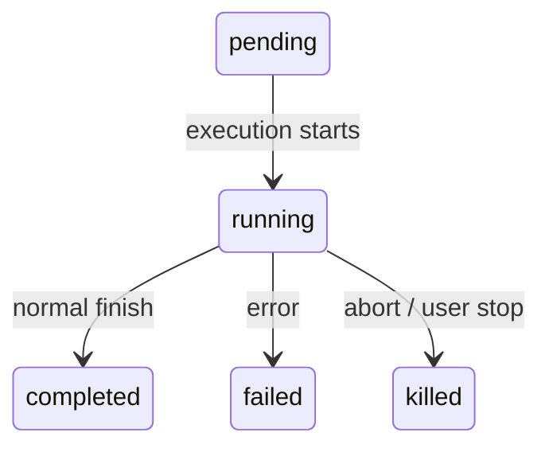
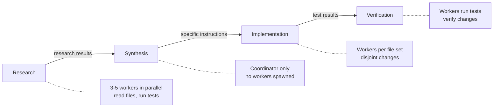
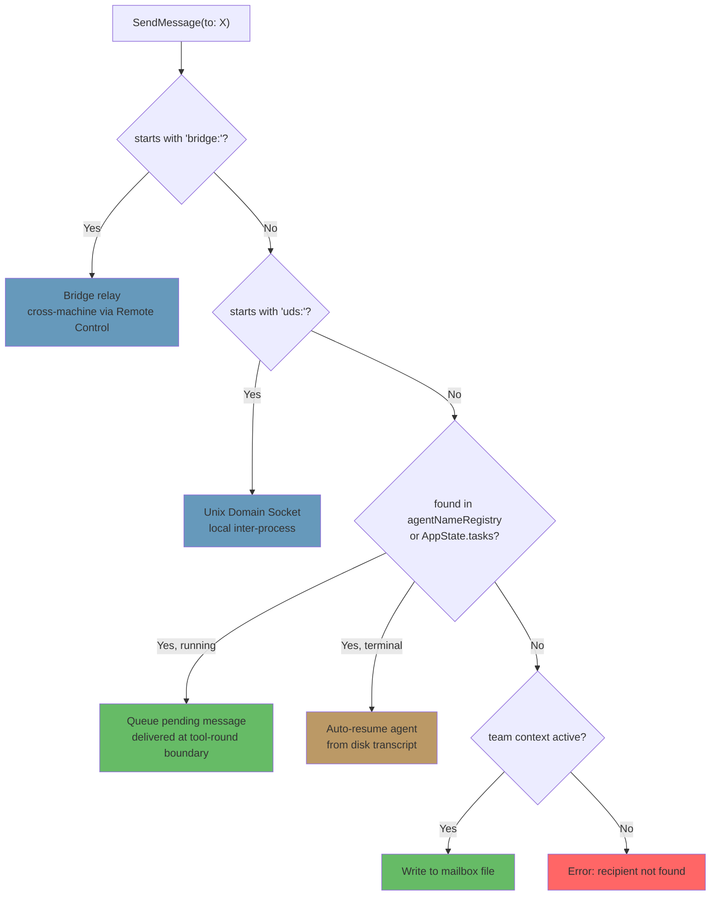

# 第 10 章：任务、协调与 Swarm

## 单线程的边界

第 8 章讲了如何创建子代理 -- 也就是那套十五步生命周期，它会从 agent definition 生成一个隔离的执行上下文。第 9 章讲了如何通过 prompt cache 利用，让并行启动变得更经济。但“创建 agent”和“管理 agent”是两个不同的问题。本章要解决的是后者。

单个 agent 循环 -- 一个模型、一次对话、一次只用一个工具 -- 已经能完成相当多的工作。它可以读文件、改代码、跑测试、搜索网页，并推理复杂问题。但它终究会碰到天花板。

这个天花板不是智能，而是并行度和作用域。一个在做大规模重构的开发者，需要改 40 个文件，每批改完都跑测试，并确认没有出问题。一次代码库迁移会同时触及前端、后端和数据库层。一次彻底的代码审查，会在后台跑测试套件的同时阅读几十个文件。这些问题不是更难，而是更宽。它们要求系统能同时做多件事，能把工作委派给专家，还要能协调结果。

Claude Code 对这个问题的答案不是一种机制，而是一组分层的编排模式，每一种都适合不同形态的工作。后台任务适合 fire-and-forget 命令。Coordinator mode 适合 manager-worker 层级。Swarm team 适合 peer-to-peer 协作。再加上一套统一的通信协议把它们串起来。

编排层大约横跨 `tools/AgentTool/`、`tasks/`、`coordinator/`、`tools/SendMessageTool/` 和 `utils/swarm/` 这 40 个左右的文件。尽管范围很大，但设计是由一个所有模式共享的状态机锚定的。理解这个状态机 -- 也就是 `Task.ts` 里的 `Task` 抽象 -- 是理解后面所有内容的前提。

本章会沿着整条栈往下讲：从基础的 task 状态机开始，一直讲到最复杂的多代理拓扑。

---

## Task 状态机

Claude Code 里的每一种后台操作 -- shell 命令、子代理、远程会话、工作流脚本 -- 都会被当作一个 *task* 来跟踪。task 抽象定义在 `Task.ts` 里，提供整套编排层共同依赖的统一状态模型。

### 七种类型

系统定义了七种 task type，每一种都代表一种不同的执行模型：

七种 task type 分别是：`local_bash`（后台 shell 命令）、`local_agent`（后台子代理）、`remote_agent`（远程会话）、`in_process_teammate`（swarm 队友）、`local_workflow`（工作流脚本执行）、`monitor_mcp`（MCP server 监控），以及 `dream`（推测性的后台思考）。

`local_bash` 和 `local_agent` 是主力 -- 分别对应后台 shell 命令和后台子代理。`in_process_teammate` 是 swarm 的基本单元。`remote_agent` 则连接到远程 Claude Code Runtime 环境。`local_workflow` 负责执行多步脚本。`monitor_mcp` 用来监控 MCP server 健康状况。`dream` 最特殊 -- 它让 agent 在等待用户输入时，也能在后台进行推测性思考。

每一种类型都会分配一个单字符 ID 前缀，方便瞬间识别：

| Type | Prefix | Example ID |
|------|--------|------------|
| `local_bash` | `b` | `b4k2m8x1` |
| `local_agent` | `a` | `a7j3n9p2` |
| `remote_agent` | `r` | `r1h5q6w4` |
| `in_process_teammate` | `t` | `t3f8s2v5` |
| `local_workflow` | `w` | `w6c9d4y7` |
| `monitor_mcp` | `m` | `m2g7k1z8` |
| `dream` | `d` | `d5b4n3r6` |

Task ID 会采用一个单字符前缀（a 表示 agent，b 表示 bash，t 表示 teammate，等等），后面跟 8 个随机字母数字字符，字符表是大小写无关安全的字母表（数字加小写字母）。这样大约能产生 2.8 万亿种组合 -- 足以抵御针对磁盘上 task 输出文件的暴力 symlink 攻击。

当你在 log 里看到 `a7j3n9p2`，就能立刻知道它是一个后台 agent；看到 `b4k2m8x1`，就知道那是一个 shell 命令。前缀对人类读者来说只是一个微优化，但在一个可能同时存在几十个并发 task 的系统里，这种微优化很重要。

### 五种状态

生命周期是一个没有环的简单有向图：



`pending` 是注册和首次执行之间的短暂状态。`running` 表示 task 正在工作。三个终态分别是 `completed`（成功）、`failed`（错误）和 `killed`（被用户、协调器或 abort signal 显式停止）。有一个辅助函数会防止和已经死亡的 task 交互：

```typescript
export function isTerminalTaskStatus(status: TaskStatus): boolean {
  return status === 'completed' || status === 'failed' || status === 'killed'
}
```

这个函数无处不在 -- message 注入保护、eviction 逻辑、孤儿清理，以及决定到底是队列化消息还是恢复死掉 agent 的 SendMessage 路由里都会用到它。

### 基础状态

每一种 task state 都继承自 `TaskStateBase`，它承载了七种类型共享的字段：

```typescript
export type TaskStateBase = {
  id: string              // Prefixed random ID
  type: TaskType          // Discriminator
  status: TaskStatus      // Current lifecycle position
  description: string     // Human-readable summary
  toolUseId?: string      // The tool_use block that spawned this task
  startTime: number       // Creation timestamp
  endTime?: number        // Terminal-state timestamp
  totalPausedMs?: number  // Accumulated pause time
  outputFile: string      // Disk path for streaming output
  outputOffset: number    // Read cursor for incremental output
  notified: boolean       // Whether completion was reported to parent
}
```

有两个字段尤其值得注意。`outputFile` 是异步执行和父对话之间的桥梁 -- 每个 task 都会把输出写到磁盘上的一个文件里，父级则可以通过 `outputOffset` 增量读取。`notified` 用来防止重复完成通知；一旦父级已经被告知 task 结束，这个标志就会变成 `true`，之后就不会再发送通知。没有这个保护的话，一个 task 如果恰好在两次通知队列轮询之间完成，就会生成重复通知，让模型误以为有两个 task 完成了，其实只有一个。

### Agent task 状态

`LocalAgentTaskState` 是最复杂的变体，它携带了管理后台子代理完整生命周期所需的一切：

```typescript
export type LocalAgentTaskState = TaskStateBase & {
  type: 'local_agent'
  agentId: string
  prompt: string
  selectedAgent?: AgentDefinition
  agentType: string
  model?: string
  abortController?: AbortController
  pendingMessages: string[]       // Queued via SendMessage
  isBackgrounded: boolean         // Was this originally a foreground agent?
  retain: boolean                 // UI is holding this task
  diskLoaded: boolean             // Sidechain transcript loaded
  evictAfter?: number             // GC deadline
  progress?: AgentProgress
  lastReportedToolCount: number
  lastReportedTokenCount: number
  // ... additional lifecycle fields
}
```

有三个字段能看出重要的设计决策。`pendingMessages` 是 inbox -- 当 `SendMessage` 指向一个正在运行的 agent 时，消息会先排到这里，而不是立刻注入。消息会在 tool-round 边界被 drain，这样就能保住 agent 的轮次结构。`isBackgrounded` 用来区分两类 agent：一类是从一开始就异步出生的，另一类是先作为前台同步 agent 启动、后来被用户按键切到后台的。`evictAfter` 是一个垃圾回收机制：没有被保留的已完成 task 会在内存里留一个宽限期，之后状态才会被清掉。

所有 task state 都以带前缀的 ID 为键，存放在 `AppState.tasks` 里的 `Record<string, TaskState>` 中。这是一个扁平 map，不是树 -- 系统不会在 state store 里建模父子关系。父子关系是通过对话流隐式表达的：父级持有生成子级的 `toolUseId`。

### Task 注册表

每种 task type 背后都有一个 `Task` 对象，接口很小：

```typescript
export type Task = {
  name: string
  type: TaskType
  kill(taskId: string, setAppState: SetAppState): Promise<void>
}
```

注册表会收集所有 task 实现：

```typescript
export function getAllTasks(): Task[] {
  return [
    LocalShellTask,
    LocalAgentTask,
    RemoteAgentTask,
    DreamTask,
    ...(LocalWorkflowTask ? [LocalWorkflowTask] : []),
    ...(MonitorMcpTask ? [MonitorMcpTask] : []),
  ]
}
```

这里要注意条件式包含 -- `LocalWorkflowTask` 和 `MonitorMcpTask` 都受特性开关控制，运行时可能根本不存在。`Task` 接口被刻意设计得很小。早期版本里曾经有 `spawn()` 和 `render()` 方法，但后来发现，spawn 和 render 从来没有以多态方式调用过，所以把它们删掉了。每一种 task type 都有自己的 spawn 逻辑、自己的状态管理和自己的渲染。真正需要按类型分发的操作只有 `kill()`，因此接口只保留这一项。

这就是通过“减法”演化出来的接口。最初的设计以为所有 task type 都会共享一套通用生命周期接口。实际做下来才发现，各种类型的差异已经大到共享接口变成了虚构 -- shell 命令的 `spawn()` 和 in-process teammate 的 `spawn()` 几乎没什么共同点。与其维护一个有泄漏的抽象，不如把所有东西都删掉，只保留真正能从多态获益的那个方法。

---

## 通信模式

一个后台运行的 task 只有在父级能观察它的进度并接收结果时才有价值。Claude Code 支持三种通信通道，每一种都针对不同的访问模式做了优化。

### 前台：生成器链

当 agent 以同步方式运行时，父级会直接迭代它的 `runAgent()` async generator，把每条消息沿调用栈向上返回。这里最有意思的机制是后台逃生口 -- 同步循环会在“来自 agent 的下一条消息”和“后台信号”之间做竞速：

```typescript
const agentIterator = runAgent({ ...params })[Symbol.asyncIterator]()

while (true) {
  const nextMessagePromise = agentIterator.next()
  const raceResult = backgroundPromise
    ? await Promise.race([nextMessagePromise.then(...), backgroundPromise])
    : { type: 'message', result: await nextMessagePromise }

  if (raceResult.type === 'background') {
    // User triggered backgrounding -- transition to async
    await agentIterator.return(undefined)
    void runAgent({ ...params, isAsync: true })
    return { data: { status: 'async_launched' } }
  }

  agentMessages.push(message)
}
```

如果用户在执行过程中决定把一个同步 agent 切成后台任务，前台 iterator 会被干净地 return（从而触发其 `finally` 块做资源清理），agent 会以同一个 ID 重新 spawn 成异步 task。这个过渡是无缝的 -- 不会丢工作，agent 也会从离开的地方继续，只不过这时它用的是一个不再和父级 ESC 键绑定的异步 abort controller。

这是一种非常难处理对的状态转移。前台 agent 共享父级的 abort controller（ESC 会把两个都杀掉）；后台 agent 则需要自己的 controller（ESC 不应该杀它）。agent 的消息还要从前台 generator stream 迁移到后台 notification 系统。task state 也必须切换 `isBackgrounded`，这样 UI 才知道要把它显示在后台面板里。所有这些都必须原子化完成 -- 不能在过渡期间丢消息，也不能留下 zombie iterator。`Promise.race` 把“下一条消息”和“后台信号”并行竞速起来，正是实现这一点的机制。

### 后台：三条通道

后台 agent 通过磁盘、通知和队列消息进行通信。

**磁盘输出文件。** 每个 task 都会写一个 `outputFile` 路径 -- 这是一个指向 agent JSONL transcript 的 symlink。父级（或任何观察者）可以通过 `outputOffset` 增量读取这个文件，它记录了已经消费到文件的哪个位置。`TaskOutputTool` 把这一能力暴露给模型：

```typescript
inputSchema = z.strictObject({
  task_id: z.string(),
  block: z.boolean().default(true),
  timeout: z.number().default(30000),
})
```

当 `block: true` 时，工具会轮询，直到 task 到达终态或者超时。这是 coordinator spawn 一个 worker 并等待结果时的主要机制。

**Task notifications。** 当后台 agent 完成时，系统会生成一条 XML 通知，并把它排队送进父级的对话里：

```xml
<task-notification>
  <task-id>a7j3n9p2</task-id>
  <tool-use-id>toolu_abc123</tool-use-id>
  <output-file>/path/to/output</output-file>
  <status>completed</status>
  <summary>Agent "Investigate auth bug" completed</summary>
  <result>Found null pointer in src/auth/validate.ts:42...</result>
  <usage>
    <total_tokens>15000</total_tokens>
    <tool_uses>8</tool_uses>
    <duration_ms>12000</duration_ms>
  </usage>
</task-notification>
```

这条通知会以 user-role message 的形式注入父级对话，也就是说模型会在正常消息流里看到它。模型不需要专门的工具去检查完成状态 -- 完成信息会作为上下文自然到达。task state 上的 `notified` 标志会防止重复投递。

**命令队列。** `LocalAgentTaskState` 上的 `pendingMessages` 数组就是第三条通道。当 `SendMessage` 指向一个正在运行的 agent 时，消息会被排队：

```typescript
if (isLocalAgentTask(task) && task.status === 'running') {
  queuePendingMessage(agentId, input.message, setAppState)
  return { data: { success: true, message: 'Message queued...' } }
}
```

这些消息会在 tool-round 边界由 `drainPendingMessages()` 取出，并作为 user message 注入 agent 的对话。这是一个关键设计 -- 消息是在工具轮次之间到达的，不是在执行中途插入。agent 会先完成当前思考，再接收新信息。没有竞态，也没有状态污染。

### 进度跟踪

`ProgressTracker` 会为 agent 活动提供实时可见性：

```typescript
export type ProgressTracker = {
  toolUseCount: number
  latestInputTokens: number        // Cumulative (latest value, not sum)
  cumulativeOutputTokens: number   // Summed across turns
  recentActivities: ToolActivity[] // Last 5 tool uses
}
```

这些字段区分 input token 和 output token，是有意设计的，也反映了 API 计费模型里的一个细节。input token 在每次 API 调用中是累积的，因为完整对话每次都会重新发送 -- 第 15 轮会带上前 14 轮的全部内容，所以 API 报告的 input token 本身就已经是总量。保留最新值才是正确的聚合方式。output token 则是按轮次生成的 -- 模型每次都会产出新 token -- 所以应该累加。算错的话，要么会严重高估（把累积的 input token 再次求和），要么会严重低估（只保留最新的 output token）。

`recentActivities` 数组（最多 5 条）提供了一条人类可读的活动流，比如：“Read src/auth/validate.ts”、“Bash: npm test”、“Edit src/auth/validate.ts”。它会出现在 VS Code 的 subagent 面板和终端的后台任务指示器里，让用户无需读完整 transcript 也能看见 agent 在干什么。

对后台 agent 来说，进度会通过 `updateAsyncAgentProgress()` 写入 `AppState`，并通过 `emitTaskProgress()` 作为 SDK event 发出。VS Code 的 subagent 面板会消费这些事件，渲染实时进度条、工具计数和活动流。进度跟踪不仅仅是装饰 -- 它是告诉用户后台 agent 是在推进，还是卡在循环里的主要反馈机制。

---

## Coordinator Mode

Coordinator mode 把 Claude Code 从“一个带后台助手的单代理”变成了真正的 manager-worker 架构。它是系统里最有主张的编排模式，而它的设计暴露了对 LLM 应该如何、以及不应该如何委派工作的深层思考。

### Coordinator Mode 要解决的问题

标准 agent 循环只有一个对话和一个上下文窗口。当它 spawn 一个后台 agent 时，后台 agent 会独立运行，并通过 task notifications 回报结果。这种方式对简单委派很有效 -- “我继续编辑，你去跑测试” -- 但遇到复杂的多步骤工作流就不够用了。

想象一次代码库迁移。agent 需要：(1) 理解 200 个文件里的现有模式，(2) 设计迁移策略，(3) 对每个文件应用改动，(4) 验证没有出问题。步骤 1 和 3 都能从并行中获益。步骤 2 需要综合步骤 1 的结果。步骤 4 依赖步骤 3。如果一个 agent 顺序做这些事情，大部分 token 预算都会耗在重新读文件上。如果多个后台 agent 没有协调地去做，就会产出不一致的修改。

Coordinator mode 的做法是把“思考” agent 和“执行” agent 分开。coordinator 负责步骤 1 和 2（派发研究 worker，然后综合结果）。worker 负责步骤 3 和 4（应用修改、运行测试）。coordinator 看见全局，worker 只看见自己的那一小块任务。

### 激活方式

只需要一个环境变量就能切换：

```typescript
export function isCoordinatorMode(): boolean {
  if (feature('COORDINATOR_MODE')) {
    return isEnvTruthy(process.env.CLAUDE_CODE_COORDINATOR_MODE)
  }
  return false
}
```

On session resume, `matchSessionMode()` checks whether the resumed session's stored mode matches the current environment. If they diverge, the environment variable is flipped to match. This prevents the confusing scenario where a coordinator session resumes as a regular agent (losing awareness of its workers) or a regular session resumes as a coordinator (losing access to its tools). The session's mode is the source of truth; the environment variable is the runtime signal.

### 工具限制

coordinator 的力量不是来自更多工具，而是来自更少工具。在 coordinator mode 下，coordinator agent 只拿到三个工具：

- **Agent** -- spawn workers
- **SendMessage** -- communicate with existing workers
- **TaskStop** -- terminate running workers

就是这样。不能读文件，不能改代码，不能跑 shell 命令。coordinator 不能直接触碰代码库。这个限制不是缺点 -- 它就是核心设计原则。coordinator 的工作是思考、规划、拆解和综合；真正干活的是 worker。

相反，worker 会拿到完整工具集，只是去掉内部协调工具：

```typescript
const INTERNAL_WORKER_TOOLS = new Set([
  TEAM_CREATE_TOOL_NAME,
  TEAM_DELETE_TOOL_NAME,
  SEND_MESSAGE_TOOL_NAME,
  SYNTHETIC_OUTPUT_TOOL_NAME,
])
```

worker 不能自己 spawn 子团队，也不能给 peer 发消息。它们通过正常的 task completion 机制回报结果，然后由 coordinator 做综合。

### 370 行系统 prompt

coordinator 的 system prompt 是代码库里关于如何把 LLM 用于编排的最有启发性的文档，逐行都是。它大约有 370 行，浓缩了关于委派模式的很多经验教训。核心教导有这些：

**“永远不要委派理解。”** 这是中心论点。coordinator 必须把研究结果综合成具体 prompt，其中要包含文件路径、行号和精确改动。prompt 里明确点出了“基于你的发现，去修 bug”这种反模式 -- 这会把*理解*委派给 worker，逼它重新推导 coordinator 已经知道的上下文。正确模式是：“在 `src/auth/validate.ts` 第 42 行，`userId` 参数在 OAuth flow 中可能为 null。加一个 null check，null 时返回 401 响应。”

**“并行是你的超能力。”** prompt 建立了一套清晰的并发模型。只读任务可以自由并行 -- 研究、探索、读文件。写重活则要按文件集串行。coordinator 需要判断哪些任务可以重叠，哪些必须顺序执行。一个好的 coordinator 会同时 spawn 五个研究 worker，等它们全部完成后做综合，然后再 spawn 三个实现 worker，让它们处理互不重叠的文件集。一个差的 coordinator 会 spawn 一个 worker，等它结束，再 spawn 下一个，再等 -- 把本可以并行的工作串行化。

**任务工作流阶段。** prompt 定义了四个阶段：



1. **Research** -- workers 并行探索代码库，读文件、跑测试、收集信息
2. **Synthesis** -- coordinator（不是 worker）读取所有研究结果，形成统一理解
3. **Implementation** -- worker 接收由 synthesis 推导出的精确指令
4. **Verification** -- worker 运行测试并验证修改

coordinator 不应该跳过这些阶段。最常见的失败模式是从 research 直接跳到 implementation，而没有 synthesis。这样一来，coordinator 就把理解本身委派给了实现 worker -- 每个 worker 都得从头重新推导上下文，结果就是改动不一致、token 浪费。

**继续还是新 spawn。** 当 worker 做完事，而 coordinator 还有后续工作时，它应该给现有 worker 发消息（通过 SendMessage），还是重新 spawn 一个新的（通过 Agent）？这个决定取决于上下文重叠程度：

- **高度重叠，同一批文件**：继续。worker 已经把文件内容放进上下文，理解了模式，也能在之前工作的基础上继续
- **重叠低，不同领域**：重新 spawn。刚调查完认证系统的 worker，身上带着 20,000 token 的 auth 上下文，这对 CSS 重构就是负担。清空重来更便宜
- **高度重叠，但 worker 失败了**：带着明确的失败说明重新 spawn。继续一个失败的 worker，往往是在和混乱的上下文搏斗。重新开始并明确说“上次失败是因为 X，避免 Y”，通常更可靠
- **后续工作需要 worker 的输出**：继续，并把输出一起放进 SendMessage。worker 不需要重新推导它自己的结果

**worker prompt 写法与反模式。** prompt 教 coordinator 如何写出有效的 worker prompt，并明确标出坏模式：

反模式：*“根据你的研究结果，去实现修复。”* 这把理解委派出去了。做研究的不是 worker -- 是 coordinator 读了研究结果。

反模式：*“修复 auth 模块里的 bug。”* 没有文件路径、没有行号、没有 bug 描述。worker 只能从头搜索整个代码库。

反模式：*“把同样的改动应用到其他所有文件。”* 哪些文件？什么改动？coordinator 知道，应该把它们列出来。

好模式：*“在 `src/auth/validate.ts` 第 42 行，`userId` 参数在 `src/oauth/callback.ts:89` 中被调用时可能为 null。加一个 null check：如果 `userId` 是 null，就返回 `{ error: 'unauthorized', status: 401 }`。然后更新 `src/auth/__tests__/validate.test.ts` 里的测试，覆盖 null 情况。”*

写一个具体 prompt 的成本，只由 coordinator 支付一次；而收益 -- worker 第一次就正确执行 -- 是巨大的。模糊 prompt 其实是在制造一种假节省：coordinator 省下了 30 秒写 prompt，worker 却浪费了 5 分钟做探索。

### Worker 上下文

coordinator 会把可用工具的信息注入自己的上下文，这样模型就知道 worker 能做什么：

```typescript
export function getCoordinatorUserContext(mcpClients, scratchpadDir?) {
  return {
    workerToolsContext: `Workers spawned via Agent have access to: ${workerTools}`
      + (mcpClients.length > 0
        ? `\nWorkers also have MCP tools from: ${serverNames}` : '')
      + (scratchpadDir ? `\nScratchpad: ${scratchpadDir}` : '')
  }
}
```

`tengu_scratch` 特性开关控制的 scratchpad 目录，是一个共享文件系统位置，worker 可以在这里读写而无需权限提示。它能支持持久的跨 worker 知识共享 -- 一个 worker 的研究笔记可以变成另一个 worker 的输入，而且是通过文件系统传递，而不是通过 coordinator 的 token 窗口。

这很重要，因为它解决了 coordinator 模式的一个根本限制。没有 scratchpad 时，所有信息都必须经过 coordinator：Worker A 产出结果，coordinator 通过 TaskOutput 读到，再把它综合进 Worker B 的 prompt。coordinator 的上下文窗口会变成瓶颈 -- 它必须把所有中间结果都装进脑子里，直到综合完成。有了 scratchpad，Worker A 可以把结果写进 `/tmp/scratchpad/auth-analysis.md`，coordinator 再告诉 Worker B：“去读 `/tmp/scratchpad/auth-analysis.md` 里的 auth 分析，并把这个模式应用到 OAuth module。” coordinator 传递的是引用，不是值。

### 与 Fork 互斥

Coordinator mode 和基于 fork 的 subagent 是互斥的：

```typescript
export function isForkSubagentEnabled(): boolean {
  if (feature('FORK_SUBAGENT')) {
    if (isCoordinatorMode()) return false
    // ...
  }
}
```

这个冲突是本质性的。Fork agent 会继承父级整个对话上下文 -- 它们是共享 prompt cache 的廉价克隆。Coordinator worker 则是拥有新上下文和明确指令的独立 agent。这两种委派哲学是对立的，系统会在特性开关层面强制你二选一。

---

## Swarm 系统

Coordinator mode 是层级式的：一个管理者、很多 worker、自上而下控制。Swarm 系统则是 peer-to-peer 的替代方案 -- 多个 Claude Code 实例组成团队，由 leader 通过消息传递协调多个队友。

### 团队上下文

团队通过 `teamName` 标识，并记录在 `AppState.teamContext` 中：

```typescript
teamContext?: {
  teamName: string
  teammates: {
    [id: string]: { name: string; color?: string; ... }
  }
}
```

每个队友都会有一个名字（用于寻址）和一种颜色（用于在 UI 里做视觉区分）。团队文件会持久化到磁盘，因此即使进程重启，团队成员关系也能保留下来。

### Agent 名称注册表

后台 agent 在 spawn 时可以被赋予名字，这样就能用人类可读的标识来寻址，而不是随机 task ID：

```typescript
if (name) {
  rootSetAppState(prev => {
    const next = new Map(prev.agentNameRegistry)
    next.set(name, asAgentId(asyncAgentId))
    return { ...prev, agentNameRegistry: next }
  })
}
```

`agentNameRegistry` 是一个 `Map<string, AgentId>`。当 `SendMessage` 解析 `to` 字段时，会先查这个注册表：

```typescript
const registered = appState.agentNameRegistry.get(input.to)
const agentId = registered ?? toAgentId(input.to)
```

这意味着你可以给 `"researcher"` 发消息，而不是 `a7j3n9p2`。这个间接层很简单，但它让 coordinator 可以按角色而不是按 ID 来思考 -- 这对模型推理多代理工作流是很大的提升。

### 进程内队友

进程内队友和 leader 跑在同一个 Node.js 进程里，通过 `AsyncLocalStorage` 隔离。它们的 state 在基础字段上增加了团队专属字段：

```typescript
export type InProcessTeammateTaskState = TaskStateBase & {
  type: 'in_process_teammate'
  identity: TeammateIdentity
  prompt: string
  messages?: Message[]                  // Capped at 50
  pendingUserMessages: string[]
  isIdle: boolean
  shutdownRequested: boolean
  awaitingPlanApproval: boolean
  permissionMode: PermissionMode
  onIdleCallbacks?: Array<() => void>
  currentWorkAbortController?: AbortController
}
```

`messages` 上限为 50 条，这一点值得解释。开发分析发现，每个进程内 agent 在 500 多轮后会积累大约 20MB RSS。曾经观察到 whale session -- 也就是跑超长工作流的重度用户 -- 在 2 分钟内启动了 292 个 agent，把 RSS 推到 36.8GB。UI 里 50 条消息的上限就是一个内存安全阀。agent 的真实对话仍然保留完整历史；被截断的只是面向 UI 的快照。

`isIdle` 标志支持 work-stealing 模式。空闲队友不会消耗 token 或 API 调用 -- 它只是等待下一条消息。`onIdleCallbacks` 数组让系统能挂钩从 active 到 idle 的过渡，从而支持“等所有队友都完成，再继续”这类编排模式。

`currentWorkAbortController` 和队友的主 abort controller 是分开的。abort 当前工作 controller 只会取消队友当前这一轮，不会杀掉队友本身。这就支持一种“redirect”模式：leader 发来更高优先级的消息，队友当前工作被中断，然后它接着处理新消息。主 abort controller 一旦被 abort，就会直接杀掉队友本身。两层中断，对应两层意图。

`shutdownRequested` 标志实现的是协作式终止。leader 发出 shutdown request 时，这个标志会被置位。队友可以在自然停点检查它，并优雅收尾 -- 做完当前文件写入、提交改动，或者发出最后的状态更新。这比硬杀更温和，硬杀可能把文件留在不一致状态。

### 邮箱

队友通过基于文件的 mailbox 系统通信。当 `SendMessage` 指向某个队友时，消息会被写入磁盘上接收者的 mailbox 文件：

```typescript
await writeToMailbox(recipientName, {
  from: senderName,
  text: content,
  summary,
  timestamp: new Date().toISOString(),
  color: senderColor,
}, teamName)
```

消息可以是纯文本、结构化协议消息（shutdown requests、plan approvals），也可以是广播（`to: "*"` 会发给所有队友，发送者自己除外）。一个 poller hook 会处理传入消息，并把它们路由进队友的对话。

这种基于文件的做法是刻意保持简单的。没有 message broker，没有 event bus，没有共享内存通道。文件是持久的（进程崩溃也不会丢）、可检查的（你可以直接 `cat` 一个 mailbox）、而且很便宜（不需要基础设施依赖）。对于每次会话消息量只有几十条、而不是每秒几千条的系统来说，这就是正确的权衡。一个 Redis-backed message queue 会增加运维复杂度、增加依赖、也增加故障模式 -- 这些只是为了满足一个文件系统调用就能轻松处理的吞吐需求。

广播机制也值得一提。当消息发给 `"*"` 时，发送者会遍历 team file 里的所有成员，跳过自己（大小写不敏感比较），然后分别给每个成员写一份 mailbox：

```typescript
for (const member of teamFile.members) {
  if (member.name.toLowerCase() === senderName.toLowerCase()) continue
  recipients.push(member.name)
}
for (const recipientName of recipients) {
  await writeToMailbox(recipientName, { from: senderName, text: content, ... }, teamName)
}
```

这里没有 fan-out 优化 -- 每个接收者都会得到一次单独的文件写入。再次强调，在 agent 团队的规模下（通常 3-8 人），这已经完全够用。如果一个团队有 100 人，那就需要重新考虑了。但那个防止 36GB RSS 的 50 消息内存上限，也会间接限制有效团队规模。

### 权限转发

Swarm worker 以受限权限运行，但在需要对敏感操作进行批准时，可以升级给 leader：

```typescript
const request = createPermissionRequest({
  toolName, toolUseId, input, description, permissionSuggestions
})
registerPermissionCallback({ requestId, toolUseId, onAllow, onReject })
void sendPermissionRequestViaMailbox(request)
```

流程是：worker 遇到一个需要权限的工具，bash classifier 先尝试自动批准；如果失败，就通过 mailbox 系统把请求转发给 leader。leader 会在自己的 UI 里看到请求，并可以批准或拒绝。callback 触发后，worker 继续执行。这样 worker 就能在安全操作上自主运行，同时在危险操作上保留人工监督。

---

## 代理间通信：SendMessage

`SendMessageTool` is the universal communication primitive. It handles four distinct routing modes through a single tool interface, selected by the shape of the `to` field.

### 输入模式

```typescript
inputSchema = z.object({
  to: z.string(),
  // "teammate-name", "*", "uds:<socket>", "bridge:<session-id>"
  summary: z.string().optional(),
  message: z.union([
    z.string(),
    z.discriminatedUnion('type', [
      z.object({ type: z.literal('shutdown_request'), reason: z.string().optional() }),
      z.object({ type: z.literal('shutdown_response'), request_id, approve, reason }),
      z.object({ type: z.literal('plan_approval_response'), request_id, approve, feedback }),
    ]),
  ]),
})
```

The `message` field is a union of plain text and structured protocol messages. This means SendMessage serves double duty -- it is both the informal chat channel ("here are my findings") and the formal protocol layer ("I approve your plan" / "please shut down").

### 路由分发

The `call()` method follows a priority-ordered dispatch chain:



**1. Bridge messages** (`bridge:<session-id>`). Cross-machine communication via Anthropic's Remote Control servers. This is the widest reach -- two Claude Code instances on different machines, potentially different continents, communicating through a relay. The system requires explicit user consent before sending bridge messages -- a safety check that prevents one agent from unilaterally establishing communication with a remote instance. Without this gate, a compromised or confused agent could exfiltrate information to a remote session. The consent check uses `postInterClaudeMessage()`, which handles serialization and transport over the Remote Control relay.

**2. UDS messages** (`uds:<socket-path>`). Local inter-process communication via Unix Domain Sockets. This is for Claude Code instances running on the same machine but in different processes -- for example, a VS Code extension hosting one instance and a terminal hosting another. UDS communication is fast (no network round-trip), secure (filesystem permissions control access), and reliable (the kernel handles delivery). The `sendToUdsSocket()` function serializes the message and writes it to the socket path specified in the `to` field. Peers discover each other via a `ListPeers` tool that scans for active UDS endpoints.

**3. In-process subagent routing** (plain name or agent ID). This is the most common path. The routing logic:

- Look up `input.to` in the `agentNameRegistry`
- If found and running: `queuePendingMessage()` -- the message waits for the next tool-round boundary
- If found but in a terminal state: `resumeAgentBackground()` -- the agent is transparently restarted
- If not in `AppState`: attempt to resume from the disk transcript

**4. Team mailbox** (fallback when team context is active). Named recipients get messages written to their mailbox files. The `"*"` wildcard triggers a broadcast to all team members.

### 结构化协议

Beyond plain text, SendMessage carries two formal protocols.

**The shutdown protocol.** The leader sends `{ type: 'shutdown_request', reason: '...' }` to a teammate. The teammate responds with `{ type: 'shutdown_response', request_id, approve: true/false, reason }`. If approved, in-process teammates abort their controller; tmux-based teammates receive a `gracefulShutdown()` call. The protocol is cooperative -- a teammate can reject a shutdown request if it is in the middle of critical work, and the leader must handle that case.

**The plan approval protocol.** Teammates operating in plan mode must get approval before executing. They submit a plan, and the leader responds with `{ type: 'plan_approval_response', request_id, approve, feedback }`. Only the team lead can issue approvals. This creates a review gate -- the leader can examine a worker's intended approach before any files are touched, catching misunderstandings early.

### 自动恢复模式

The most elegant feature of the routing system is transparent agent resumption. When `SendMessage` targets a completed or killed agent, instead of returning an error, it resurrects the agent:

```typescript
if (task.status !== 'running') {
  const result = await resumeAgentBackground({
    agentId,
    prompt: input.message,
    toolUseContext: context,
    canUseTool,
  })
  return {
    data: {
      success: true,
      message: `Agent "${input.to}" was stopped; resumed with your message`
    }
  }
}
```

The `resumeAgentBackground()` function reconstructs the agent from its disk transcript:

1. Reads the sidechain JSONL transcript
2. Reconstructs the message history, filtering orphaned thinking blocks and unresolved tool uses
3. Rebuilds the content replacement state for prompt cache stability
4. Resolves the original agent definition from stored metadata
5. Re-registers as a background task with a fresh abort controller
6. Calls `runAgent()` with the restored history plus the new message as prompt

From the coordinator's perspective, sending a message to a dead agent and sending a message to a live agent are the same operation. The routing layer handles the complexity. This means coordinators do not need to track which agents are alive -- they simply send messages and the system figures it out.

The implications are significant. Without auto-resume, the coordinator would need to maintain a mental model of agent liveness: "Is `researcher` still running? Let me check. It completed. I need to spawn a new agent. But wait, should I use the same name? Will it have the same context?" With auto-resume, all of that collapses to: "Send `researcher` a message." If it is alive, the message is queued. If it is dead, it is resurrected with its full history. The coordinator's prompt complexity drops dramatically.

There is a cost, of course. Resuming from a disk transcript means re-reading potentially thousands of messages, reconstructing internal state, and making a new API call with a full context window. For a long-lived agent, this can be expensive in both latency and tokens. But the alternative -- requiring the coordinator to manually manage agent lifecycles -- is worse. The coordinator is an LLM. It is good at reasoning about problems and writing instructions. It is bad at bookkeeping. Auto-resume plays to the LLM's strengths by eliminating a category of bookkeeping entirely.

---

## TaskStop：终止开关

`TaskStopTool` is the complement to Agent and SendMessage -- it terminates running tasks:

```typescript
inputSchema = z.strictObject({
  task_id: z.string().optional(),
  shell_id: z.string().optional(),  // Deprecated backward compat
})
```

The implementation delegates to `stopTask()`, which dispatches based on task type:

1. Look up the task in `AppState.tasks`
2. Call `getTaskByType(task.type).kill(taskId, setAppState)`
3. For agents: abort the controller, set status to `'killed'`, start the eviction timer
4. For shells: kill the process group

The tool has a legacy alias `"KillShell"` -- a reminder that the task system evolved from simpler origins where the only background operation was a shell command.

The kill mechanism varies by task type, but the pattern is consistent. For agents, killing means aborting the abort controller (which causes the `query()` loop to exit at the next yield point), setting the status to `'killed'`, and starting an eviction timer so the task state is cleaned up after a grace period. For shells, killing means sending a signal to the process group -- `SIGTERM` first, then `SIGKILL` if the process does not exit within a timeout. For in-process teammates, killing also triggers a shutdown notification to the team so other members know the teammate is gone.

The eviction timer is worth noting. When an agent is killed, its state is not immediately purged. It lingers in `AppState.tasks` for a grace period (controlled by `evictAfter`) so that the UI can show the killed status, any final output can be read, and auto-resume via SendMessage remains possible. After the grace period, the state is garbage collected. This is the same pattern used for completed tasks -- the system distinguishes between "finished" (result available) and "forgotten" (state purged).

---

## 如何选择这些模式

(A note on naming: the codebase also contains `TaskCreate`/`TaskGet`/`TaskList`/`TaskUpdate` tools that manage a structured todo list -- a completely separate system from the background task state machine described here. `TaskStop` operates on `AppState.tasks`; `TaskUpdate` operates on a project tracking data store. The naming overlap is historical and a recurring source of model confusion.)

With three orchestration patterns available -- background delegation, coordinator mode, and swarm teams -- the natural question is when to use each.

**Simple delegation** (Agent tool with `run_in_background: true`) is appropriate when the parent has one or two independent tasks to offload. Run the tests in the background while continuing to edit. Search the codebase while waiting for a build. The parent stays in control, checks results when ready, and never needs a complex communication protocol. The overhead is minimal -- one task state entry, one disk output file, one notification on completion.

**Coordinator mode** is appropriate when the problem decomposes into a research phase, a synthesis phase, and an implementation phase -- and when the coordinator needs to reason across the results of multiple workers before directing the next step. The coordinator cannot touch files, which forces clean separation of concerns: thinking happens in one context, doing happens in another. The 370-line system prompt is not ceremony -- it encodes patterns that prevent the most common failure mode of LLM delegation, which is delegating comprehension instead of delegating action.

**Swarm teams** are appropriate for long-running collaborative sessions where agents need peer-to-peer communication, where the work is ongoing rather than batch-oriented, and where agents may need to idle and resume based on incoming messages. The mailbox system supports asynchronous patterns that coordinator mode (which is synchronous spawn-wait-synthesize) does not. Plan approval gates add a review layer. Permission forwarding maintains security without requiring every agent to have full privileges.

A practical decision table:

| Scenario | Pattern | Why |
|----------|---------|-----|
| Run tests while editing | Simple delegation | One background task, no coordination needed |
| Search codebase for all usages | Simple delegation | Fire-and-forget, read output when done |
| Refactor 40 files across 3 modules | Coordinator | Research phase finds patterns, synthesis plans changes, workers execute in parallel per module |
| Multi-day feature development with review gates | Swarm | Long-lived agents, plan approval protocol, peer communication |
| Fix a bug with known location | Neither -- single agent | Orchestration overhead exceeds the benefit for focused, sequential work |
| Migrate database schema + update API + update frontend | Coordinator | Three independent workstreams after a shared research/planning phase |
| Pair programming with user oversight | Swarm with plan mode | Worker proposes, leader approves, worker executes |

The patterns are not mutually exclusive in principle, but they are in practice. Coordinator mode disables fork subagents. Swarm teams have their own communication protocol that does not mix with coordinator task notifications. The choice is made at session startup via environment variables and feature flags, and it shapes the entire interaction model.

One final observation: the simplest pattern is almost always the right starting point. Most tasks do not need coordinator mode or swarm teams. A single agent with occasional background delegation handles the vast majority of development work. The sophisticated patterns exist for the 5% of cases where the problem is genuinely wide, genuinely parallel, or genuinely long-running. Reaching for coordinator mode on a single-file bug fix is like deploying Kubernetes for a static website -- technically possible, architecturally inappropriate.

---

## 编排的成本

Before examining what the orchestration layer reveals philosophically, it is worth acknowledging what it costs practically.

Every background agent is a separate API conversation. It has its own context window, its own token budget, and its own prompt cache slot. A coordinator that spawns 5 research workers is making 6 concurrent API calls, each with its own system prompt, tool definitions, and CLAUDE.md injection. The token overhead is not trivial -- the system prompt alone can be thousands of tokens, and each worker re-reads files that other workers may have already read.

The communication channels add latency. Disk output files require filesystem I/O. Task notifications are delivered at tool-round boundaries, not instantly. The command queue introduces a full round-trip delay -- the coordinator sends a message, the message waits for the worker to finish its current tool use, the worker processes the message, and the result is written to disk for the coordinator to read.

The state management adds complexity. Seven task types, five statuses, and dozens of fields per task state. The eviction logic, the garbage collection timers, the memory caps -- all of this exists because unbounded state growth caused real production incidents (36.8GB RSS).

None of this means orchestration is wrong. It means orchestration is a tool with a cost, and the cost should be weighed against the benefit. Running 5 parallel workers to search a codebase is worthwhile when the search would take 5 sequential minutes. Running a coordinator to fix a typo in one file is pure overhead.

---

## 编排层揭示了什么

The most interesting aspect of this system is not any individual mechanism -- task states, mailboxes, and notification XML are all straightforward engineering. What is interesting is the *design philosophy* that emerges from how they fit together.

The coordinator prompt's "never delegate understanding" is not just good advice for LLM orchestration. It is a statement about the fundamental limitation of context-window-based reasoning. A worker with a fresh context window cannot understand what the coordinator understood after reading 50 files and synthesizing three research reports. The only way to bridge that gap is for the coordinator to distill its understanding into a specific, actionable prompt. Vague delegation is not just inefficient -- it is information-theoretically lossy.

The auto-resume pattern in SendMessage reveals a preference for *apparent simplicity over actual simplicity*. The implementation is complex -- reading disk transcripts, reconstructing content replacement state, re-resolving agent definitions. But the interface is trivial: send a message, and it works regardless of whether the recipient is alive or dead. The complexity is absorbed by the infrastructure so that the model (and the user) can reason in simpler terms.

And the 50-message memory cap on in-process teammates is a reminder that orchestration systems operate under real physical constraints. 292 agents in 2 minutes reaching 36.8GB of RSS is not a theoretical concern -- it happened in production. The abstractions are elegant, but they run on hardware with finite memory, and the system must degrade gracefully when users push it to extremes.

There is also a lesson in the layered architecture itself. The task state machine is agnostic -- it does not know about coordinators or swarms. The communication channels are agnostic -- SendMessage does not know whether it is being called by a coordinator, a swarm leader, or a standalone agent. The coordinator prompt is layered on top, adding methodology without changing the underlying machinery. Each layer can be understood independently, tested independently, and evolved independently. When the team added the swarm system, they did not need to modify the task state machine. When they added the coordinator prompt, they did not need to modify SendMessage.

This is the hallmark of well-factored orchestration: the primitives are general, and the patterns are composed from them. A coordinator is just an agent with restricted tools and a detailed system prompt. A swarm leader is just an agent with a team context and mailbox access. A background worker is just an agent with an independent abort controller and a disk output file. The seven task types, five statuses, and four routing modes combine to produce orchestration patterns that are greater than the sum of their parts.

The orchestration layer is where Claude Code stops being a single-threaded tool executor and becomes something closer to a development team. The task state machine provides the bookkeeping. The communication channels provide the information flow. The coordinator prompt provides the methodology. And the swarm system provides the peer-to-peer topology for problems that do not fit a strict hierarchy. Together, they make it possible for a language model to do what no single model invocation can: work on wide problems, in parallel, with coordination.

The next chapter examines the permission system -- the safety layer that determines which of these agents can do what, and how dangerous operations are escalated from workers to humans. Orchestration without permission controls would be a force multiplier for mistakes. The permission system ensures that more agents means more capability, not more risk.
