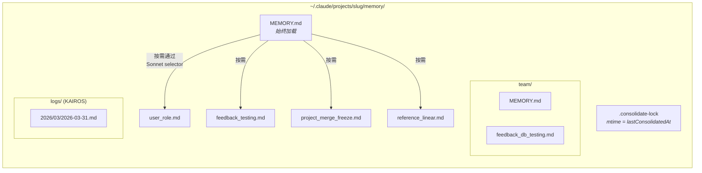
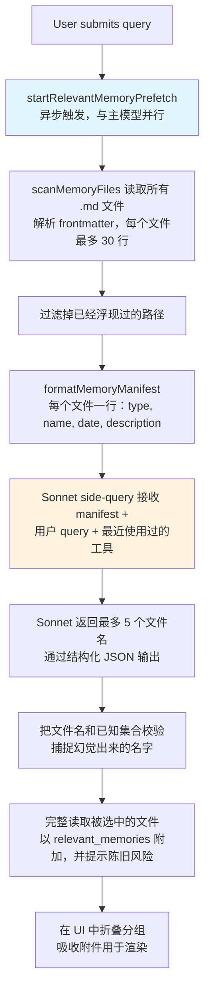
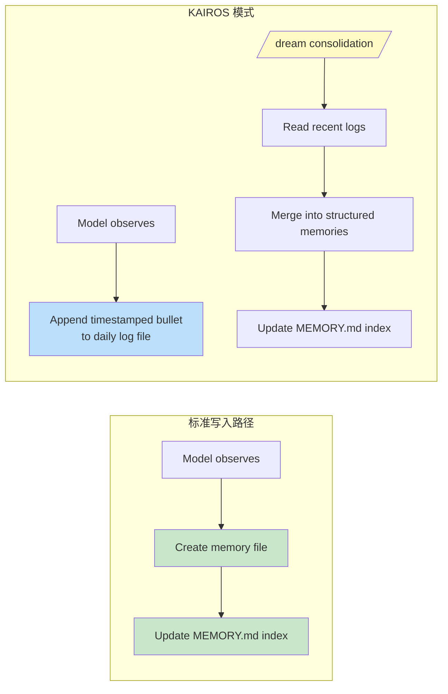

# 第 11 章：记忆 -- 跨会话学习

## 无状态问题

到目前为止，每一章描述的都是只存在于单次会话中的机制。agent 循环运行、工具执行、子代理协作，而当进程退出时，这一切都会消失。下一次对话会带着同样的 system prompt、同样的工具定义、同样的模型 -- 以及对上一次发生了什么的完全空白。

这就是无状态架构的根本局限。某位开发者在周一纠正了模型的测试策略，到了周二模型又犯同样的错。用户解释了自己的角色、项目约束、代码风格偏好，而每一次新会话都要重新解释一遍。模型不是健忘 -- 它从来就不知道。每次对话都是一个独立宇宙。

这个问题并不抽象，它会以具体形式侵蚀信任。用户说“记住，我们在测试里用真实数据库实例，不用 mock” -- 结果下周模型又生成了 mock 测试。用户解释自己是资深工程师，不需要入门级讲解 -- 下一次会话开头又是教程式的逐步说明。没有记忆，所有会话都从零开始。agent 永远像第一天入职的新员工。

业界的标准方案是检索增强生成（RAG）：把文档嵌入成向量，存到向量数据库里，在查询时检索相关片段。它对知识库很有效 -- 文档、FAQ、参考资料。但对 agent 真正需要跨会话记住的东西来说，这种架构并不匹配。agent 的记忆不是知识库，而是一组观察：用户是谁、他们纠正过什么、项目当前的约束是什么、信息该去哪里找。这些观察体量小、变化快，而且必须允许人工编辑。向量数据库解决的是错误的问题。

Claude Code 的记忆系统选择了一条完全不同的路：磁盘文件、Markdown 格式、LLM 驱动的回忆、零基础设施。它的赌注是：把存储做得简单，同时把检索做得聪明，最终会比两边都复杂的方案更好。

这个设计哲学会对整个系统产生一连串后果：

- **人类可读。** 想看 Claude Code 记住了什么，用户可以直接用任意文本编辑器打开 `~/.claude/projects/<slug>/memory/MEMORY.md`。不需要专用工具、不需要解密、不需要导出命令。
- **人类可编辑。** 过时的记忆可以用 vim 修正，错误的记忆可以用 `rm` 删除。用户对 agent 的知识拥有完全控制权。
- **可版本控制。** 团队记忆可以提交到 git。因为它们是 Markdown，变更可以干净地 diff 出来。
- **零基础设施。** 这个记忆系统离线可用、无服务器也可用、在任何带文件系统的操作系统上都能跑。没有迁移路径，因为没有 schema。
- **可调试。** 当记忆行为异常时，排查方式是 `ls` 和 `cat`，而不是查 query log 和数据库。

模型通过 `FileWriteTool` 和 `FileEditTool` 读写记忆 -- 和它编辑源代码时使用的是同一套工具（第 6 章已经介绍）。系统里没有单独的 memory API。系统 prompt 教模型一套两步写入协议（创建文件、更新索引），模型就用自己已有的能力在新指令下执行。这是把工具复用当成架构原则 -- 记忆系统不是外挂到 agent 上的子系统，而是 agent 利用现有能力自然涌现出来的行为。

这里选择基于文件还有一个更深层的原因。对 AI agent 来说，记忆和传统应用里的记忆根本不同。传统应用的数据库保存的是权威状态 -- 系统数据的唯一事实来源。agent 的记忆保存的是*观察* -- 某个时间点上成立、之后也许会变的事情。文件天然表达了这种认识论地位。它们有修改时间，可以看出观察是什么时候记录的。知道它错了的人可以读、改、删。数据库暗示的是永久性和权威性；Markdown 文件暗示的是一条记录下来、可能还得更新的便签。存储介质本身就在传达数据的性质 -- 这些是工作笔记，不是教条。

### 按项目作用域划分

记忆的作用域是 git 仓库根目录，而不是当前工作目录。用户即使在 `src/components/` 打开一个终端、在 `tests/` 打开另一个终端，它们共享的也是同一个记忆目录。解析逻辑会先找 canonical git root，再回退到项目根目录：

基础路径解析会优先找到 canonical git root，然后回退到项目根目录。这样同一个仓库的所有 git worktree 都会共享一个记忆目录。

`findCanonicalGitRoot` 调用确保同一仓库的所有 git worktree 共用一个记忆目录。git root 会经过清理（斜杠变成连字符，通过 `sanitizePath()`），从而生成一个扁平目录名：

```
~/.claude/projects/-Users-alex-code-myapp/memory/
```

一个填充完整的记忆目录会呈现出系统的结构：



命名约定是语义化的：`<type>_<topic>.md`。类型前缀不是代码强制的，但写进了 prompt 指令里，因此目录一眼就能扫出记忆版图。

---

## 四类记忆分类

不是所有东西都值得记住。记忆系统把所有记忆严格限定为四种类型：

这四种类型是：**user**、**feedback**、**project**、**reference**。

这套分类围绕一个单一标准来设计：**这条知识能否从当前项目状态重新推导出来？** 代码模式、架构、文件结构、git 历史 -- 这些都可以通过读代码库重新获得，所以不算。四种类型只捕捉那些无法重新推导的内容。

**用户记忆** 记录人的信息：角色、目标、职责、熟练程度。一个熟悉 Go 但刚接触 React 的资深 Go 工程师，会得到和第一次写程序的人不同的解释方式。

**反馈记忆** 记录做事方式上的指导 -- 包括纠正和确认。系统明确要求模型两者都记：“如果你只保存纠正，你会逐渐偏离用户已经验证过的方法。” 每条反馈记忆都有固定结构：先写规则本身，再写一行“原因”，说明为什么要记这条（通常是过去的事故），然后再写一行“如何应用”，说明触发条件。

**项目记忆** 记录正在进行的工作上下文 -- 谁在做什么、为什么做、截止日期是什么。prompt 特别强调要把相对日期转成绝对日期：比如“Thursday”要写成“2026-03-05”，这样几周后它仍然可读。

**参考记忆** 是书签 -- 指向外部系统里信息所在的位置。比如 Linear 项目 URL、Grafana 仪表盘、Slack 频道。它们告诉模型去哪里找，不告诉模型要找什么。

### 分类即过滤器

四种类型不只是分类 -- 它们本身就是过滤器。通过精确定义什么算 memory，系统也就隐式定义了什么不算。没有这套分类，贪心的模型会把什么都存：代码模式、架构图、错误信息。可这些都能从代码库本身重新推导。把它们存起来，只会制造一份平行的、可能过时的信息副本，而这些信息本来更应该从源头读取。

这套分类还阻止了一种更隐蔽的失败：把 memory 当拐杖。如果模型把架构决策也存成 memory，它就不再去读代码库理解架构了。通过排除可推导信息，系统迫使模型始终锚定在代码的当前状态上。

排除列表是明确的：代码模式、git 历史、调试方案、CLAUDE.md 里的任何内容、短暂的任务细节。即使用户明确要求保存，这些也会被排除。如果用户说“记住这个 PR 列表”，模型会被要求追问 -- “里面有什么是*出乎意料*或*不明显*的？”真正值得保存的是那部分意外或不明显的内容。原始列表本身不值得。这个指令经过 eval 验证，在加入排除覆盖指令后，从 0/2 提升到了 3/3。

### 元数据头部作为契约

每个记忆文件都使用 YAML frontmatter，并包含三个必需字段：

```markdown
---
name: {{memory name}}
description: {{one-line description -- used to decide relevance}}
type: {{user, feedback, project, reference}}
---
```

`description` 是最关键的字段。相关性选择器（下面会讲到的 Sonnet 子查询）就是用它来判断要不要加载这条记忆。像“testing stuff”这样模糊的描述，要么匹配太宽，要么干脆匹配不上。像“Integration tests must hit real DB, not mocks -- burned by mock divergence Q4”这样具体的描述，能精确匹配到需要它的对话。description 就是记忆的检索索引 -- 只不过它不是给搜索引擎，而是给一个能理解细微差别、上下文和意图的语言模型。

frontmatter 还是扫描系统在回忆时读取的唯一部分。`scanMemoryFiles()` 只会读取每个文件前 30 行，用来提取 header。正文只有在文件被明确选中并加载时才会进入上下文。

---

## 写入路径

写记忆是一个两步流程，用的就是标准文件工具。

**步骤 1：写记忆文件。** 模型在 memory 目录里创建一个 `.md` 文件，并写入 YAML 元数据头：

```markdown
---
name: Testing Policy
description: Integration tests must hit real DB, not mocks
type: feedback
---

Don't mock the database in integration tests.

**为什么：** 上个季度我们就栽过一次，mock 测试虽然通过了，但生产查询碰到了 mock 没覆盖到的边界情况。

**如何应用：** `__tests__/` 下所有涉及数据库操作的测试文件，都应该使用 test-utils 里的真实 PGlite 实例。
```

**步骤 2：更新索引。** 模型向 `MEMORY.md` 添加一条一行的指针：

```markdown
- [Testing Policy](feedback_testing.md) -- integration tests must hit real DB
```

每条索引项都必须控制在大约 150 个字符以内。索引是目录，而不是知识库。

当模型学到的新信息会修改已有记忆时，它会使用 `FileEditTool` 更新现有文件，而不是创建重复项。系统内部不做记忆版本管理 -- 文件就在本地文件系统上，用户如果需要版本控制可以直接用 `git`。在 prompt 构建之前，`ensureMemoryDirExists()` 会先创建 memory 目录，prompt 也会告诉模型这个目录已经存在，从而避免无意义地 `ls` 和 `mkdir -p`。

---

## 回忆路径

写记忆是必要条件，但还不够。更难的问题是检索：给定用户的查询，在潜在的数百个记忆文件里，应该把哪几个加载进模型上下文？全部加载会耗尽 token 预算；一个都不加载则失去意义；加载错了又会把 token 浪费在无关信息上，同时错过真正会改变模型行为的知识。

回忆系统分两层工作。`MEMORY.md` 索引在会话开始时始终加载到上下文里，提供方向感。单独的记忆文件则通过一个由 LLM 驱动的相关性查询按需浮现，每次最多选出五条记忆。

### 完整回忆流水线



第 2 步里的异步预取是关键性能决策。当主模型推进到需要回忆上下文的时刻时，side-query 通常已经完成了。用户不会感受到额外延迟。

### Sonnet side-query

manifest 会作为 side-query 发给 Sonnet 模型。selector 的 system prompt 写得很精确：

selector 的 system prompt 要求它保持保守：只包含对当前查询有用的记忆，在不确定时跳过，避免选择那些已经在使用中的工具的 API/usage 文档（因为模型已经加载了这些工具） -- 但仍然要浮现这些工具的警告、坑点或已知问题。

返回结果使用结构化输出 -- `{ selected_memories: string[] }` -- 然后把文件名和已知集合进行校验。

这套做法是在延迟和精度之间做权衡，而且权衡结果很有启发性。**关键词匹配** 很快，但不理解上下文 -- 它没法表达“不要选择那些已经在使用中的工具的记忆”。**向量相似度** 能处理语义匹配，但会引入基础设施（embedding 模型、向量存储、更新流水线），而且不擅长处理否定句 -- “不要使用数据库 mock”的 embedding 距离“使用数据库 mock”其实很近。**Sonnet side-query** 能理解语义相关性、推理上下文、处理否定，而且不需要任何基础设施。延迟成本是可控的（几百毫秒），并且被主模型的初始处理阶段掩盖掉了。

遥测系统会追踪选择率，即使最终没有选中任何记忆。0/150 和 0/3 代表的事情不同 -- 前者说明精度问题，后者说明覆盖问题。

---

## 陈旧性

陈旧性系统解决的是一个从真实使用中暴露出来的故障模式。用户报告说，旧记忆里带着已经变化过的代码的 file:line 引用，模型却把它们当成事实断言。带着引用的陈旧结论，反而显得**更**权威，而不是更不可靠。

解决方案不是过期删除。旧记忆并不会被删掉 -- 它们可能包含能用很多年的制度性知识。系统做的是加年龄警告：

陈旧性函数会计算记忆的年龄（天）。今天或昨天的记忆不会显示警告（函数返回空字符串）。更早的记忆会在内容旁边插入一个 caveat：消息会说明它已经存在多少天，并提醒代码行为断言或 file:line 引用可能已经过时，需要对照当前代码重新核实。

今天或昨天的记忆不会有警告；更早的记忆则会附带陈旧性提示。使用“today”“yesterday”“47 days ago”这种人类可读格式，是因为模型不擅长日期运算。原始 ISO 时间戳并不会像“47 days ago”那样触发陈旧性推理。这个判断是通过 eval 证实的：动作提示式的“Before recommending from memory” 得分 3/3，而更抽象的 “Trusting what you recall” 在正文相同的情况下得分 0/3。

这里存在一个值得点明的哲学张力。陈旧性系统把记忆当作假设，而不是事实。但模型天然会倾向于自信地陈述信息。陈旧性警告其实是在对抗模型自己的语气 -- 用它服从指令的能力，去覆盖它生成置信度的倾向。

---

## 作为始终加载索引的 MEMORY.md

每次对话都会从上下文里带上 `MEMORY.md`。它不是一条记忆 -- 它是索引，是实际记忆文件的目录。

这个索引有两个硬上限：

索引有两个硬上限：200 行和 25,000 字节。

200 行上限可以拦住普通增长。25KB 字节上限则可以拦住一个观察到的失败模式：用户塞进了很长的行数，虽然行数没超过 200，但 token 预算被吃得很厉害。在第 97 个百分位，某个只有 197 行的 `MEMORY.md` 竟然重达 197KB。任一上限触发时，系统都会给出可操作的指导：“把索引项控制在每行约 200 字符以内；把细节移到主题文件里。”

这种双层架构 -- 轻量的始终在线索引 + 重量级的按需内容 -- 才是记忆能够扩展的关键。一个有 150 条记忆的项目，索引可能只占 150 行、约 3,000 个 token，而不是 150 个完整文件、10 万个 token。

---

从单条记忆走向共享知识的过渡是自然的。测试策略、部署约定、构建系统里的已知坑 -- 这些都需要在团队中共享。

## 团队记忆

团队记忆是自动记忆目录下 `<autoMemPath>/team/` 的一个子目录，它受特性开关控制，并且要求启用 auto-memory。这样的嵌套结构是有意设计的：关闭 auto-memory 会连带关闭团队记忆。

### 深度防御

团队记忆引入了个人记忆没有的攻击面。团队同步文件来自其他用户，而恶意队友可能会尝试路径穿越。安全模型使用三层防御。

**第 1 层：输入净化。** `sanitizePathKey()` 会校验空字节、URL 编码的穿越（`%2e%2e%2f`）、Unicode 规范化攻击（全角字符归一化后变成 `../`）、反斜杠以及绝对路径。

**第 2 层：字符串级路径校验。** 净化后，`path.resolve()` 会规范化剩余的 `..` 段，然后把解析后的路径和 team 目录前缀进行比较（前缀里要带上尾部分隔符，防止 `team-evil/` 误匹配成 `team/`）。

**第 3 层：符号链接解析。** `realpathDeepestExisting()` 会在最深的已存在祖先节点上解析符号链接，捕捉字符串级校验看不出来的攻击。如果 `team/evil` 是一个指向 `/etc/` 的 symlink，字符串校验会看到一个合法前缀，但 `realpath` 会暴露真实目标。

所有校验失败都会抛出 `PathTraversalError`。没有部分成功，没有 fallback。失败即关闭。

### 作用域指导

prompt 会教模型区分私有记忆和共享记忆。user memories 永远是私有的。reference memories 通常属于团队。feedback memories 默认是私有的，除非它们代表的是项目级约定。交叉检查指令 -- “在保存私有 feedback memory 之前，先检查它是否和 team feedback memory 冲突” -- 可以防止冲突性的指导因为回忆顺序不同而随机浮现。

---

## KAIROS 模式：只追加的每日日志

标准记忆默认的是离散会话。KAIROS 模式（Claude Code 的 assistant mode）打破了这个假设 -- 会话是长生命周期的，可能持续数天。两步写入模式不适合连续运行。

解决方案是把捕获和归并在架构上分开：



在 KAIROS 模式下，模型会把内容追加到按日期命名的日志文件里（`<autoMemPath>/logs/YYYY/MM/YYYY-MM-DD.md`）。每条记录都是一条简短的、带时间戳的 bullet。模型会被要求：“不要重写或重组日志” -- 在捕获阶段做重构会丢掉 consolidation 需要的时间顺序信号。

日志的路径在 prompt 里被描述成一个 *pattern*，而不是今天的字面日期。这是一个缓存优化：记忆 prompt 会被缓存，而不会在午夜日期变化时失效。模型会通过单独的 `date_change` 附件来推导当前日期。

### /dream 归并

归并分四个阶段：**Orient**（列目录、读索引、扫一遍已有文件）、**Gather**（搜索日志、检查漂移的记忆）、**Consolidate**（写入或更新文件，合并而不是复制）、**Prune**（把索引控制在 200 行以内，删除过时指针）。强调“合并到已有文件，而不是新建文件”很重要 -- 不然记忆目录会随着使用量线性膨胀。

### 归并锁

锁文件 `.consolidate-lock` 有两个用途：它的内容是持有者的 PID（互斥），它的 mtime *就是* `lastConsolidatedAt`（调度状态）。当三个门禁都通过时，auto-dream 会触发，而且按从便宜到昂贵的顺序评估：距离上次归并超过 24 小时、距上次以来被修改的会话数超过 5、没有其他进程持有锁。崩溃恢复会通过 `process.kill(pid, 0)` 检测死 PID，并用一小时的陈旧超时来防止 PID 重用。

---

## 背景提取

主 agent 已经有完整指令，会主动写记忆。但 agent 终归会出错，而这种出错是可预期的。当用户说“记住，永远用集成测试”，然后立刻又问“现在修复登录 bug”时，模型注意力会完全转向 bug。保存记忆的指令虽然已经被处理，但可能没有真正执行。

每个完整 query loop 结束时，都会有一个 fork 出来的 agent -- 和父级共享 prompt cache -- 分析最近消息，并补写主 agent 漏掉的记忆。当主 agent 已经在当前 turn 范围内写过记忆时，提取 agent 会跳过这段范围。提取 agent 的工具预算是受限的：只允许读工具，以及对 memory 目录路径的写访问。它的 prompt 指示采用两轮策略：第一轮并行读取，第二轮并行写入。

这个交互是协作性的，不是竞争性的。主 agent 的 prompt 始终包含完整的保存指令。主 agent 去保存时，后台 agent 就让开；主 agent 没有保存时，后台 agent 补上这个缺口。这个模式 -- 主路径加一个后台安全网 -- 让记忆捕获更可靠，同时又不会拖累主交互。两者单独看都不够。

---

## 路径解析与安全

自动记忆路径通过一个优先级链来解析：

1. **`CLAUDE_COWORK_MEMORY_PATH_OVERRIDE`** -- 给 Cowork 用的完整路径覆盖。
2. **`settings.json` 里的 `autoMemoryDirectory`** -- 只接受受信任的 settings 来源。项目 settings 被故意排除。
3. **默认计算路径** -- `~/.claude/projects/<sanitized-git-root>/memory/`。

之所以排除项目 settings，是出于安全考虑。恶意仓库可以提交 `.claude/settings.json`，把 `autoMemoryDirectory` 设成 `"~/.ssh"`，而 memory 文件的写入权限又会让模型自动获得对 SSH key 的写权限。通过把覆盖入口限制在 policy、flag、local 和 user settings -- 这些都不能提交进仓库 -- 这个攻击面就被关上了。

`isAutoMemPath()` 会在做前缀比较前先规范化路径，以防止穿越；尾部分隔符约定则确保前缀匹配必须落在目录边界上。

### 启用 / 禁用链

auto-memory 是否启用由 `isAutoMemoryEnabled()` 决定，它有自己的一条优先级链：环境变量、bare mode、CCR without persistent storage、settings、默认启用。禁用时，prompt 片段会被移除（因此模型收不到任何记忆指令），后台进程也会停止（extract-memories、auto-dream、team sync）。这两个门禁必须同时生效 -- 只移除 prompt 并不能阻止提取 agent，因为它有自己的 prompt。

---

## 应用：设计 agent 记忆

记忆系统的复杂性主要在行为层 -- prompt 指令、LLM 驱动的回忆、陈旧性管理、后台提取 -- 而不在存储基础设施上。复杂性分布本身就是一种设计原则。

**文件比数据库更适合 agent 记忆。** 文件可检查、可编辑、可版本控制。透明性建立信任。当备选方案是用户很难直接读取的数据库时，文件仅凭信任就已经赢了。

**限制保存什么，而不仅仅是怎么保存。** 可推导性测试 -- 这条知识能否从当前项目状态重新推导出来？ -- 可以删掉大多数潜在记忆，同时保留下真正重要的那些。

**回忆时用 LLM，不要用关键词或 embeddings。** LLM side-query 能理解上下文，知道对话里已经有哪些信息，能处理否定，而且不需要维护索引。延迟是真实存在的，但它是有界的，而且被主模型处理过程掩盖掉了。

**警告陈旧，不要过期删除。** 制度性知识可能有效很多年。加年龄警告可以让模型把旧记忆当作假设而不是事实。人类可读的年龄格式能以原始时间戳做不到的方式触发正确推理。

**给捕获过程建立安全网。** 主 agent 会漏记忆。一个回看最近对话的后台提取 agent，可以在不拖累主交互的前提下提高系统可靠性。主 agent 保存时，后台 agent 就让开。

---

现在，agent 已经能够跨会话学习了 -- 它会积累关于用户、偏好、项目状态以及用户纠正过的内容的知识。这个记忆系统做出了一种哲学承诺：agent 和用户的关系应该随着时间加深，而不是每次交互都重置。基于文件的实现让这个承诺变得具体可见 -- 它在磁盘上可见、可被人类编辑、可和代码一起版本控制。agent 的记忆不是黑盒，而是放在文件夹里的笔记，写的是模型和人都能读的语言。

下一章会考察 Claude Code 如何把能力扩展到核心之外：教模型新行为的 skills 系统，以及让外部代码在二十多个生命周期点上约束和修改这些行为的 hooks 系统。
