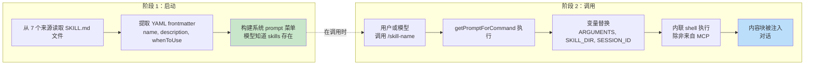
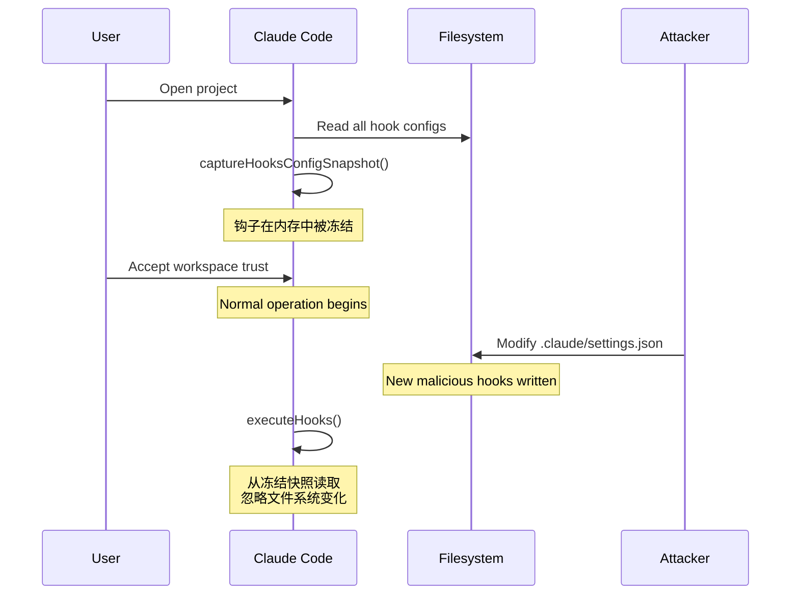
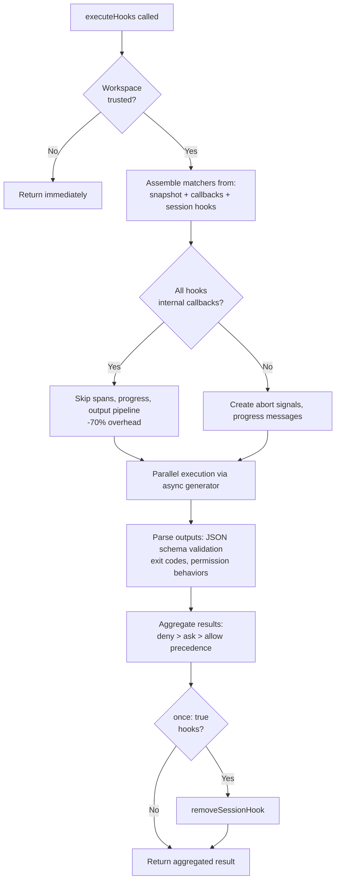

# 第 12 章：可扩展性 -- 技能与钩子

## 扩展的两个维度

每一种可扩展性系统都要回答两个问题：系统能做什么，以及它在什么时候做。大多数框架会把这两件事混在一起 -- 一个插件对象既注册能力，又注册生命周期回调，“添加功能”和“拦截功能”之间的边界逐渐模糊成一个统一的注册 API。

Claude Code 把这两者清晰地分开了。技能扩展的是模型“能做什么”。它们是 Markdown 文件，调用后会变成斜杠命令，把新的指令注入对话。钩子扩展的是“何时以及如何发生”。它们是生命周期拦截器，在会话中的二十多个不同位置触发，执行任意代码：可以阻止动作、修改输入、强制继续，或者悄悄观察。

这种分离并不是偶然的。技能属于内容层 -- 通过增加 prompt 文本来扩展模型的知识和能力。钩子属于控制流 -- 它们改变执行路径，但不会改变模型知道什么。一个技能可能教模型怎么执行团队的部署流程；一个钩子可能确保没有通过测试套件就不能执行部署命令。技能增加能力，钩子增加约束。

本章会深入讲解这两个系统，然后再看它们的交叉点：当 skill 被调用时，skill 在 frontmatter 中声明的 hooks 会注册为会话作用域的生命周期拦截器。

---

## 技能：教模型新本领

### 两阶段加载

skills 系统的核心优化是：frontmatter 在启动时加载，而完整内容只在调用时加载。



**阶段 1** 读取每个 `SKILL.md` 文件，把 YAML frontmatter 和 Markdown 正文分离，并提取元数据。frontmatter 字段会成为 system prompt 的一部分，这样模型就知道这个 skill 存在。Markdown 正文会被捕获到闭包里，但不会立即处理。一个有 50 个 skills 的项目，只需要付出 50 条简短描述的 token 成本，而不是 50 份完整文档。

**阶段 2** 在模型或用户调用 skill 时触发。`getPromptForCommand` 会补上基础目录，替换变量（`$ARGUMENTS`、`${CLAUDE_SKILL_DIR}`、`${CLAUDE_SESSION_ID}`），并执行内联 shell 命令（以反引号前缀的 `!`）。结果会以内容块的形式返回，并注入对话。

### 七个来源与优先级

skills 来自七个不同来源，按并行加载并按优先级合并：

| 优先级 | 来源 | 位置 | 说明 |
|----------|--------|--------|-------|
| 1 | Managed (Policy) | `<MANAGED_PATH>/.claude/skills/` | 企业控制 |
| 2 | User | `~/.claude/skills/` | 个人级，全局可用 |
| 3 | Project | `.claude/skills/`（向上遍历到 home） | 已提交到版本控制 |
| 4 | Additional Dirs | `<add-dir>/.claude/skills/` | 通过 `--add-dir` 传入 |
| 5 | Legacy Commands | `.claude/commands/` | 向后兼容 |
| 6 | Bundled | 编译进二进制 | 受特性开关控制 |
| 7 | MCP | MCP server prompts | 远程、未受信任 |

去重时使用 `realpath` 解析符号链接和重叠的父目录。先出现的来源获胜。`getFileIdentity` 函数通过 `realpath` 解析到规范路径，而不是依赖 inode 值，因为在容器/NFS 挂载和 ExFAT 上 inode 可能不可靠。

### 元数据头部契约

控制 skill 行为的关键 frontmatter 字段如下：

| YAML 字段 | 作用 |
|-----------|------|
| `name` | 面向用户的显示名称 |
| `description` | 显示在自动补全和 system prompt 中 |
| `when_to_use` | 供模型发现 skill 时参考的详细使用场景 |
| `allowed-tools` | 这个 skill 可以使用哪些工具 |
| `disable-model-invocation` | 阻止模型自主调用 |
| `context` | `'fork'` 表示作为子代理运行 |
| `hooks` | 调用时注册的生命周期 hooks |
| `paths` | 触发条件用的 glob 模式 |

`context: 'fork'` 会让 skill 在自己的上下文窗口中作为子代理运行，这对需要大量工作、又不想污染主对话 token 预算的 skills 尤其重要。`disable-model-invocation` 和 `user-invocable` 字段控制两条不同的访问路径 -- 两者都设为 true 时，skill 会变得不可见，这对只用于 hooks 的 skill 很有用。

### MCP 安全边界

变量替换之后，内联 shell 命令才会执行。这个安全边界是绝对的：**MCP skills 永远不会执行内联 shell 命令。** MCP servers 是外部系统。一个 MCP prompt 里如果包含 `` !`rm -rf /` ``，一旦允许执行，就会以用户的完整权限运行。系统把 MCP skills 视为纯内容。这个信任边界和第 15 章讨论的更广泛 MCP 安全模型是一致的。

### 动态发现

技能不只在启动时加载。当模型触碰文件时，`discoverSkillDirsForPaths` 会从每个路径向上查找 `.claude/skills/` 目录。带有 `paths` frontmatter 的 skill 会存入 `conditionalSkills` map，并且只有在被触碰路径匹配其模式时才激活。声明 `paths: "packages/database/**"` 的 skill，会一直不可见，直到模型读取或编辑某个数据库文件 -- 这就是上下文敏感的能力扩展。

---

## 钩子：控制事情何时发生

钩子是 Claude Code 用来在生命周期节点拦截并修改行为的机制。主执行引擎超过 4,900 行。这个系统服务三类用户：个人开发者（自定义 lint、校验）、团队（检查入库项目里的共享质量门禁）、企业（由策略管理的合规规则）。

### 一个真实钩子：阻止提交到 main

在深入机制之前，先看一个实际中的 hook 长什么样。假设你的团队想阻止模型直接向 `main` 分支提交。

**第 1 步：`settings.json` 配置：**

```json
{
  "hooks": {
    "PreToolUse": [
      {
        "matcher": "Bash",
        "hooks": [
          {
            "type": "command",
            "command": "/path/to/check-not-main.sh",
            "if": "Bash(git commit*)"
          }
        ]
      }
    ]
  }
}
```

**第 2 步：shell 脚本：**

```bash
#!/bin/bash
BRANCH=$(git rev-parse --abbrev-ref HEAD 2>/dev/null)
if [ "$BRANCH" = "main" ]; then
  echo "Cannot commit directly to main. Create a feature branch first." >&2
  exit 2  # Exit 2 = blocking error
fi
exit 0
```

**第 3 步：模型会经历什么。** 当模型在 `main` 分支上尝试执行 `git commit` 时，hook 会在命令执行前触发。脚本检查分支、写入 stderr，并以退出码 2 结束。模型会看到一条系统消息：“Cannot commit directly to main. Create a feature branch first.” 提交不会执行。模型会改为创建分支并在其上提交。

`if: "Bash(git commit*)"` 这个条件表示脚本只会在 git commit 命令上运行，而不是每次 Bash 调用都运行。退出码 2 表示阻断；退出码 0 表示放行；其他任何退出码都会产生非阻断警告。这就是完整协议。

### 四种可配置类型

Claude Code 定义了六种 hook 类型 -- 四种可配置，两种内部类型。

**Command hooks** 会启动一个 shell 进程。hook 输入 JSON 通过 stdin 传入；hook 通过退出码和 stdout/stderr 回传结果。这是最常用的一类。

**Prompt hooks** 会进行一次 LLM 调用，返回 `{"ok": true}` 或 `{"ok": false, "reason": "..."}`。它提供轻量级的 AI 驱动校验，但不需要完整的 agent 循环。

**Agent hooks** 运行多轮 agentic 循环（最多 50 轮，使用 `dontAsk` 权限，关闭 thinking）。每个 hook 都有自己的会话作用域。这是用于“验证测试套件是否通过并覆盖了新功能”的重型机制。

**HTTP hooks** 会把 hook 输入 POST 到某个 URL。这样就能启用远程策略服务器和审计日志，而不需要在本地启动进程。

两种内部类型是 **callback hooks**（由程序注册，在热路径上通过跳过 span 跟踪的快速路径实现 -70% 开销）和 **function hooks**（会话作用域的 TypeScript 回调，用于 agent hook 中的结构化输出约束）。

### 最重要的五个生命周期事件

hook 系统会在二十多个生命周期点触发。下面五个最常用于实际场景：

**PreToolUse** -- 在每次工具执行前触发。可以阻止、修改输入、自动批准，或者注入上下文。权限行为遵循严格优先级：deny > ask > allow。这是最常见的质量门禁触发点。

**PostToolUse** -- 在成功执行后触发。可以注入上下文，或者完全替换 MCP 工具输出。适合对工具结果进行自动反馈。

**Stop** -- 在 Claude 准备结束响应之前触发。一个阻断型 hook 会强制继续。这是自动验证循环的机制：“你真的结束了吗？”

**SessionStart** -- 在会话开始时触发。可以设置环境变量、覆盖第一条用户消息，或者注册文件监视路径。不能阻断（hook 不能阻止会话启动）。

**UserPromptSubmit** -- 在用户提交 prompt 时触发。可以阻止处理，因此可以在模型看到输入之前做校验或内容过滤。

**剩余事件表：**

| 类别 | 事件 |
|------|------|
| 工具生命周期 | PostToolUseFailure, PermissionDenied, PermissionRequest |
| 会话 | SessionEnd（1.5s 超时）, Setup |
| 子代理 | SubagentStart, SubagentStop |
| 压缩 | PreCompact, PostCompact |
| 通知 | Notification, Elicitation, ElicitationResult |
| 配置 | ConfigChange, InstructionsLoaded, CwdChanged, FileChanged, TaskCreated, TaskCompleted, TeammateIdle |

阻断行为的不对称性是故意设计的。那些代表可恢复决策的事件（工具调用、停止条件）支持阻断；那些代表不可逆事实的事件（会话已启动、API 失败）不支持。

### 退出码语义

对于 command hooks，退出码有特定含义：

| Exit Code | 含义 | 是否阻断 |
|-----------|------|----------|
| 0 | 成功，如果是 JSON 则解析 stdout | 否 |
| 2 | 阻断错误，stderr 会作为系统消息显示 | 是 |
| 其他 | 非阻断警告，仅展示给用户 | 否 |

选择退出码 2 是有意为之。退出码 1 太常见 -- 任何未处理异常、断言失败或语法错误都会返回 1。使用 2 作为阻断信号，可以避免误触发强制执行。

### 六个钩子来源

| 来源 | 信任级别 | 说明 |
|------|----------|------|
| `userSettings` | 用户 | `~/.claude/settings.json`，优先级最高 |
| `projectSettings` | 项目 | `.claude/settings.json`，受版本控制 |
| `localSettings` | 本地 | `.claude/settings.local.json`，被 git 忽略 |
| `policySettings` | 企业 | 不能覆盖 |
| `pluginHook` | 插件 | 优先级 999（最低） |
| `sessionHook` | 会话 | 仅驻留内存，由 skills 注册 |

---

## 快照安全模型

钩子会执行任意代码。一个项目的 `.claude/settings.json` 可以定义在每次工具调用前触发的钩子。假如某个恶意仓库在用户接受工作区信任对话框后修改了自己的钩子，会发生什么？

什么都不会发生。hooks 配置在启动时被冻结了。



`captureHooksConfigSnapshot()` 会在启动期间调用一次。从那一刻起，`executeHooks()` 只读快照，不会隐式重读 settings 文件。快照只会通过显式渠道更新：`/hooks` 命令或文件监听器检测，这两者都会通过 `updateHooksConfigSnapshot()` 重建快照。

策略执行遵循级联规则：策略设置里的 `disableAllHooks` 会清空全部钩子。`allowManagedHooksOnly` 会排除用户和项目钩子。用户可以通过设置 `disableAllHooks` 来禁用自己的钩子，但不能禁用企业管理的钩子。策略层永远优先。

信任检查本身（`shouldSkipHookDueToTrust()`）是在两类漏洞之后引入的：`SessionEnd` 钩子在用户**拒绝**信任对话框时仍然执行，以及 `SubagentStop` 钩子在信任提示出现之前就触发。这两个问题的根因相同 -- 钩子在用户尚未同意工作区代码执行的生命周期状态下被触发。修复方法是在 `executeHooks()` 顶部增加集中式门禁。

---

## 执行流程



内部 callback 的快速路径是一个重要优化。当所有匹配的 hooks 都是内部 hook（文件访问分析、提交归因）时，系统会跳过 span 跟踪、abort signal 创建、进度消息和完整输出处理流水线。大多数 PostToolUse 调用都只命中内部 callback。

hook 输入 JSON 只会通过一个惰性的 `getJsonInput()` 闭包序列化一次，并在所有并行 hooks 之间复用。环境注入会设置 `CLAUDE_PROJECT_DIR`、`CLAUDE_PLUGIN_ROOT`，以及在某些事件下的 `CLAUDE_ENV_FILE`，hook 可以往这里写环境导出内容。

---

## 交汇：技能与钩子如何协作

当一个 skill 被调用时，它在 frontmatter 中声明的 hooks 会注册为会话作用域 hooks。`skillRoot` 会成为 hook shell 命令的 `CLAUDE_PLUGIN_ROOT`：

```
my-skill/
  SKILL.md          # The skill content
  validate.sh       # Called by a PreToolUse hook declared in frontmatter
```

skill 的 frontmatter 声明如下：

```yaml
hooks:
  PreToolUse:
    - matcher: "Bash"
      hooks:
        - type: command
          command: "${CLAUDE_PLUGIN_ROOT}/validate.sh"
          once: true
```

当用户调用 `/my-skill` 时，skill 内容会加载进对话，PreToolUse hook 也会注册。下一次 Bash 工具调用就会触发 `validate.sh`。由于设置了 `once: true`，这个 hook 会在第一次成功执行后自动移除。

对于 agent 来说，frontmatter 中声明的 `Stop` hooks 会自动转换成 `SubagentStop` hooks，因为子代理触发的是 `SubagentStop`，不是 `Stop`。如果不做这个转换，agent 的 stop 校验 hook 将永远不会触发。

### 权限行为优先级

`executePreToolHooks()` 可以阻断（通过 `blockingError`）、自动批准（`permissionBehavior: 'allow'`）、强制询问（`'ask'`）、拒绝（`'deny'`）、修改输入（`updatedInput`），或者添加上下文（`additionalContext`）。当多个钩子返回不同行为时，deny 永远获胜。这是面向安全相关决策时正确的默认策略。

### 停止钩子：强制继续

当一个 Stop hook 返回退出码 2 时，stderr 会作为反馈展示给模型，对话则继续进行。这把一次性的 prompt-response 变成了一个面向目标的循环。Stop hook 可以说是整个系统里最强大的集成点。

---

## 这样做：设计一个可扩展系统

**把内容和控制流分开。** 技能增加能力；钩子约束行为。把两者混在一起，会让你无法判断一个插件到底做了什么，或者阻止了什么。

**在信任边界处冻结配置。** 快照机制在用户同意的那一刻捕获 hooks，并且不会隐式重读。如果你的系统会执行用户提供的代码，这能消除 TOCTOU 攻击。

**用不常见的退出码表达语义信号。** Exit code 1 太吵了 -- 任何未处理错误都会产生它。用 exit code 2 作为阻断信号，可以避免误触发强制执行。选择那些需要明确意图的信号。

**在 socket 层验证，而不是在应用层验证。** SSRF 防护是在 DNS 查询时做的，而不是预检。这样就消除了 DNS rebinding 窗口。校验网络目标时，检查必须与连接原子化。

**优化常见路径。** 内部 callback 快速路径（-70% 开销）认识到大多数 hook 调用只会命中内部 callback。两阶段 skills 加载认识到大多数 skills 在一次会话里根本不会被调用。每一种优化都针对真实的使用分布。

可扩展性系统体现了对“能力”和“安全”之间张力的成熟理解。技能在第 15 章讨论的 MCP 安全边界内给模型增加新能力。钩子在快照机制、退出码语义和策略级联的边界内，让外部代码影响模型行为。两者都不完全信任对方 -- 正是这种相互不信任，让它们可以安全地大规模部署。

下一章将转向视觉层：Claude Code 如何以 60fps 渲染一个响应式终端 UI，并在五种终端协议之间处理输入。
