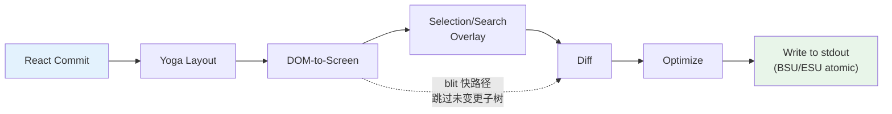

# 第 13 章：终端 UI

## 为什么要自定义渲染器？

终端不是浏览器。这里没有 DOM、没有 CSS 引擎、没有 compositor，也没有保留模式图形管线。这里只有一条写向 stdout 的字节流，以及一条从 stdin 读入的字节流。介于这两条流之间的一切 -- 布局、样式、diff、命中测试、滚动、选择 -- 都得从零实现。

Claude Code 需要一个响应式 UI。它有 prompt 输入、流式 Markdown 输出、权限对话框、进度指示器、可滚动消息列表、搜索高亮，以及 vim 模式编辑器。React 很适合用来声明这类组件树。但 React 需要一个宿主环境来渲染，而终端并不提供这种环境。

Ink 是标准答案：一个用于终端的 React 渲染器，基于 Yoga 做 flexbox 布局。Claude Code 一开始也用了 Ink，后来把它改到几乎认不出来。原版会为每个单元格、每一帧分配一个 JavaScript 对象 -- 在 200x120 的终端上，这意味着每 16ms 创建并回收 24,000 个对象。它在字符串层面做 diff，比较的是整行 ANSI 编码文本。它不理解 blit 优化、不理解双缓冲、不理解单元格级 dirty tracking。对于一个每秒刷新一次的简单 CLI 面板，这没问题；但对于一个以 60fps 流式输出 token、同时用户还在浏览几百条消息的 LLM agent 来说，这就完全不行了。

Claude Code 保留下来的，是一个自定义渲染引擎。它保留了 Ink 的概念 DNA -- React reconciler、Yoga 布局、ANSI 输出 -- 但重写了关键路径：用压缩的 typed array 替代“每格一个对象”，用池化字符串驻留替代“每帧一个字符串”，用双缓冲渲染和单元格级 diff 替代粗粒度比较，再加上一个优化器把相邻的终端写入合并成尽量少的转义序列。

最终效果是在 200 列终端上可以稳定跑到 60fps，同时还能从 Claude 流式接收 token。要理解它怎么做到的，我们得看四层：React reconcile 的自定义 DOM、把这个 DOM 转成终端输出的渲染流水线、让长会话不被垃圾回收拖垮的池化内存管理，以及把这一切串起来的组件架构。

---

## 自定义 DOM

React 的 reconciler 需要一个可以 reconcile 的对象。浏览器里这是 DOM；在 Claude Code 的终端里，这是一个自定义的内存树，包含七种元素类型和一种文本节点类型。

这些元素类型和终端渲染概念一一对应：

- **`ink-root`** -- 文档根节点，每个 Ink 实例一个
- **`ink-box`** -- flexbox 容器，相当于终端里的 `<div>`
- **`ink-text`** -- 带 Yoga measure function 的文本节点，用于自动换行
- **`ink-virtual-text`** -- 嵌套在另一个文本节点里的样式化文本（当它位于 text 上下文中时，会自动从 `ink-text` 提升而来）
- **`ink-link`** -- 超链接，通过 OSC 8 转义序列渲染
- **`ink-progress`** -- 进度指示器
- **`ink-raw-ansi`** -- 预渲染的 ANSI 内容，尺寸已知，用于语法高亮代码块

每个 `DOMElement` 都携带渲染流水线所需的状态：

```typescript
// Illustrative — actual interface extends this significantly
interface DOMElement {
  yogaNode: YogaNode;           // Flexbox layout node
  style: Styles;                // CSS-like properties mapped to Yoga
  attributes: Map<string, DOMNodeAttribute>;
  childNodes: (DOMElement | TextNode)[];
  dirty: boolean;               // Needs re-rendering
  _eventHandlers: EventHandlerMap; // Separated from attributes
  scrollTop: number;            // Imperative scroll state
  pendingScrollDelta: number;
  stickyScroll: boolean;
  debugOwnerChain?: string;     // React component stack for debug
}
```

把 `_eventHandlers` 和 `attributes` 分开是有意为之。在 React 里，handler 的 identity 每次 render 都可能变化（除非手工 memoize）。如果把 handler 当成 attribute 存，每次 render 都会把节点标成 dirty 并触发整屏重绘。把它们单独存放后，reconciler 的 `commitUpdate` 就可以只更新 handler，而不污染节点。

`markDirty()` 函数是 DOM 变更与渲染流水线之间的桥梁。当任意节点内容变化时，`markDirty()` 会沿着所有祖先向上走，把每个元素的 `dirty` 置为 `true`，并在叶子文本节点上调用 `yogaNode.markDirty()`。这就是为什么深层文本节点里一个字符的变化，会调度从该节点到根节点整条路径的重渲染 -- 但只限这条路径。兄弟子树仍然保持干净，可以直接从上一帧 blit 过来。

`ink-raw-ansi` 元素类型值得特别一提。当一个代码块已经完成语法高亮（生成了 ANSI 转义序列）时，如果再解析这些序列去提取字符和样式，那就太浪费了。于是，预高亮内容会被包进一个 `ink-raw-ansi` 节点，并带上 `rawWidth` 和 `rawHeight` 属性，让 Yoga 知道精确尺寸。渲染流水线会把原始 ANSI 内容直接写入输出缓冲区，而不会拆成一个个带样式的字符。这让语法高亮代码块在首次高亮之后几乎是零成本的 -- UI 里最贵的视觉元素，反而是最便宜的渲染对象。

`ink-text` 节点的 measure function 值得理解，因为它运行在 Yoga 的布局阶段，而布局阶段是同步且阻塞的。这个函数接收可用宽度，并必须返回文本尺寸。它会做单词换行（遵循 `wrap` style prop：`wrap`、`truncate`、`truncate-start`、`truncate-middle`）、考虑 grapheme cluster 边界（因此不会把一个多码位 emoji 拆到两行）、正确测量 CJK 双宽字符（每个算 2 列），并且从宽度计算中剥离 ANSI escape code（转义序列的可见宽度为 0）。这些都必须在每个节点的微秒级内完成，因为一段有 50 个可见文本节点的对话意味着每次布局都要调用 50 次 measure function。

---

## React Fiber 容器

reconciler 桥接层使用 `react-reconciler` 创建自定义 host config。这和 React DOM、React Native 用的是同一套 API。关键差别是：Claude Code 运行在 `ConcurrentRoot` 模式下。

```typescript
createContainer(rootNode, ConcurrentRoot, ...)
```

`ConcurrentRoot` 启用了 React 的并发特性 -- 比如用于懒加载语法高亮的 Suspense、以及在流式输出时避免阻塞的 state transition。相较之下，`LegacyRoot` 会强制同步渲染，并在重度 Markdown 重新解析时阻塞事件循环。

host config 的方法把 React 操作映射到自定义 DOM：

- **`createInstance(type, props)`** 会通过 `createNode()` 创建一个 `DOMElement`，应用初始样式和属性，绑定事件处理器，并捕获 React component 的 owner chain 以便 debug 归因。owner chain 会存成 `debugOwnerChain`，供 `CLAUDE_CODE_DEBUG_REPAINTS` 模式使用，用来把整屏重置归因到具体组件
- **`createTextInstance(text)`** 创建一个 `TextNode` -- 但只有在 text context 中才允许。reconciler 强制要求原始字符串必须包在 `<Text>` 里。试图在 text context 外创建文本节点会抛错，这样能在 reconcile 阶段而不是 render 阶段就捕获一类 bug
- **`commitUpdate(node, type, oldProps, newProps)`** 会通过浅比较 diff 新旧 props，然后只应用变化的部分。样式、属性和事件处理器各自走不同的更新路径。如果什么都没变，diff 函数会返回 `undefined`，从而完全避免不必要的 DOM mutation
- **`removeChild(parent, child)`** 会把节点从树上移除，递归释放 Yoga 节点（先调用 `unsetMeasureFunc()` 再 `free()`，避免访问已释放的 WASM 内存），并通知 focus manager
- **`hideInstance(node)` / `unhideInstance(node)`** 会切换 `isHidden`，并把 Yoga 节点在 `Display.None` 和 `Display.Flex` 之间切换。这是 React 的 Suspense fallback 过渡机制
- **`resetAfterCommit(container)`** 是关键 hook：它会调用 `rootNode.onComputeLayout()` 运行 Yoga，再调用 `rootNode.onRender()` 安排终端绘制

reconciler 在每个 commit 周期都会跟踪两个性能计数器：Yoga 布局时间（`lastYogaMs`）和总 commit 时间（`lastCommitMs`）。这些数据会进入 Ink 类报告的 `FrameEvent`，用于生产环境性能监控。

事件系统模仿了浏览器的 capture/bubble 模式。一个 `Dispatcher` 类实现了完整的事件传播，分三阶段：capture（从根到目标）、at-target、bubble（从目标回到根）。事件类型会映射到 React 的调度优先级 -- discrete 用于键盘和点击（最高优先级，立即处理），continuous 用于滚动和 resize（可以延后）。dispatcher 会用 `reconciler.discreteUpdates()` 包裹所有事件处理，以便正确地批处理 React 更新。

当你在终端里按一个键时，对应的 `KeyboardEvent` 会沿着自定义 DOM 树分发，像浏览器 DOM 里的键盘事件一样，从焦点元素一路冒泡到根节点。路径上的任何 handler 都可以调用 `stopPropagation()` 或 `preventDefault()`，语义和浏览器规范一致。

---

## 渲染流水线

每一帧都会经过七个阶段，每个阶段单独计时：



每个阶段都会单独计时，并写入 `FrameEvent.phases`。这种分阶段埋点对排查性能问题至关重要：当一帧耗时 30ms 时，你需要知道瓶颈是在 Yoga 重新测量文本（第 2 阶段）、渲染器遍历大范围 dirty 子树（第 3 阶段），还是 stdout 被慢终端背压了（第 7 阶段）。答案决定了修复方案。

**第 1 阶段：React commit 和 Yoga 布局。** reconciler 处理状态更新并调用 `resetAfterCommit`。它会把根节点宽度设为 `terminalColumns`，然后运行 `yogaNode.calculateLayout()`。Yoga 会遵循 CSS flexbox 规范，一次性计算完整的 flexbox 树：解析 flex-grow、flex-shrink、padding、margin、gap、对齐和换行。结果 -- `getComputedWidth()`、`getComputedHeight()`、`getComputedLeft()`、`getComputedTop()` -- 都会按节点缓存。对于 `ink-text` 节点，Yoga 在布局过程中会调用自定义 measure function（`measureTextNode`），它通过单词换行和 grapheme 测量来计算文本尺寸。这是最贵的单节点操作：它必须处理 Unicode grapheme cluster、CJK 双宽字符、emoji 序列，以及嵌在文本内容里的 ANSI escape code。

**第 2 阶段：DOM 到屏幕。** 渲染器深度优先遍历 DOM 树，把字符和样式写进 `Screen` 缓冲区。每个字符都会变成一个压缩单元格。输出是一整帧：终端上的每个格子都有确定的字符、样式和宽度。

**第 3 阶段：覆盖层。** 文本选择和搜索高亮会在主渲染之后、diff 之前，直接修改屏幕缓冲区。文本选择会应用反白，得到熟悉的“高亮文本”外观。搜索高亮则更激进：对当前匹配同时应用反白 + 黄色前景 + 粗体 + 下划线，对其他匹配只应用反白。这会污染缓冲区 -- 通过 `prevFrameContaminated` 标志记录下来，这样下一帧就知道不能走 blit 快路径了。污染是有意的权衡：原地修改缓冲区，避免额外分配 overlay buffer（在 200x120 终端上省 48KB），代价是覆盖层清除后的那一帧会完全失去增量优势。

**第 4 阶段：Diff。** 新屏幕会和前帧的屏幕做逐单元比较，只有变化的单元格才会产出输出。比较过程每个单元只做两个整数比较（两个 packed `Int32` word），而且 diff 只遍历 damage rectangle，而不是整屏。在稳态帧（比如只有一个 spinner 在转）里，这可能只会产生 3 个单元格的 patch，而整屏一共 24,000 个格子。每个 patch 都是一个 `{ type: 'stdout', content: string }` 对象，里面装着光标移动序列和 ANSI 编码后的单元格内容。

**第 5 阶段：优化。** 同一行相邻的 patch 会被合并成一次写入。多余的光标移动会被消掉 -- 如果 patch N 结束在第 10 列，而 patch N+1 从第 11 列开始，那光标本来就已经在正确位置，不需要再移动。样式过渡由 `StylePool.transition()` 缓存预序列化，所以从“粗体红色”切到“暗绿色”只是一次缓存字符串查找，而不是做一次 diff + 重新序列化。优化器通常能把字节数比朴素的逐单元输出减少 30% 到 50%。

**第 6 阶段：写出。** 优化后的 patch 会被序列化为 ANSI escape sequence，并通过一次 `write()` 调用写到 stdout；在支持的终端上，还会包在同步更新标记（BSU/ESU）里。BSU（Begin Synchronized Update，`ESC [ ? 2026 h`）会告诉终端缓存后续输出，ESU（`ESC [ ? 2026 l`）则告诉它刷新。这可以消除支持该协议的终端上的可见撕裂 -- 整帧会以原子方式出现。

每一帧都会通过 `FrameEvent` 对象报告时间拆分：

```typescript
interface FrameEvent {
  durationMs: number;
  phases: {
    renderer: number;    // DOM-to-screen
    diff: number;        // Screen comparison
    optimize: number;    // Patch merging
    write: number;       // stdout write
    yoga: number;        // Layout computation
  };
  yogaVisited: number;   // Nodes traversed
  yogaMeasured: number;  // Nodes that ran measure()
  yogaCacheHits: number; // Nodes with cached layout
  flickers: FlickerEvent[];  // Full-reset attributions
}
```

启用 `CLAUDE_CODE_DEBUG_REPAINTS` 后，整屏重置会通过 `findOwnerChainAtRow()` 归因到对应的 React component。这相当于终端版 React DevTools 的“Highlight Updates” -- 它能告诉你到底是哪个组件导致了整屏重绘，而这恰恰是渲染流水线里最贵的事。

blit 优化值得特别强调。当某个节点在上一帧没有 dirty，且位置和上一次相比也没有变化时（通过节点缓存检查），渲染器会直接把 `prevScreen` 里的单元格复制到当前屏幕，而不是重新渲染这个子树。这让稳态帧极其便宜 -- 在一个典型的只剩 spinner 在转的帧里，blit 会覆盖 99% 的屏幕，只有 spinner 的 3 到 4 个格子需要从头渲染。

blit 会在三种情况下被禁用：

1. **`prevFrameContaminated` 为 true** -- 选择覆盖层或搜索高亮曾经原地修改过前帧的屏幕缓冲区，因此这些单元格不能再被当作“正确的前一状态”
2. **删除了绝对定位节点** -- 绝对定位意味着节点可能覆盖了非兄弟单元格，这些格子需要从真正拥有它们的元素重新渲染
3. **布局发生偏移** -- 任何节点的缓存位置与当前计算位置不同，都说明 blit 会把单元格复制到错误坐标

damage rectangle（`screen.damage`）记录了渲染时写入单元格的边界框。diff 只检查这个矩形内的行，完全跳过没有变化的区域。在一个 120 行的终端里，如果流式消息只占据第 80 到 100 行，diff 只检查 20 行，而不是 120 行 -- 比较工作量直接缩小 6 倍。

---

## 双缓冲渲染与帧调度

Ink 类维护着两个帧缓冲区：

```typescript
private frontFrame: Frame;  // 当前显示在终端上
private backFrame: Frame;   // 正在渲染到其中
```

每个 `Frame` 都包含：

- **`screen: Screen`** -- 单元格缓冲区（packed `Int32Array`）
- **`viewport: Size`** -- 渲染时的终端尺寸
- **`cursor: { x, y, visible }`** -- 终端光标要停放的位置
- **`scrollHint`** -- DECSTBM（滚动区域）优化提示，仅用于 alt-screen 模式
- **`scrollDrainPending`** -- 某个 ScrollBox 是否还有剩余滚动增量待处理

每次渲染之后，两个帧会交换：`backFrame = frontFrame; frontFrame = newFrame`。旧的 front frame 变成下一次的 back frame，既提供了 blit 优化需要的 `prevScreen`，也提供了单元格级 diff 的基线。

这种双缓冲设计消除了分配。与其每一帧都创建一个新的 `Screen`，不如重用 back frame 的缓冲区。交换只是一条指针赋值。这个模式借鉴自图形编程：双缓冲可以保证显示读取的是完整帧，而渲染器在另一缓冲上写入，从而避免撕裂。在终端场景里，真正关心的不是撕裂（BSU/ESU 协议已经处理了），而是每 16ms 创建并丢弃一个包含 48KB 以上 typed array 的 `Screen` 对象所带来的 GC 压力。

渲染调度使用 lodash 的 `throttle`，间隔 16ms（大约 60fps），同时开启 leading 和 trailing 边缘：

```typescript
const deferredRender = () => queueMicrotask(this.onRender);
this.scheduleRender = throttle(deferredRender, FRAME_INTERVAL_MS, {
  leading: true,
  trailing: true,
});
```

微任务延迟不是偶然的。`resetAfterCommit` 运行在 React 的 layout effects 阶段之前。如果这里同步渲染，就会错过在 `useLayoutEffect` 中设置的光标声明。微任务会在 layout effects 之后、但仍然在同一个 event-loop tick 内执行 -- 终端看到的是一个单一且一致的帧。

对于滚动操作，还有一个单独的 `setTimeout`，间隔 4ms（`FRAME_INTERVAL_MS >> 2`），这样可以在不干扰 throttle 的前提下提供更快的滚动帧。滚动 mutation 直接绕过 React：`ScrollBox.scrollBy()` 直接修改 DOM 节点属性，调用 `markDirty()`，再通过微任务安排渲染。没有 React state update，没有 reconcile 开销，也不会因为一次滚轮事件就重渲整个消息列表。

**窗口缩放处理** 是同步的，不做 debounce。当终端尺寸变化时，`handleResize` 会立即更新尺寸，确保布局一致。对于备用屏模式，它会重置帧缓冲区，并把 `ERASE_SCREEN` 延迟到下一个原子化的 BSU/ESU 绘制块里，而不是立刻写出去。同步写 erase 会让屏幕在大约 80ms 的渲染时间里保持空白；把它延迟到原子块里，则可以让旧内容一直显示到新帧完全准备好。

**备用屏管理** 又多了一层。`AlternateScreen` 组件在挂载时进入 DEC 1049 alternate screen buffer，并把高度限制为终端行数。它使用 `useInsertionEffect` -- 而不是 `useLayoutEffect` -- 来确保 `ENTER_ALT_SCREEN` escape sequence 在第一帧渲染之前就送到终端。`useLayoutEffect` 太晚了：第一帧会先画到主屏缓冲区，造成可见闪烁，然后才切换。`useInsertionEffect` 会在 layout effects 之前、也在浏览器（或终端）绘制之前运行，因此过渡可以做到无缝。

---

## 基于池的内存：为什么驻留很重要

一个 200 列乘 120 行的终端有 24,000 个单元格。如果每个单元格都是一个 JavaScript 对象，里面有 `char` 字符串、`style` 字符串和 `hyperlink` 字符串，那每一帧就会有 72,000 次字符串分配，再加上 24,000 个单元格对象本身。60fps 下，这相当于每秒 576 万次分配。V8 的垃圾回收器能处理，但会产生会显示成掉帧的停顿。GC 停顿通常是 1 到 5ms，但它们不可预测：它们可能正好打在一次流式 token 更新上，让用户在最关注输出的时候看到明显卡顿。

Claude Code 通过压缩 typed array 和三个驻留池把这一切彻底消掉。结果是：单元格缓冲区在每一帧都不会有对象分配。唯一的分配发生在池本身（而且是摊销过的，因为大多数字符和样式在第一帧就已经驻留，之后会复用）以及 diff 产生的 patch 字符串中（这是不可避免的，因为 stdout.write 需要字符串或 Buffer 参数）。

**单元格布局** 使用两个 `Int32` word 表示一个单元格，连续存放在 `Int32Array` 中：

```
word0: charId        (32 bits, index into CharPool)
word1: styleId[31:17] | hyperlinkId[16:2] | width[1:0]
```

在同一块 buffer 上再开一个 `BigInt64Array` 视图，可以做批量操作 -- 比如清空一行只需要对 64 位 word 做一次 `fill()`，而不是逐个字段清零。

**CharPool** 会把字符字符串驻留成整数 ID。它对 ASCII 有快路径：一个 128 项的 `Int32Array` 可以直接把字符码映射到池索引，完全跳过 `Map` 查找。多字节字符（emoji、CJK 表意文字）则会落到 `Map<string, number>`。索引 0 永远是空格，索引 1 永远是空字符串。

```typescript
export class CharPool {
  private strings: string[] = [' ', '']
  private ascii: Int32Array = initCharAscii()

  intern(char: string): number {
    if (char.length === 1) {
      const code = char.charCodeAt(0)
      if (code < 128) {
        const cached = this.ascii[code]!
        if (cached !== -1) return cached
        const index = this.strings.length
        this.strings.push(char)
        this.ascii[code] = index
        return index
      }
    }
    // Map fallback for multi-byte characters
    ...
  }
}
```

**StylePool** 会把 ANSI 样式码数组驻留成整数 ID。巧妙之处在于：每个 ID 的 bit 0 记录这个样式是否会对空格产生可见效果（背景色、反白、下划线）。只影响前景色的样式会拿到偶数 ID；对空格可见的样式会拿到奇数 ID。这样渲染器就能用一个位掩码检查直接跳过不可见空格 -- `if (!(styleId & 1) && charId === 0) continue` -- 而不用查样式定义。这个池还会缓存任意两个样式 ID 之间的预序列化 ANSI 过渡字符串，所以从“粗体红色”切到“暗绿色”就是一次缓存字符串拼接，而不是 diff + 序列化。

**HyperlinkPool** 会驻留 OSC 8 超链接 URI。索引 0 表示没有超链接。

这三个池都在 front frame 和 back frame 之间共享。这是一个关键设计决策。因为池是共享的，驻留后的 ID 在帧之间是有效的：blit 优化可以把 `prevScreen` 里的 packed cell word 直接复制到当前屏幕，而不需要重新驻留。diff 也可以直接把 ID 当整数比较，而不用查字符串。如果每一帧都有自己的池，blit 就必须对每个被复制的单元格重新驻留（先按旧 ID 查字符串，再在新池里驻留），那样大部分 blit 的性能收益就没了。

池会定期重置（每 5 分钟）以避免长会话里无限增长。迁移过程会把 front frame 的活跃单元格重新驻留到新的池里。

**CellWidth** 用 2 位分类处理双宽字符：

| Value | Meaning |
|-------|---------|
| 0 (Narrow) | Standard single-column character |
| 1 (Wide) | CJK/emoji head cell, occupies two columns |
| 2 (SpacerTail) | Second column of a wide character |
| 3 (SpacerHead) | Soft-wrap continuation marker |

这些信息存储在 `word1` 的低 2 位里，因此对 packed cell 的宽度检查是“免费”的 -- 常见路径不需要字段提取。

额外的按单元元数据则放在并行数组里，而不是塞进 packed cell：

- **`noSelect: Uint8Array`** -- 每个单元格的标志位，表示该内容不参与文本选择。用于 UI 壳层（边框、指示器），这些内容不应该出现在复制文本里
- **`softWrap: Int32Array`** -- 每行的标记，用于表示换行续接。当用户跨 soft wrap 的行选择文本时，选择逻辑就知道不要在换行点插入换行符
- **`damage: Rectangle`** -- 当前帧里所有被写入单元格的边界框。diff 只检查这个矩形内的行，跳过完全未变更的区域

这些并行数组避免了扩大 packed cell 格式（那样会增加 diff 热循环里的 cache pressure），同时又提供了选择、复制和优化所需的元数据。

`Screen` 还暴露了一个 `createScreen()` 工厂，接收尺寸和池引用。创建屏幕时，会通过在 `BigInt64Array` 视图上执行 `fill(0n)` 来把 `Int32Array` 清零 -- 这是一次原生调用，可以在微秒级清空整个缓冲区。这个操作用于 resize（需要新的帧缓冲区时）以及池迁移（旧屏幕中的单元格要重新驻留到新池时）。
