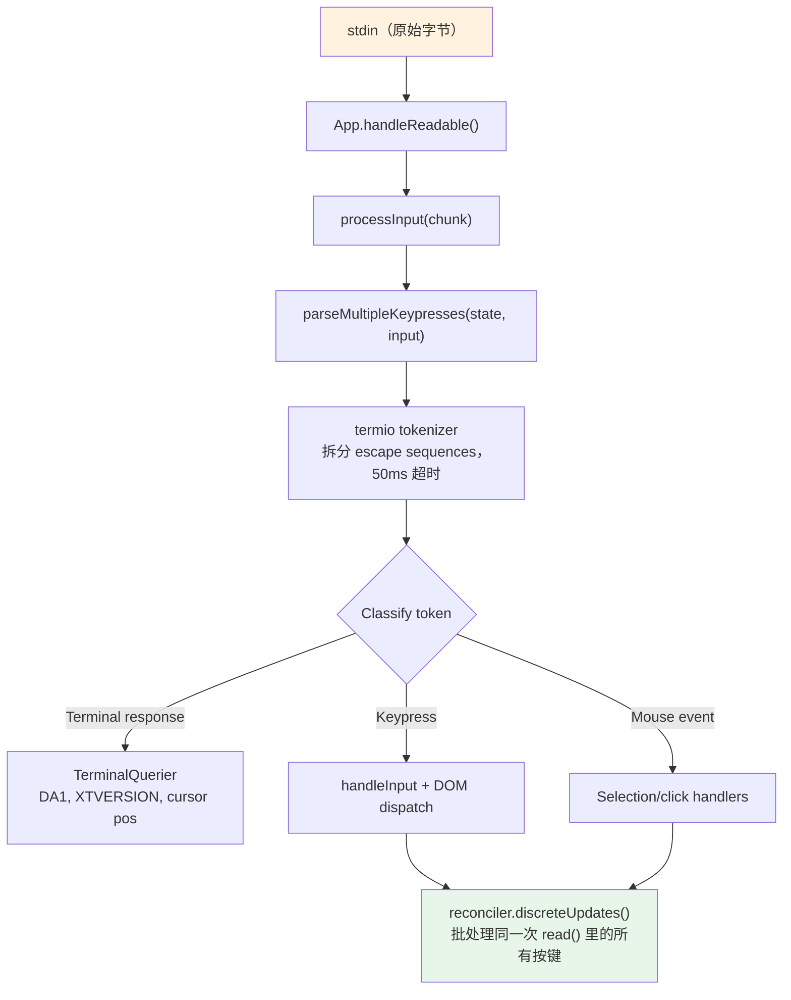
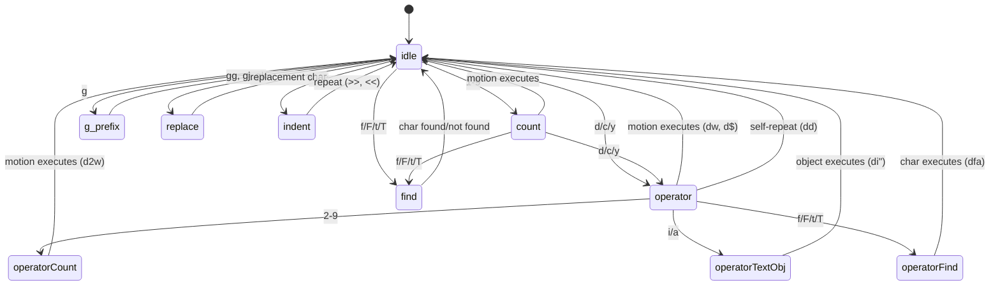

# 第 14 章：输入与交互

## 原始字节，有意义的动作

当你在 Claude Code 里先按 `Ctrl+X` 再按 `Ctrl+K` 时，终端会在大约 200 毫秒的间隔内发送两段字节序列。第一段是 `0x18`（ASCII CAN），第二段是 `0x0B`（ASCII VT）。这两个字节本身除了“控制字符”之外并没有任何固有含义。输入系统必须识别出：这两个字节在超时时间窗口内按顺序到达，构成 chord `ctrl+x ctrl+k`，而这个 chord 又映射到动作 `chat:killAgents`，从而终止所有正在运行的子代理。

从原始字节到被终止的 agents 之间，会有六个系统参与：一个 tokenizer 拆分 escape sequence，一个 parser 在五种终端协议上对其分类，一个 keybinding resolver 把序列与上下文相关的绑定匹配起来，一个 chord 状态机管理多键序列，一个 handler 执行动作，最后 React 把产生的状态更新批量合并成一次渲染。

问题不在任何单一系统本身，而在终端多样性的组合爆炸。iTerm2 会发送 Kitty keyboard protocol 序列，macOS Terminal 会发送老式 VT220 序列，Ghostty 通过 SSH 会发送 xterm modifyOtherKeys，tmux 则会根据配置吞掉、变换或者透传这些序列。Windows Terminal 在 VT mode 上也有自己的怪癖。输入系统必须从所有这些协议中生成正确的 `ParsedKey` 对象，因为用户不应该被迫知道自己的终端到底用了哪一种键盘协议。

本章会沿着这条路径，从原始字节一路追踪到有意义的动作。

设计哲学是“渐进增强，优雅降级”。在支持 Kitty keyboard protocol 的现代终端上，Claude Code 可以完整识别修饰键（`Ctrl+Shift+A` 和 `Ctrl+A` 是不同的）、报告 super 键（Cmd 快捷键），并且明确识别每个按键。若是在通过 SSH 连接的老终端上，它会退回到可用的最佳协议，丢掉一部分修饰键区分，但保留核心功能。用户不会看到“你的终端不受支持”的错误提示。你可能不能用 `ctrl+shift+f` 做全局搜索，但 `ctrl+r` 的历史搜索到处都能用。

---

## 按键解析流水线

输入会作为 stdin 上的字节块到达。流水线按阶段处理它们：



tokenizer 是基础。终端输入是一条混合了可打印字符、控制码和多字节 escape sequence 的字节流，而且没有显式帧边界。一次 stdin 的 `read()` 可能返回 `\x1b[1;5A`（Ctrl+Up arrow），也可能在第一次 read 里只返回 `\x1b`，下一次再返回 `[1;5A`，这取决于 PTY 传字节的速度。tokenizer 维护一个状态机，用来缓存不完整的 escape sequence，并在完整 token 到来时再发出。

不完整序列的问题是根本性的。当 tokenizer 看到单独一个 `\x1b` 时，它无法知道这到底是 Escape 键，还是 CSI 序列的起始。于是它会先缓存这个字节并启动一个 50ms 计时器。如果在超时前没有后续内容到达，就把缓存刷出，把 `\x1b` 当成 Escape 键处理。但在刷出之前，tokenizer 还会检查 `stdin.readableLength` -- 如果 kernel buffer 里已经有字节在等着，计时器会重新设定，而不是直接刷出。这能处理 event loop 被阻塞超过 50ms 的情况：续接字节其实已经在缓冲区里了，只是还没被读出来。

对于粘贴操作，超时时间会延长到 500ms。因为粘贴文本可能很长，而且会分成多块到达。

来自同一次 `read()` 的所有已解析按键都会在同一次 `reconciler.discreteUpdates()` 调用里处理。这样 React 的状态更新就会被批处理：粘贴 100 个字符只会触发一次重渲，而不是 100 次。这个批处理至关重要：如果没有它，粘贴中的每个字符都会触发完整的 reconciliation 周期 -- 状态更新、reconcile、commit、Yoga 布局、render、diff、write。按每个周期 5ms 算，100 字符的粘贴要花 500ms 才能处理完。有了批处理，同样的粘贴只需要一个 5ms 周期。

### stdin 管理

`App` 组件通过引用计数管理 raw mode。当某个组件需要原始输入（prompt、dialog、vim mode）时，它会调用 `setRawMode(true)`，计数器加 1。当它不再需要时，再调用 `setRawMode(false)`，计数器减 1。只有当计数器归零时，raw mode 才会被关闭。这样可以避免终端应用里一个很常见的 bug：组件 A 打开 raw mode，组件 B 也打开 raw mode，然后组件 A 关闭 raw mode，结果组件 B 的输入突然坏掉，因为全局 raw mode 被关了。

当 raw mode 第一次启用时，App 会：

1. 停止早期输入捕获（bootstrap 阶段在 React 挂载前收集按键的机制）
2. 把 stdin 切到 raw mode（没有行缓冲、没有回显、没有信号处理）
3. 绑定 `readable` 监听器，进行异步输入处理
4. 启用 bracketed paste（让粘贴文本可识别）
5. 启用 focus reporting（让应用知道终端窗口何时获得/失去焦点）
6. 启用扩展按键报告（Kitty keyboard protocol + xterm modifyOtherKeys）

关闭时，上述动作会反向撤销。谨慎的顺序很重要：先关扩展按键报告，再关 raw mode，可以确保应用停止解析之后，终端不会继续发送 Kitty 编码序列。

`onExit` 信号处理器（通过 `signal-exit` 包）确保即使遇到意外终止也能清理现场。如果进程收到 SIGTERM 或 SIGINT，处理器会关闭 raw mode、恢复终端状态、如果在 alt-screen 中则退出 alt-screen，并在进程退出前重新显示光标。没有这一步，崩溃后的 Claude Code 会让终端停在 raw mode，既没有光标也没有回显 -- 用户只能盲打 `reset` 才能救回来。

---

## 多协议支持

不同终端对键盘输入的编码方式并不一致。现代终端模拟器（比如 Kitty）会发送带完整修饰键信息的结构化序列；老式 SSH 终端则会发送模糊的字节序列，需要上下文来解释。Claude Code 的 parser 同时处理五种不同协议，因为用户的终端可能是其中任何一种。

**CSI u（Kitty keyboard protocol）** 是现代标准。格式：`ESC [ codepoint [; modifier] u`。例如 `ESC[13;2u` 表示 Shift+Enter，`ESC[27u` 表示不带修饰键的 Escape。codepoint 可以无歧义地标识按键 -- 不会混淆“Escape 键”和“Escape 作为序列前缀”。modifier word 则把 shift、alt、ctrl 和 super（Cmd）分别编码成 bit。Claude Code 会在支持的终端上通过 `ENABLE_KITTY_KEYBOARD` escape sequence 在启动时启用该协议，并在退出时通过 `DISABLE_KITTY_KEYBOARD` 关闭它。协议通过 query/response 握手检测：应用发送 `CSI ? u`，终端返回 `CSI ? flags u`，其中 `flags` 表示支持的协议级别。

**xterm modifyOtherKeys** 是 Ghostty 这类通过 SSH 运行、又没有协商 Kitty 协议的终端的 fallback。格式：`ESC [ 27 ; modifier ; keycode ~`。注意参数顺序和 CSI u 相反 -- modifier 在前，keycode 在后。这是 parser bug 的常见来源。该协议可通过 `CSI > 4 ; 2 m` 启用，并由 Ghostty、tmux 和 xterm 在终端的 TERM 标识无法检测到时发出（SSH 场景里 `TERM_PROGRAM` 传不过去，这很常见）。

**老式终端序列** 覆盖其余所有情况：函数键通过 `ESC O` 和 `ESC [` 序列表示，方向键、数字小键盘、Home/End/Insert/Delete，以及四十年终端演化中积累下来的 VT100/VT220/xterm 变体，都属于这一类。parser 用两个正则来匹配它们：`FN_KEY_RE` 对应 `ESC O/N/[/[[` 前缀模式（匹配函数键、方向键及其修饰变体），`META_KEY_CODE_RE` 对应 meta 键编码（`ESC` 后跟单个字母数字字符，也就是传统的 Alt+key 编码）。

老式序列的难点在于歧义。`ESC [ 1 ; 2 R` 可能是 Shift+F3，也可能是光标位置报告，具体取决于上下文。parser 通过 private-marker 检查来消歧：光标位置报告用的是 `CSI ? row ; col R`（带 `?` 私有标记），而修饰后的函数键用的是 `CSI params R`（不带它）。这也是 Claude Code 请求 DECXCPR（extended cursor position reports）而不是标准 CPR 的原因 -- 扩展形式没有歧义。

终端识别增加了另一层复杂度。启动时，Claude Code 会发送一个 `XTVERSION` 查询（`CSI > 0 q`）来获取终端名称和版本。响应（`DCS > | name ST`）在 SSH 连接中也能保留 -- 不像 `TERM_PROGRAM`，它只是一个不会透过 SSH 传播的环境变量。知道终端身份之后，parser 就能处理终端特定的怪癖。例如，xterm.js（VS Code 集成终端使用的就是它）和原生 xterm 的 escape sequence 行为不同，而识别字符串（`xterm.js(X.Y.Z)`）能帮助 parser 适配这些差异。

**SGR mouse events** 的格式是 `ESC [ < button ; col ; row M/m`，其中 `M` 表示按下，`m` 表示释放。button code 编码动作：0/1/2 代表左/中/右键，64/65 代表滚轮上/下（0x40 与 wheel bit 做 OR），32+ 代表拖拽（0x20 与 motion bit 做 OR）。滚轮事件会被转换成 `ParsedKey` 对象，这样它们也能走 keybinding 系统；点击和拖拽事件则会变成 `ParsedMouse` 对象，路由到选择处理器。

**Bracketed paste** 会把粘贴内容包在 `ESC [200~` 和 `ESC [201~` 标记之间。标记之间的所有内容都会成为一个 `ParsedKey`，并带上 `isPasted: true`，不管里面包含什么 escape sequence。这样可以防止粘贴的代码被解释成命令 -- 当用户粘贴的代码片段里包含 `\x03`（原始字节里的 Ctrl+C）时，这一点尤其关键。

parser 的输出类型形成了一个干净的 discriminated union：

```typescript
type ParsedKey = {
  kind: 'key';
  name: string;        // 'return', 'escape', 'a', 'f1', etc.
  ctrl: boolean; meta: boolean; shift: boolean;
  option: boolean; super: boolean;
  sequence: string;    // Raw escape sequence for debugging
  isPasted: boolean;   // Inside bracketed paste
}

type ParsedMouse = {
  kind: 'mouse';
  button: number;      // SGR button code
  action: 'press' | 'release';
  col: number; row: number;  // 1-indexed terminal coordinates
}

type ParsedResponse = {
  kind: 'response';
  response: TerminalResponse;  // Routed to TerminalQuerier
}
```

`kind` 这个 discriminant 可以确保下游代码显式处理每一种输入类型。按键不可能被误当成鼠标事件；终端响应也不可能被误当成按键。`ParsedKey` 还带着原始 `sequence` 字符串用于调试 -- 当用户报告“按 Ctrl+Shift+A 没反应”时，debug log 可以准确显示终端发出了什么字节序列，从而判断问题究竟出在终端编码、parser 识别，还是 keybinding 配置。

`isPasted` 标志对安全性非常关键。启用 bracketed paste 时，终端会用标记序列把粘贴内容包起来。parser 会在结果 key event 上设置 `isPasted: true`，而 keybinding resolver 会跳过对粘贴内容的按键匹配。没有这一层，粘贴里如果包含 `\x03`（原始字节的 Ctrl+C）或 escape 序列，就会触发应用命令。有了它，粘贴内容无论字节里有什么，都只会被当成字面文本输入。

parser 也会识别 terminal response -- 即终端本身对查询的回答。这些包括 device attributes（DA1、DA2）、cursor position reports、Kitty keyboard flag 响应、XTVERSION（终端识别）和 DECRPM（mode status）。它们会被路由到 `TerminalQuerier`，而不是输入处理器：

```typescript
type TerminalResponse =
  | { type: 'decrpm'; mode: number; status: number }
  | { type: 'da1'; params: number[] }
  | { type: 'da2'; params: number[] }
  | { type: 'kittyKeyboard'; flags: number }
  | { type: 'cursorPosition'; row: number; col: number }
  | { type: 'osc'; code: number; data: string }
  | { type: 'xtversion'; version: string }
```

**Modifier decoding** 遵循 XTerm 约定：modifier word 的值是 `1 + (shift ? 1 : 0) + (alt ? 2 : 0) + (ctrl ? 4 : 0) + (super ? 8 : 0)`。`ParsedKey` 里的 `meta` 字段对应 Alt/Option（bit 2）。`super` 字段是单独的（bit 8，在 macOS 上对应 Cmd）。这个区分很重要，因为 Cmd 快捷键通常被操作系统保留，终端应用无法捕获 -- 除非终端使用 Kitty 协议，它会报告其他协议会悄悄吞掉的 super 修饰键。

一个 stdin-gap 检测器会在间隔 5 秒后没有输入时，触发终端模式重申。这能处理 tmux 重新 attach 和笔记本唤醒的场景，因为终端的键盘模式可能已经被 multiplexer 或操作系统重置了。重新宣告时，会再次发送 `ENABLE_KITTY_KEYBOARD`、`ENABLE_MODIFY_OTHER_KEYS`、bracketed paste 和 focus reporting 序列。否则，从 tmux 会话里 detach 再 reattach 后，键盘协议会静默降级到老式模式，导致后续整个会话的修饰键识别失效。

### 终端 I/O 层

在 parser 之下，是 `ink/termio/` 里的结构化终端 I/O 子系统：

- **csi.ts** -- CSI（Control Sequence Introducer）序列：光标移动、清除、滚动区域、启用/禁用 bracketed paste、启用/禁用 focus 事件、启用/禁用 Kitty keyboard protocol
- **dec.ts** -- DEC private mode 序列：alternate screen buffer（1049）、鼠标跟踪模式（1000/1002/1003）、光标可见性、bracketed paste（2004）、focus 事件（1004）
- **osc.ts** -- Operating System Commands：剪贴板访问（OSC 52）、标签页状态、iTerm2 进度指示器、tmux/screen multiplexer 包装（需要穿过 multiplexer 边界的序列会走 DCS passthrough）
- **sgr.ts** -- Select Graphic Rendition：ANSI 样式码系统（颜色、粗体、斜体、下划线、反白）
- **tokenize.ts** -- 负责检测 escape sequence 边界的有状态 tokenizer

multiplexer 包装值得单独说明。当 Claude Code 在 tmux 里运行时，某些 escape sequence（例如 Kitty keyboard protocol 协商）必须透传到外层终端。tmux 使用 DCS passthrough（`ESC P ... ST`）转发它不理解的序列。`osc.ts` 里的 `wrapForMultiplexer` 函数会检测 multiplexer 环境并适当包装序列。没有这一层，Kitty keyboard mode 在 tmux 里会静默失效，而用户根本不知道为什么 Ctrl+Shift 绑定突然不能用了。

### 事件系统

`ink/events/` 目录实现了一个兼容浏览器的事件系统，包含七种事件类型：`KeyboardEvent`、`ClickEvent`、`FocusEvent`、`InputEvent`、`TerminalFocusEvent`，以及基础的 `TerminalEvent`。每个事件都携带 `target`、`currentTarget`、`eventPhase`，并支持 `stopPropagation()`、`stopImmediatePropagation()` 和 `preventDefault()`。

包裹 `ParsedKey` 的 `InputEvent` 是为了兼容旧的 `EventEmitter` 路径，老组件可能还在用它。新组件使用 DOM 风格的键盘事件分发，支持 capture/bubble 阶段。两条路径都来自同一个 parsed key，所以它们始终一致 -- 进入 stdin 的一个按键会恰好产生一个 `ParsedKey`，然后同时派生出一个 `InputEvent`（给旧监听器）和一个 `KeyboardEvent`（给 DOM 风格分发）。这种双路径设计让系统可以从 EventEmitter 模式逐步迁移到 DOM 事件模式，而不会破坏现有组件。

---

## 按键绑定系统

keybinding 系统把三个经常被混在一起的概念分开了：什么按键触发什么动作（bindings）、动作触发时发生什么（handlers）、以及当前哪些 bindings 处于激活状态（contexts）。

### 绑定：声明式配置

默认 bindings 定义在 `defaultBindings.ts` 里，是一个 `KeybindingBlock` 数组，每个 block 都绑定到某个 context：

```typescript
export const DEFAULT_BINDINGS: KeybindingBlock[] = [
  {
    context: 'Global',
    bindings: {
      'ctrl+c': 'app:interrupt',
      'ctrl+d': 'app:exit',
      'ctrl+l': 'app:redraw',
      'ctrl+r': 'history:search',
    },
  },
  {
    context: 'Chat',
    bindings: {
      'escape': 'chat:cancel',
      'ctrl+x ctrl+k': 'chat:killAgents',
      'enter': 'chat:submit',
      'up': 'history:previous',
      'ctrl+x ctrl+e': 'chat:externalEditor',
    },
  },
  // ... 14 more contexts
]
```

平台相关的 bindings 会在定义时处理。图片粘贴在 macOS/Linux 上是 `ctrl+v`，但在 Windows 上是 `alt+v`（因为那里 `ctrl+v` 是系统粘贴）。模式切换在支持 VT mode 的终端上是 `shift+tab`，但在不支持它的 Windows Terminal 上是 `meta+m`。受特性开关控制的 bindings（快速搜索、voice mode、terminal panel）也会按条件包含。

用户可以通过 `~/.claude/keybindings.json` 覆盖任何 binding。parser 支持 modifier 别名（`ctrl`/`control`、`alt`/`opt`/`option`、`cmd`/`command`/`super`/`win`）、按键别名（`esc` -> `escape`，`return` -> `enter`）、chord 记法（空格分隔的步骤，比如 `ctrl+k ctrl+s`），以及用 `null` 取消默认按键。`null` 动作和“不定义 binding”并不一样 -- 它显式阻止默认 binding 触发，这对想把某个按键交还给终端本身的用户很重要。

### 上下文：16 个活动范围

每个 context 都代表一种交互模式，某组 bindings 在其中生效：

| 上下文 | 何时生效 |
|---------|------------|
| Global | 始终 |
| Chat | prompt 输入获得焦点 |
| Autocomplete | 补全菜单可见 |
| Confirmation | 权限对话框正在显示 |
| Scroll | alt-screen 中有可滚动内容 |
| Transcript | 只读 transcript 查看器 |
| HistorySearch | 反向历史搜索（`ctrl+r`） |
| Task | 正在运行后台任务 |
| Help | 正在显示帮助覆盖层 |
| MessageSelector | rewind 对话框 |
| MessageActions | 消息光标导航 |
| DiffDialog | diff 查看器 |
| Select | 通用选择列表 |
| Settings | 配置面板 |
| Tabs | 标签页导航 |
| Footer | 底部指示器 |

当按键到达时，resolver 会基于当前激活的 contexts（由 React component state 决定）构建一个 context 列表，去重并保留优先级顺序，然后查找匹配的 binding。最后一个匹配项获胜 -- 这就是用户覆盖默认配置的方式。context 列表会在每次按键时重建（代价很低：最多 16 个字符串的数组拼接和去重），因此 context 变化能立即生效，不需要订阅或监听器机制。

context 设计可以很好地处理一个棘手交互：嵌套模态。当权限对话框在一个运行中的任务之上弹出时，`Confirmation` 和 `Task` 两个 context 可能同时活跃。`Confirmation` 的优先级更高（因为它在组件树里注册得更晚），所以 `y` 会触发“approve”，而不会触发任何 task 级别的绑定。对话框关闭后，`Confirmation` context 会失效，`Task` bindings 再次恢复。这种堆叠行为是由 context 列表的优先级顺序自然产生的 -- 不需要专门的模态处理代码。

### 保留快捷键

不是所有按键都能重新绑定。系统使用三层保留机制：

**不可重绑定**（硬编码行为）：`ctrl+c`（interrupt/exit）、`ctrl+d`（exit）、`ctrl+m`（在所有终端里都等同于 Enter -- 重新绑定它会破坏 Enter）。

**终端保留**（警告）：`ctrl+z`（SIGTSTP）、`ctrl+\`（SIGQUIT）。这些理论上可以绑定，但在大多数配置里，终端会在应用看到之前就截获它们。

**macOS 保留**（错误）：`cmd+c`、`cmd+v`、`cmd+x`、`cmd+q`、`cmd+w`、`cmd+tab`、`cmd+space`。操作系统会在它们到达终端之前把它们截获。绑定这些快捷键只会得到一个永远不会触发的 shortcut。

### 解析流程

当按键到达时，解析路径如下：

1. 构建 context 列表：组件注册的活跃 contexts 加上 Global，去重并保留优先级
2. 对合并后的 binding 表调用 `resolveKeyWithChordState(input, key, contexts)`
3. 如果 `match`：清掉任何待处理 chord，调用 handler，对事件执行 `stopImmediatePropagation()`
4. 如果 `chord_started`：保存待处理按键，停止传播，启动 chord 超时
5. 如果 `chord_cancelled`：清掉待处理 chord，让事件继续向下传
6. 如果 `unbound`：清掉 chord -- 这是显式取消绑定（用户把动作设成了 `null`），因此传播会被阻止，但不会执行 handler
7. 如果 `none`：让事件流向其他 handler

“最后一个获胜”的解析策略意味着，如果默认 bindings 和用户 bindings 都在 `Chat` context 里定义了 `ctrl+k`，用户的绑定会优先。这个判断是在匹配时按定义顺序遍历 bindings，并保留最后一个命中的结果，而不是在加载时构建覆盖 map。好处是：上下文相关的覆盖可以自然组合。用户可以只覆盖 `Chat` 里的 `enter`，而不会影响 `Confirmation` 里的 `enter`。

---

## 组合键支持

`ctrl+x ctrl+k` 这个 binding 是一个 chord：两个按键合起来形成一个动作。resolver 用状态机管理它。

按键到达时：

1. resolver 会把它追加到任何待处理 chord 前缀上
2. 检查是否有某个 binding 的 chord 以前缀开头。如果有，就返回 `chord_started` 并保存待处理按键
3. 如果完整 chord 与某个 binding 精确匹配，就返回 `match` 并清掉待处理状态
4. 如果 chord 前缀什么也不匹配，就返回 `chord_cancelled`

`ChordInterceptor` 组件会在 chord 等待状态下拦截所有输入。它有 1000ms 超时 -- 如果第二个按键在一秒内没到，chord 就会取消，第一个按键会被丢弃。`KeybindingContext` 提供了一个 `pendingChordRef`，用于同步访问待处理状态，避免 React state 更新延迟导致第二个按键先于第一个按键的状态更新被处理。

这种 chord 设计避免了和 readline 编辑键发生遮蔽。没有 chord 时，“kill agents” 之类的 keybinding 可能会被设成 `ctrl+k` -- 但这其实是 readline 里的“kill to end of line”，用户在终端文本输入中是会期待它保留的。使用 `ctrl+x` 作为前缀（和 readline 自己的 chord 前缀惯例一致），系统就得到了一组不会和单键编辑快捷键冲突的 bindings。

实现里还处理了一个大多数 chord 系统都会漏掉的边界情况：用户按下 `ctrl+x` 后，输入了一个不属于任何 chord 的字符，会发生什么？如果处理不当，这个字符会被吞掉 -- chord interceptor 消费了输入，chord 被取消，而字符也丢了。Claude Code 的 `ChordInterceptor` 在这种情况下会返回 `chord_cancelled`，这样待处理输入会被丢弃，但那个不匹配的字符仍然会继续走正常输入处理。丢失的是 chord 前缀，不是字符本身。这和用户对 Emacs 风格 chord 前缀的预期一致。

---

## Vim 模式

### 状态机

vim 的实现是一个纯状态机，并带有穷尽类型检查。类型本身就是文档：

```typescript
export type VimState =
  | { mode: 'INSERT'; insertedText: string }
  | { mode: 'NORMAL'; command: CommandState }

export type CommandState =
  | { type: 'idle' }
  | { type: 'count'; digits: string }
  | { type: 'operator'; op: Operator; count: number }
  | { type: 'operatorCount'; op: Operator; count: number; digits: string }
  | { type: 'operatorFind'; op: Operator; count: number; find: FindType }
  | { type: 'operatorTextObj'; op: Operator; count: number; scope: TextObjScope }
  | { type: 'find'; find: FindType; count: number }
  | { type: 'g'; count: number }
  | { type: 'operatorG'; op: Operator; count: number }
  | { type: 'replace'; count: number }
  | { type: 'indent'; dir: '>' | '<'; count: number }
```

这是一个带有 12 个变体的 discriminated union。TypeScript 的穷尽检查可以确保对 `CommandState.type` 的每个 `switch` 都覆盖全部 12 种情况。只要往这个 union 里加一个新状态，所有不完整的 `switch` 就会编译报错。这个状态机不会有死状态，也不会有缺失转移 -- 类型系统不允许它们存在。

注意每个状态都只携带下一步转移真正需要的数据。`operator` 状态知道 operator 是什么（`op`）以及前面的 count。`operatorCount` 状态再加上了数字累加器（`digits`）。`operatorTextObj` 状态再加上作用域（`inner` 或 `around`）。任何状态都不会携带自己用不到的数据。这不只是品味问题 -- 它避免了整个一类 bug：handler 读到了上一个命令残留的旧数据。如果你处在 `find` 状态，你手里只有 `FindType` 和 `count`。你没有 operator，因为此时并没有等待中的 operator。类型系统让不可能的状态无法表示。

状态图会把故事讲得更清楚：



从 `idle` 开始，按下 `d` 会进入 `operator` 状态。从 `operator` 出发，按 `w` 会执行带 `w` motion 的 delete。再次按 `d`（`dd`）会触发整行删除。按 `2` 会进入 `operatorCount`，于是 `d2w` 变成“删除接下来的 2 个单词”。按 `i` 会进入 `operatorTextObj`，于是 `di"` 变成“删除引号内部内容”。每个中间状态都只携带下一步转移所需的上下文 -- 多一分没有，少一分也不行。

### 把转移写成纯函数

`transition()` 函数会根据当前状态类型分派到 10 个处理函数之一。每个处理函数都会返回一个 `TransitionResult`：

```typescript
type TransitionResult = {
  next?: CommandState;    // New state (omitted = stay in current)
  execute?: () => void;   // Side effect (omitted = no action yet)
}
```

副作用是返回的，不是立刻执行的。transition 函数是纯的 -- 给定一个状态和一个按键，它只返回下一个状态，并可选地返回一个执行动作的闭包。调用方决定什么时候运行这个 effect。这使状态机天然可测：给它状态和按键，断言返回的状态，忽略闭包就行。它也意味着 transition 函数不依赖 editor state、cursor 位置或 buffer 内容。这些细节是在闭包创建时捕获的，不是在状态机转移时消费的。

`fromIdle` 处理器是入口，覆盖了完整的 vim 词汇：

- **计数前缀**：`1-9` 进入 `count` 状态，累积数字。`0` 是特殊的 -- 它是“行首” motion，而不是 count 数字，除非前面已经累积过数字
- **操作符**：`d`、`c`、`y` 进入 `operator` 状态，等待 motion 或 text object 来定义范围
- **查找**：`f`、`F`、`t`、`T` 进入 `find` 状态，等待要查找的字符
- **G-prefix**：`g` 进入 `g` 状态，用于复合命令（`gg`、`gj`、`gk`）
- **替换**：`r` 进入 `replace` 状态，等待替换字符
- **缩进**：`>`、`<` 进入 `indent` 状态（对应 `>>` 和 `<<`）
- **简单 motion**：`h/j/k/l/w/b/e/W/B/E/0/^/$` 会立即执行，移动光标
- **即时命令**：`x`（删字符）、`~`（切换大小写）、`J`（合并行）、`p/P`（粘贴）、`D/C/Y`（operator 快捷方式）、`G`（跳到末尾）、`.`（dot-repeat）、`;/,`（find repeat）、`u`（undo）、`i/I/a/A/o/O`（进入 insert mode）

### Motion、操作符与文本对象

**Motions** 是把一个按键映射到光标位置的纯函数。`resolveMotion(key, cursor, count)` 会把 motion 应用 `count` 次，并在光标不再移动时短路（你不可能在列 0 的左边继续向左走）。这种短路对行尾的 `3w` 很重要 -- 它会停在最后一个单词，而不是换行或报错。

motions 按它们和 operators 的交互方式分类：

- **Exclusive**（默认）-- 目标位置上的字符**不**包含在范围里。`dw` 会删除到下一个单词第一个字符之前为止
- **Inclusive**（`e`、`E`、`$`）-- 目标位置上的字符**包含**在范围里。`de` 会删除到当前单词最后一个字符为止
- **Linewise**（`j`、`k`、`G`、`gg`、`gj`、`gk`）-- 和 operator 一起用时，范围会扩展到整行。`dj` 会删除当前行和下一行，而不是只删除两个光标位置之间的字符

**Operators** 作用于一个范围。`delete` 删除文本并把它保存到 register。`change` 删除文本并进入 insert mode。`yank` 复制到 register，但不修改内容。`cw`/`cW` 这个特例遵循 vim 约定：change-word 会走到当前单词末尾，而不是下一个单词开头（和 `dw` 不一样）。

有一个有意思的边界情况：`[Image #N]` chip snapping。当一个 word motion 落进图片引用 chip（在终端里会被渲染成一个视觉整体）里时，范围会扩展到整个 chip。这可以防止把用户眼里一个原子元素删成半截 -- 你不能删掉 `[Image #3]` 的一半，因为 motion 系统把整个 chip 当成一个单词。

额外命令覆盖了完整的常见 vim 词汇：`x`（删字符）、`r`（替换字符）、`~`（切换大小写）、`J`（合并行）、`p`/`P`（粘贴，区分 linewise/characterwise）、`>>` / `<<`（缩进/取消缩进，以 2 个空格为步长）、`o`/`O`（在下方/上方打开一行并进入 insert mode）。

**Text objects** 会查找光标周围的边界。它们回答的是：“光标所在的‘东西’是什么？”

单词对象（`iw`、`aw`、`iW`、`aW`）会把文本分成 grapheme，分别把每个部分分类为词字符、空白或标点，并把选择扩展到单词边界。`i`（inner）变体只选单词本身。`a`（around）变体还会把周围空白包含进去 -- 优先选尾随空白，若行尾没有则回退到前导空白。大写变体（`W`、`aW`）把任何非空白序列都当成单词，忽略标点边界。

引号对象（`i"`、`a"`、`i'`、`a'`、`` i` ``、`` a` ``）会在当前行里寻找成对引号。配对是按顺序匹配的（第一个和第二个引号成对，第三个和第四个引号成下一对，依此类推）。如果光标位于第一和第二个引号之间，那就是匹配范围。`a` 变体包含引号字符，`i` 变体不包含。

括号对象（`ib`/`i(`、`ab`/`a(`、`i[`/`a[`、`iB`/`i{`/`aB`/`a{`、`i<`/`a<`）会做带深度跟踪的匹配搜索，寻找成对分隔符。它们会从光标向外搜索，维护 nesting count，直到在深度 0 找到匹配对。这样就能正确处理嵌套括号 -- 在 `foo((bar))` 里使用 `d i (` 会删除 `bar`，而不是 `(bar)`。

### 持久状态与 Dot-Repeat

vim mode 会维护一个跨命令存活的 `PersistentState` -- 这就是让 vim 有“vim 味道”的那种“记忆”：

```typescript
interface PersistentState {
  lastChange: RecordedChange;   // For dot-repeat
  lastFind: { type: FindType; char: string };  // For ; and ,
  register: string;             // Yank buffer
  registerIsLinewise: boolean;  // Paste behavior flag
}
```

每个会修改内容的命令都会被记录成一个 `RecordedChange` -- 这是一个 discriminated union，覆盖 insert、operator+motion、operator+textObj、operator+find、replace、delete-char、toggle-case、indent、open-line 和 join。`.` 命令会从持久状态里重放 `lastChange`，使用记录下来的 count、operator 和 motion，在当前光标位置复现完全相同的编辑。

find-repeat（`;/,`）使用 `lastFind`。`;` 命令会沿同一方向重复上一次查找。`,` 会反转方向：`f` 变成 `F`，`t` 变成 `T`，反之亦然。这意味着在 `fa`（查找下一个 `a`）之后，`;` 会向前找下一个 `a`，`,` 会向后找下一个 `a` -- 用户不需要记住自己当时是向哪个方向搜的。

register 会跟踪 yank 和 delete 的文本。当 register 内容以 `\n` 结尾时，它会被标记为 linewise，这会改变粘贴行为：`p` 会插到当前行下面（而不是光标后面），`P` 会插到上面。这个区分对用户是透明的，但对“删一整行再粘到别处”这种 vim 用户经常依赖的工作流至关重要。

---

## 虚拟滚动

Claude Code 的长会话会产生很长的对话。一次重度调试会话可能生成 200 条以上消息，每条都包含 Markdown、代码块、工具调用结果和权限记录。如果不用虚拟化，React 就得在内存里维护 200 多个组件子树，每个都有自己的 state、effects 和 memoization cache。DOM 树会膨胀成成千上万个节点。Yoga 布局每帧都要访问它们。终端就会变得无法使用。

`VirtualMessageList` 组件通过只渲染视口内可见的消息，再加上上下各一点缓冲区，来解决这个问题。在一个有几百条消息的对话里，这意味着挂载 500 个 React 子树（每个都要做 Markdown 解析、语法高亮和 tool use block），还是只挂载 15 个子树的差别。

这个组件维护：

- **按消息维度的高度缓存**，在终端列数变化时失效
- **跳转把手**，用于 transcript 搜索导航（跳到索引、下一条/上一条匹配）
- **搜索文本提取**，支持 warm-cache（当用户输入 `/` 时预先把所有消息转成小写）
- **sticky prompt 跟踪** -- 当用户滚出输入区时，他们最后一次输入的 prompt 会显示在顶部作为上下文
- **message actions 导航** -- 用于 rewind 功能的基于光标的消息选择

`useVirtualScroll` hook 会根据 `scrollTop`、`viewportHeight` 和消息累计高度，计算哪些消息需要挂载。它会在 `ScrollBox` 上维护滚动 clamp 边界，防止 burst `scrollTo` 调用超过 React 的异步重渲而导致空白屏幕 -- 这是虚拟列表里很经典的问题：滚动位置跑得比 DOM 更新还快。

虚拟滚动和 Markdown token cache 的交互也值得注意。当一条消息滚出视口时，它的 React 子树会卸载；当用户滚回来时，子树会重新挂载。如果没有缓存，用户每滚过一次消息，都要重新解析 Markdown。模块级 LRU cache（500 条，按内容 hash 缓存）确保 `marked.lexer()` 这种昂贵调用对每种唯一消息内容最多只会发生一次，不管组件挂载卸载多少次。

`ScrollBox` 组件本身通过 `useImperativeHandle` 提供一个 imperative API：

- `scrollTo(y)` -- 绝对滚动，会破坏 sticky-scroll 模式
- `scrollBy(dy)` -- 累积到 `pendingScrollDelta`，由渲染器以受限速率处理
- `scrollToElement(el, offset)` -- 通过 `scrollAnchor` 把位置读取延迟到渲染时
- `scrollToBottom()` -- 重新启用 sticky-scroll 模式
- `setClampBounds(min, max)` -- 约束虚拟滚动窗口

所有滚动 mutation 都直接写 DOM 节点属性，并通过微任务安排渲染，绕过 React reconciler。`markScrollActivity()` 会通知后台间隔任务（spinners、timers）跳过下一次 tick，以减少活动滚动时的 event-loop 竞争。这是一种协作式调度模式：滚动路径会告诉后台工作“我现在是低延迟敏感操作，请让步”。后台 interval 会在安排下一次 tick 前检查这个标志，如果当前有滚动，就延迟一帧。结果就是即使后台同时跑着多个 spinner 和 timer，滚动依然始终顺滑。

---

## 这样做：构建一个上下文感知的按键绑定系统

Claude Code 的 keybinding 架构可以给任何有模态输入的应用当模板 -- 编辑器、IDE、绘图工具、终端多路复用器。关键洞见有这些：

**把 bindings 和 handlers 分开。** bindings 是数据（哪个按键映射到哪个动作名）；handlers 是代码（动作触发后发生什么）。分开之后，bindings 可以序列化成 JSON 供用户自定义，而 handlers 仍然保留在拥有相关状态的组件里。用户可以把 `ctrl+k` 重绑成 `chat:submit`，而不用改任何组件代码。

**把 context 当成一等概念。** 不要只有一张平铺 keymap，而是定义一组会随应用状态激活/失活的 contexts。当对话框打开时，`Confirmation` context 激活，并且优先于 `Chat` bindings；对话框关闭后，`Chat` bindings 恢复。这可以避免在事件处理器里到处都是 `if (dialogOpen && key === 'y')` 这种条件分支。

**把 chord 状态做成显式机器。** 多键序列（chord）不是单键绑定的特殊情况，而是另一种绑定类型，需要一个带超时和取消语义的状态机。把这件事显式化（使用专门的 `ChordInterceptor` 组件和 `pendingChordRef`）可以避免一些隐蔽 bug：比如 chord 的第二个按键被另一个 handler 消费了，因为 React state 更新还没传播到位。

**尽早保留，清晰警告。** 在定义时就识别哪些按键不能重绑（系统快捷键、终端控制字符），而不是在解析时再识别。当用户尝试绑定 `ctrl+c` 时，在配置加载阶段就报错，而不是静默接受一个永远不会触发的绑定。这就是“能用的 keybinding 系统”和“只会产出神秘 bug 报告的系统”之间的区别。

**为终端多样性设计。** Claude Code 的 keybinding 系统把平台特定的替代方案定义在 binding 层，而不是 handler 层。图片粘贴在不同系统上可能是 `ctrl+v` 或 `alt+v`。模式切换在不同终端上可能是 `shift+tab` 或 `meta+m`。每个动作对应的 handler 都一样，不管是哪一个按键触发。这意味着测试只需要覆盖“每个动作一条代码路径”，而不是“每个平台-按键组合一条代码路径”。当新的终端怪癖出现时（比如 Windows Terminal 在 Node 24.2.0 之前缺少 VT mode），修复只需要在 binding 定义里加一个条件，而不是在 handler 代码里到处散落 `if (platform === 'windows')`。

**提供逃生出口。** `null` 动作的取消绑定机制看起来很小，但很重要。用户如果在终端 multiplexer 里运行 Claude Code，可能会发现 `ctrl+t`（toggle todos）和 multiplexer 的 tab 切换快捷键冲突。只要在 `keybindings.json` 里加上 `{ "ctrl+t": null }`，就可以彻底禁用这个绑定。按键会透传给 multiplexer。没有 null unbinding，用户的选择就只剩下：把 `ctrl+t` 重绑到别的自己不想要的动作，或者去改 multiplexer 配置 -- 这都不是好体验。

vim mode 的实现还带来一个教训：**让类型系统替你强制执行状态机。** 12 变体的 `CommandState` union 让你不可能在 `switch` 里漏掉某个状态。`TransitionResult` 类型把状态变化和副作用分开，让状态机可以作为纯函数来测试。如果你的应用有模态输入，就把模式表达成 discriminated union，并让编译器帮你检查穷尽性。花在类型定义上的时间，会从减少的运行时 bug 里赚回来。

想想另一种做法：用可变状态和命令式条件来实现 vim。`fromOperator` 处理器会变成一大串 `if (mode === 'operator' && pendingCount !== null && isDigit(key))`，每个分支都在修改共享变量。添加一个新状态（比如宏录制模式）时，你得检查所有分支，确保新状态都被处理了。有了 discriminated union，编译器会替你做这次审计 -- 新 variant 的 PR 在所有 `switch` 都处理完之前根本过不了编译。

Claude Code 输入系统更深层的教训是：在每一层 -- tokenizer、parser、keybinding resolver、vim 状态机 -- 架构都尽可能早地把无结构输入变成有类型、可穷尽处理的结构。原始字节在 parser 边界变成 `ParsedKey`。`ParsedKey` 在 keybinding 边界变成动作名。动作名在组件边界变成有类型的 handler。每一次转换都在缩小可能状态空间，而每一次缩小都由 TypeScript 的类型系统强制执行。等按键抵达应用逻辑时，歧义已经消失了。不存在“万一 key 是 undefined 呢？”也不存在“万一修饰键组合不可能呢？”类型系统已经禁止了这些状态存在。

这两章讲的是同一个故事。第 13 章讲渲染系统如何消除不必要的工作 -- blit 未变区域、驻留重复值、按单元格 diff、跟踪 damage bounds。第 14 章讲输入系统如何消除歧义 -- 把五种协议解析成一种类型、按上下文 bindings 解析按键、把模态状态表达成穷尽 union。渲染系统回答“如何每秒 60 次画出 24,000 个格子？”输入系统回答“如何在一个碎片化生态里把字节流变成有意义的动作？”两个答案都遵循同一个原则：把复杂性推到边界上，在那里一次性、正确地处理掉，让下游只面对干净、有类型、边界明确的数据。终端是混沌的，应用是秩序。边界代码负责把前者变成后者。

---

## 总结：两个系统，一种设计哲学

第 13 和第 14 章讲的是终端界面的两半：输出和输入。虽然关注点不同，但这两个系统遵循的是同一组架构原则。

**驻留与间接层。** 渲染系统把字符、样式和超链接驻留到池里，用整数比较替代热路径里的字符串比较。输入系统则在 parser 边界把 escape sequence 驻留为结构化的 `ParsedKey` 对象，用类型化字段访问替代整条 handler 路径上的字节级模式匹配。

**分层消除工作。** 渲染系统叠加了五种优化（dirty flag、blit、damage rectangle、单元格级 diff、patch 优化），每一种都消除一类不必要的计算。输入系统叠加了三种优化（tokenizer、协议 parser、keybinding resolver），每一种都消除一类歧义。

**纯函数和类型化状态机。** vim mode 是一个带类型转移的纯状态机。keybinding resolver 是一个从（key、contexts、chord-state）到 resolution-result 的纯函数。渲染流水线是一个从（DOM 树、前一帧屏幕）到（新屏幕、patch）的纯函数。副作用都发生在边界 -- 写 stdout、分发到 React -- 而不在核心逻辑里。

**跨环境优雅降级。** 渲染系统会适配终端尺寸、alt-screen 支持以及同步更新协议是否可用。输入系统会适配 Kitty keyboard protocol、xterm modifyOtherKeys、老式 VT 序列以及 multiplexer 透传需求。两个系统都不要求某一种特定终端才能工作；终端能力越强，它们表现越好。

这些原则并不只适用于终端应用。它们适用于任何必须处理高频输入、并在多样运行环境里输出低延迟结果的系统。终端只是一个约束足够尖锐的环境，因此一旦违反这些原则，退化就会立刻可见 -- 掉帧、吞键、闪烁。正因为尖锐，它才是个很好的老师。

下一章会从 UI 层转向 protocol 层：Claude Code 如何实现 MCP -- 这是一种通用工具协议，能让任何外部服务变成一等工具。终端 UI 负责用户体验的最后一公里 -- 把数据结构转换成屏幕上的像素，把按键转换成应用动作。MCP 负责扩展性的第一公里 -- 发现、连接并执行那些不在 agent 自身代码库里的工具。记忆系统（第 11 章）和 skills/hooks 系统（第 12 章）则定义了智能和控制层。整个系统的质量上限取决于这四者：再强的模型智能，也补不上一套卡顿的 UI；再强的渲染性能，也补不上一个够不到所需工具的模型。
