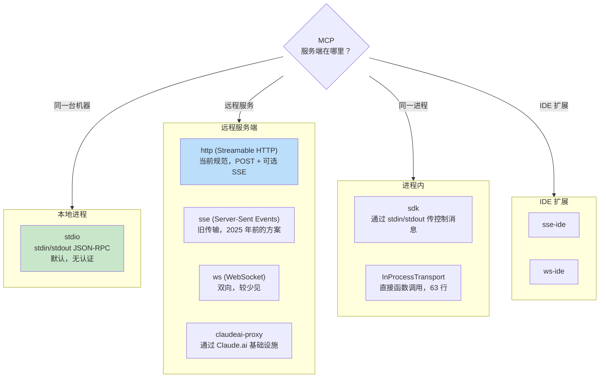
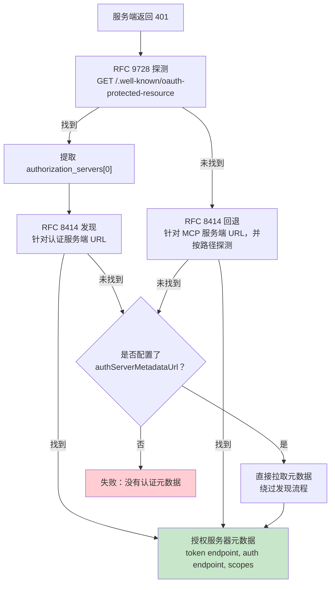

# 第 15 章：MCP -- 通用工具协议

## 为什么 MCP 超越 Claude Code 也重要

本书前面的每一章都在讲 Claude Code 的内部实现，这一章不同。Model Context Protocol 是一个开放规范，任何代理都可以实现，而 Claude Code 的 MCP 子系统则是现存最完整的生产级客户端之一。如果你正在构建一个需要调用外部工具的代理，任何代理、任何语言、任何模型，这一章里的模式都可以直接迁移。

核心主张很简单：MCP 定义了一套 JSON-RPC 2.0 协议，用于客户端（代理）和服务端（工具提供方）之间的工具发现与调用。客户端先发送 `tools/list` 来发现服务端提供什么，再发送 `tools/call` 执行。服务端用名称、描述和输入的 JSON Schema 来描述每个工具。契约到此为止。其余一切，传输方式选择、认证、配置加载、工具名称规范化，都是把一个干净规范变成能经受现实世界考验的工程工作。

Claude Code 的 MCP 实现分布在四个核心文件中：`types.ts`、`client.ts`、`auth.ts` 和 `InProcessTransport.ts`。它们共同支持八种传输类型、七个配置作用域、跨两个 RFC 的 OAuth 发现，以及一层工具包装机制，让 MCP 工具与内置工具无法区分，也就是第 6 章讲过的同一个 `Tool` 接口。本章会逐层展开。

---

## 八种传输类型

任何 MCP 集成中的第一个设计决策，都是客户端如何与服务端通信。Claude Code 支持八种传输配置：



有三个设计点值得注意。第一，`stdio` 是默认值，当 `type` 被省略时，系统会假定是一个本地子进程。这与最早的 MCP 配置保持向后兼容。第二，fetch 包装器是叠加的：超时包装在 step-up 检测之外，而 step-up 检测又包在基础 fetch 之外。每一层只处理一个问题。第三，`ws-ide` 分支存在 Bun/Node 运行时分流，Bun 的 `WebSocket` 原生支持代理和 TLS 选项，而 Node 需要 `ws` 包。

**什么时候用哪种。** 本地工具（文件系统、数据库、自定义脚本）用 `stdio`，没有网络、没有认证，只有管道。远程服务则应使用 `http`（Streamable HTTP），这是当前规范推荐方案。`sse` 属于旧方案，但部署面很广。`sdk`、IDE 和 `claudeai-proxy` 类型都只存在于各自生态内部。

---

## 配置加载与作用域

MCP 服务端配置会从七个作用域加载，并进行合并和去重：

| 作用域 | 来源 | 信任级别 |
|-------|------|---------|
| `local` | 工作目录中的 `.mcp.json` | 需要用户批准 |
| `user` | `~/.claude.json` 的 `mcpServers` 字段 | 由用户管理 |
| `project` | 项目级配置 | 共享的项目设置 |
| `enterprise` | 托管的企业配置 | 已由组织预先批准 |
| `managed` | 插件提供的服务端 | 自动发现 |
| `claudeai` | Claude.ai 网页界面 | 通过网页预授权 |
| `dynamic` | 运行时注入（SDK） | 程序化添加 |

**去重依据是内容，而不是名称。** 两个名称不同、但命令或 URL 相同的服务端，会被识别为同一个服务端。`getMcpServerSignature()` 函数会计算一个规范化键：本地服务端用 `stdio:["command","arg1"]`，远程服务端用 `url:https://example.com/mcp`。如果插件提供的服务端签名与手动配置相同，就会被抑制。

---

## 工具包装：从 MCP 到 Claude Code

连接成功后，客户端会调用 `tools/list`。每个工具定义都会被转换成 Claude Code 内部的 `Tool` 接口，也就是内置工具使用的同一个接口。包装完成后，模型无法区分内置工具和 MCP 工具。

包装过程分四步：

**1. 名称规范化。** `normalizeNameForMCP()` 会把非法字符替换成下划线。完整名称遵循 `mcp__{serverName}__{toolName}`。

**2. 描述截断。** 上限是 2,048 个字符。已经观察到 OpenAPI 生成的服务端会把 15-60KB 的内容塞进 `tool.description`，单个工具一次调用大约会浪费 15,000 个 token。

**3. Schema 透传。** 工具的 `inputSchema` 会直接传给 API。不会做转换，也不会在包装时校验。Schema 错误会在调用时暴露，而不是注册时。

**4. 注解映射。** MCP 注解会映射为行为标志：`readOnlyHint` 表示该工具可安全并发执行（第 7 章的流式执行器里提到过），`destructiveHint` 会触发额外的权限审查。这些注解来自 MCP 服务端，恶意服务端完全可以把破坏性工具标成只读。这是系统接受的信任边界，但也值得理解：用户是主动接入这个服务端的，而恶意服务端把破坏性工具标成只读，确实是一种现实攻击面。系统之所以接受这个权衡，是因为另一种做法，完全忽略注解，会让合法服务端无法改善用户体验。

---

## MCP 服务端的 OAuth

远程 MCP 服务端通常需要认证。Claude Code 实现了完整的 OAuth 2.0 + PKCE 流程，包含基于 RFC 的发现、Cross-App Access，以及错误响应体归一化。

### 发现链路



`authServerMetadataUrl` 这个逃生口之所以存在，是因为有些 OAuth 服务端既不实现这个 RFC，也不实现那个 RFC。

### Cross-App Access (XAA)

当某个 MCP 服务端配置了 `oauth.xaa: true` 时，系统会通过 Identity Provider 做联邦令牌交换，一次 IdP 登录即可解锁多个 MCP 服务端。

### 错误响应体归一化

`normalizeOAuthErrorBody()` 函数用于处理不符合规范的 OAuth 服务端。Slack 会对错误响应返回 HTTP 200，而错误信息被藏在 JSON 响应体里。这个函数会检查 2xx 的 POST 响应体，当响应体匹配 `OAuthErrorResponseSchema` 但不匹配 `OAuthTokensSchema` 时，会把响应改写为 HTTP 400。它还会把 Slack 特有的错误码（`invalid_refresh_token`、`expired_refresh_token`、`token_expired`）统一映射为标准的 `invalid_grant`。

---

## 进程内传输

不是每个 MCP 服务端都必须是独立进程。`InProcessTransport` 类支持让 MCP 服务端和客户端运行在同一个进程中：

```typescript
class InProcessTransport implements Transport {
  async send(message: JSONRPCMessage): Promise<void> {
    if (this.closed) throw new Error('Transport is closed')
    queueMicrotask(() => { this.peer?.onmessage?.(message) })
  }
  async close(): Promise<void> {
    if (this.closed) return
    this.closed = true
    this.onclose?.()
    if (this.peer && !this.peer.closed) {
      this.peer.closed = true
      this.peer.onclose?.()
    }
  }
}
```

整个文件只有 63 行。有两个设计决策值得注意。第一，`send()` 通过 `queueMicrotask()` 发送，避免同步请求/响应循环里的栈深度问题。第二，`close()` 会级联到对端，防止出现半开状态。Chrome MCP 服务端和 Computer Use MCP 服务端都采用了这种模式。

---

## 连接管理

### 连接状态

每个 MCP 服务端连接都处于五种状态之一：`connected`、`failed`、`needs-auth`（带有 15 分钟 TTL 缓存，避免 30 个服务端各自去发现同一个过期 token）、`pending` 或 `disabled`。

### 会话过期检测

MCP 的 Streamable HTTP 传输使用 session ID。服务端重启后，请求会返回 HTTP 404，并附带 JSON-RPC 错误码 -32001。`isMcpSessionExpiredError()` 函数会同时检查这两个信号，注意它是通过在错误消息里做字符串包含判断来检测错误码的，虽然实用，但也比较脆弱：

```typescript
export function isMcpSessionExpiredError(error: Error): boolean {
  const httpStatus = 'code' in error ? (error as any).code : undefined
  if (httpStatus !== 404) return false
  return error.message.includes('"code":-32001') ||
    error.message.includes('"code": -32001')
}
```

一旦检测到，连接缓存会被清空，并且调用会重试一次。

### 批量连接

本地服务端按 3 个一批建立连接（因为启动进程可能耗尽文件描述符），远程服务端按 20 个一批。React context provider `MCPConnectionManager.tsx` 负责管理生命周期，把当前连接与新配置做 diff。

---

## Claude.ai 代理传输

`claudeai-proxy` 传输展示了一种常见的代理集成模式：通过中介建立连接。Claude.ai 订阅用户会通过网页界面配置 MCP “connector”，而 CLI 则经由 Claude.ai 的基础设施路由，由那里处理供应商侧的 OAuth。

`createClaudeAiProxyFetch()` 函数会在请求时捕获 `sentToken`，而不是在收到 401 后重新读取。在多个 connector 并发返回 401 的情况下，另一个 connector 的重试可能已经刷新了 token。这个函数还会在 refresh handler 返回 false 时检查并发刷新，也就是 “ELOCKED contention” 的场景，另一个 connector 抢到了锁文件。

---

## 超时架构

MCP 的超时是分层设计的，每一层都针对不同的失败模式：

| 层级 | 时长 | 防范对象 |
|------|------|----------|
| 连接 | 30s | 无法访问或启动缓慢的服务端 |
| 单次请求 | 60s（每次请求都会刷新） | 过期的超时信号 bug |
| 工具调用 | 约 27.8 小时 | 合法但非常耗时的操作 |
| 认证 | 每次 OAuth 请求 30s | 无法访问的 OAuth 服务端 |

单次请求超时尤其值得强调。早期实现会在连接建立时创建一个单独的 `AbortSignal.timeout(60000)`。在 60 秒空闲后，下一次请求会立刻中止，因为这个信号已经过期了。修复方式是：`wrapFetchWithTimeout()` 为每次请求创建一个新的超时信号。它还会在最后一步把 `Accept` 头归一化，作为对会丢弃该头的运行时和代理的最后防线。

---

## 这样做：把 MCP 集成进你自己的代理

**先从 stdio 开始，再逐步增加复杂度。** `StdioClientTransport` 把启动、管道和终止都包办了。只要一行配置、一个传输类，你就能拿到 MCP 工具。

**规范化名称并截断描述。** 名称必须匹配 `^[a-zA-Z0-9_-]{1,64}$`。前缀加上 `mcp__{serverName}__` 可以避免冲突。描述长度上限设为 2,048 字符，否则 OpenAPI 生成的服务端会白白浪费上下文 token。

**把认证做成惰性的。** 只有当服务端返回 401 时才尝试 OAuth。大多数 stdio 服务端根本不需要认证。

**对内置服务端使用进程内传输。** `createLinkedTransportPair()` 可以消除你自己控制的服务端的子进程开销。

**尊重工具注解，并清理输出。** `readOnlyHint` 可以启用并发执行。要清理响应中的恶意 Unicode（双向覆盖字符、零宽连接符），这些内容可能误导模型。

MCP 协议本身刻意保持极简，只有两个 JSON-RPC 方法。把这两个方法接到生产部署之间的所有部分，都是工程问题：八种传输、七个配置作用域、两个 OAuth RFC，以及分层超时。Claude Code 的实现展示了这种工程在规模化场景下会长成什么样。

下一章会看代理越过 localhost 时会发生什么：那些让 Claude Code 能在云容器里运行、接受网页浏览器指令，并通过注入凭据的代理隧道转发 API 流量的远程执行协议。
