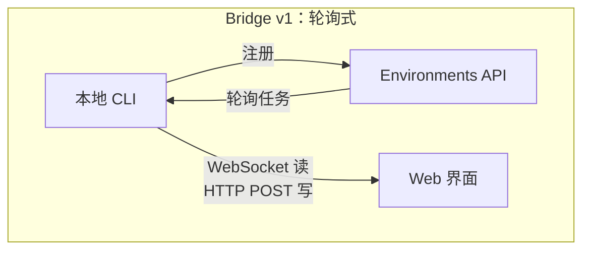
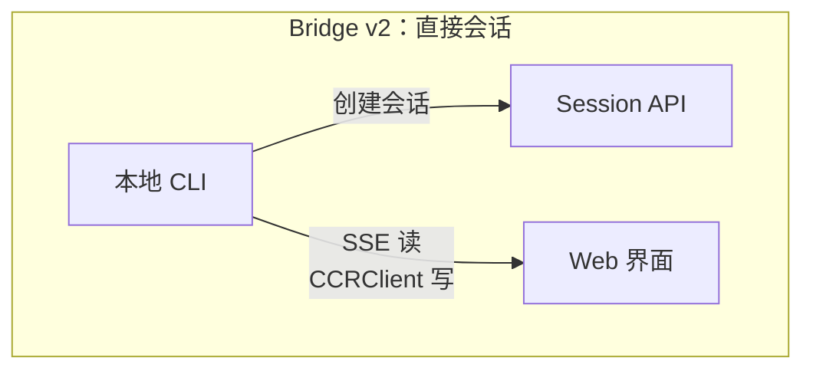
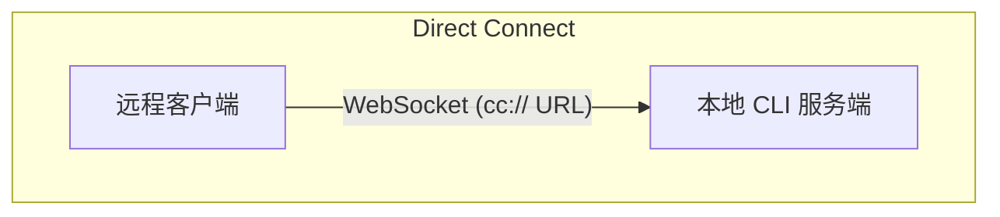
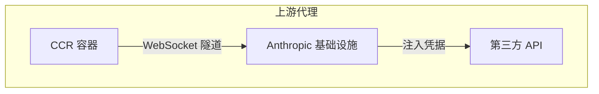

# 第 16 章：远程控制与云端执行

## 代理越过了 localhost

到目前为止，每一章都默认 Claude Code 运行在代码所在的同一台机器上。终端是本地的。文件系统是本地的。模型响应流回那个同时拥有键盘和工作目录的进程。

一旦你想从浏览器控制 Claude Code、把它跑在云容器里，或者把它作为你局域网里的一个服务暴露出去，这个假设就会失效。代理需要一种方式，从网页浏览器、移动应用或自动化流水线接收指令，把权限提示转发给不在终端前的人，并把 API 流量穿过可能注入凭据、或代表代理终止 TLS 的基础设施。

Claude Code 用四个系统解决这个问题，每个系统对应一种不同的拓扑：

<div class="diagram-grid">









</div>

这些系统共享一套共同的设计哲学：读写是非对称的，重连是自动的，失败会优雅退化。

---

## Bridge v1：轮询、分发、拉起

v1 bridge 是基于环境的远程控制系统。开发者运行 `claude remote-control` 时，CLI 会向 Environments API 注册、轮询任务，并为每个会话拉起一个子进程。

在注册之前，会跑一连串预检：运行时特性门、OAuth token 校验、组织策略检查、死 token 检测（对同一个过期 token 连续三次失败后，跨进程退避），以及主动刷新 token，能避免大约 9% 原本会在第一次尝试时失败的注册。

一旦完成注册，bridge 就进入长轮询循环。任务项会以会话或健康检查的形式到达，会话里带有一个 `secret` 字段，包含 session token、API base URL、MCP 配置和环境变量。bridge 会把“没有任务”的日志节流到每 100 次空轮询才输出一次。

每个会话都会拉起一个子 Claude Code 进程，通过 stdin/stdout 上的 NDJSON 通信。权限请求会经过 bridge transport 流向 Web 界面，由用户批准或拒绝。整个往返必须在大约 10-14 秒内完成。

---

## Bridge v2：直接会话与 SSE

v2 bridge 去掉了整个 Environments API 层，没有注册、没有轮询、没有确认、没有心跳、没有注销。背后的动机是：v1 需要服务端在派发任务前知道机器能力。v2 把生命周期压缩成三步：

1. **创建会话**：使用 OAuth 凭据 `POST /v1/code/sessions`。
2. **连接 bridge**：`POST /v1/code/sessions/{id}/bridge`。返回 `worker_jwt`、`api_base_url` 和 `worker_epoch`。每次调用 `/bridge` 都会递增 epoch，这本身就是注册。
3. **打开传输**：读走 SSE，写走 `CCRClient`。

传输抽象 `ReplBridgeTransport` 把 v1 和 v2 统一在同一个接口之后，因此消息处理不需要知道自己正在和哪一代系统通信。

当 SSE 连接因为 401 断开时，transport 会通过新的 `/bridge` 调用，用新凭据重建，同时保留序列号游标，不会丢消息。写路径使用按实例绑定的 `getAuthToken` 闭包，而不是进程级环境变量，从而防止 JWT 在并发会话之间泄露。

### FlushGate

这里有一个微妙的顺序问题：bridge 需要在把对话历史发出去的同时，接受来自 Web 界面的实时写入。如果历史刷新期间有实时写入到达，消息顺序就可能乱掉。`FlushGate` 会在 flush POST 期间把实时写入排队，完成后再按顺序排空。

### Token 刷新与 Epoch 管理

v2 bridge 会在 worker JWT 过期前主动刷新。新的 epoch 告诉服务端，这还是同一个 worker，只是凭据更新了。epoch 不匹配（409 响应）会被强硬处理：两个连接都会关闭，然后抛出异常让调用方退出，从而避免 split-brain 场景。

---

## 消息路由与回声去重

两个 bridge 版本都使用 `handleIngressMessage()` 作为中央路由：

1. 解析 JSON，并规范化控制消息的键。
2. 把 `control_response` 路由给权限处理器，把 `control_request` 路由给请求处理器。
3. 用 `recentPostedUUIDs`（回声去重）和 `recentInboundUUIDs`（重复投递去重）检查 UUID。
4. 转发已校验的用户消息。

### BoundedUUIDSet：O(1) 查找，O(capacity) 内存

bridge 有一个回声问题，消息可能会在读流里回弹，或者在切换传输时被投递两次。`BoundedUUIDSet` 是一个由循环缓冲区支撑的 FIFO 有界集合：

```typescript
class BoundedUUIDSet {
  private buffer: string[]
  private set: Set<string>
  private head = 0

  add(uuid: string): void {
    if (this.set.size >= this.capacity) {
      this.set.delete(this.buffer[this.head])
    }
    this.buffer[this.head] = uuid
    this.set.add(uuid)
    this.head = (this.head + 1) % this.capacity
  }

  has(uuid: string): boolean { return this.set.has(uuid) }
}
```

这里并行运行两个实例，每个容量都是 2000。通过 Set 实现 O(1) 查找，通过循环缓冲区淘汰实现 O(capacity) 内存，没有定时器，也没有 TTL。未知的 control request 子类型会返回错误响应，而不是悄无声息地吞掉，这样就不会让服务端一直等一个永远不会到来的响应。

---

## 非对称设计：持久化读，HTTP POST 写

CCR 协议使用的是非对称传输：读走持久连接（WebSocket 或 SSE），写走 HTTP POST。这反映了通信模式中的根本非对称。

读是高频、低延迟、由服务端发起的，token streaming 期间每秒会有上百条小消息。持久连接是唯一合理的选择。写是低频、由客户端发起、并且需要确认的，每分钟几条，而不是每秒几条。HTTP POST 提供可靠投递、通过 UUID 实现幂等，以及与负载均衡器的天然集成。

如果试图把它们统一到单个 WebSocket 上，就会产生耦合：如果 WebSocket 在写入期间断开，你就需要重试逻辑，还要区分“没发出去”和“发出去了但确认丢了”。拆分通道可以让每条路径独立优化。

---

## 远程会话管理

`SessionsWebSocket` 负责管理 CCR WebSocket 连接的客户端侧。它的重连策略会区分不同失败类型：

| 失败 | 策略 |
|------|------|
| 4003（未授权） | 立即停止，不重试 |
| 4001（会话未找到） | 最多重试 3 次，线性退避（压缩期间可能是短暂现象） |
| 其他临时错误 | 指数退避，最多 5 次 |

`isSessionsMessage()` 这个类型守卫接受任何带字符串 `type` 字段的对象，故意设计得比较宽松。硬编码白名单会在客户端更新前，静默丢弃新的消息类型。

---

## Direct Connect：本地服务端

Direct Connect 是最简单的拓扑：Claude Code 作为服务端运行，客户端通过 WebSocket 连接进来。没有云中介，没有 OAuth token。

会话有五种状态：`starting`、`running`、`detached`、`stopping`、`stopped`。元数据会持久化到 `~/.claude/server-sessions.json`，以便在服务端重启后恢复。`cc://` URL scheme 为本地连接提供了干净的寻址方式。

---

## 上游代理：容器中的凭据注入

上游代理运行在 CCR 容器内，解决一个特定问题：在代理可能执行不可信命令的容器里，把组织凭据注入出站 HTTPS 流量。

初始化顺序是经过精心安排的：

1. 从 `/run/ccr/session_token` 读取 session token。
2. 通过 Bun FFI 设置 `prctl(PR_SET_DUMPABLE, 0)`，阻止同 UID 对进程堆做 ptrace。没有这一步，提示注入的 `gdb -p $PPID` 就可能从内存里把 token 扒出来。
3. 下载上游代理的 CA 证书，并与系统 CA bundle 连接。
4. 在一个临时端口上启动本地 CONNECT-to-WebSocket 中继。
5. 删除 token 文件，token 现在只存在于堆内存里。
6. 为所有子进程导出环境变量。

每一步都采用 fail open：出错时禁用代理，而不是杀掉会话。这个权衡是正确的，代理失败意味着某些集成不可用，但核心功能仍然可用。

### Protobuf 手工编码

穿过隧道的字节会被包装成 `UpstreamProxyChunk` protobuf 消息。schema 很简单，`message UpstreamProxyChunk { bytes data = 1; }`，Claude Code 用十行手工编码，而不是引入一个 protobuf 运行时：

```typescript
export function encodeChunk(data: Uint8Array): Uint8Array {
  const varint: number[] = []
  let n = data.length
  while (n > 0x7f) { varint.push((n & 0x7f) | 0x80); n >>>= 7 }
  varint.push(n)
  const out = new Uint8Array(1 + varint.length + data.length)
  out[0] = 0x0a  // field 1, wire type 2
  out.set(varint, 1)
  out.set(data, 1 + varint.length)
  return out
}
```

十行代码就能替代完整的 protobuf 运行时。单字段消息不值得引入依赖，位运算的维护成本远低于供应链风险。

---

## 这样做：设计远程代理执行

**把读通道和写通道分开。** 当读是高频流、写是低频 RPC 时，把它们合并只会带来不必要的耦合。让每个通道独立失败、独立恢复。

**给去重内存设上限。** `BoundedUUIDSet` 模式提供了固定内存的去重。任何至少一次投递系统都需要有界的去重缓冲区，而不是无限增长的 Set。

**让重连策略和失败信号的性质相匹配。** 永久性失败不应该重试。短暂性失败应该带退避重试。含糊不清的失败应该以较低上限重试。

**在对抗环境里，把秘密保留在堆里。** 从文件读取 token、禁用 ptrace、删除文件，可以同时消除文件系统和内存探测这两类攻击面。

**辅助系统要 fail open。** 上游代理采用 fail open，因为它提供的是增强功能（凭据注入），不是核心功能（模型推理）。

远程执行系统体现了一个更深层的原则：代理的核心循环（第 5 章）应该对指令从哪里来、结果往哪里去都保持无感。bridge、Direct Connect 和上游代理都只是传输层。其上的消息处理、工具执行和权限流，无论用户是在终端前，还是在 WebSocket 的另一端，都完全一致。

下一章会看另一个运维问题：性能，也就是 Claude Code 如何在启动、渲染、搜索和 API 成本上，把每一毫秒和每一个 token 都算清楚。
