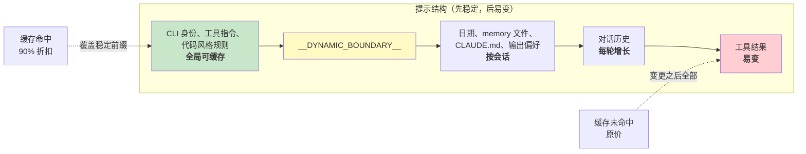

# 第 17 章：性能 -- 每一毫秒和每一个 token 都算数

## 高级工程师的作战手册

代理系统里的性能优化不是一个问题，而是五个：

1. **启动延迟** -- 从按键到第一次有用输出之间的时间。用户会放弃那些启动感觉很慢的工具。
2. **token 效率** -- 上下文窗口中有用内容相对于开销所占的比例。上下文窗口是最受约束的资源。
3. **API 成本** -- 每一轮的美元开销。提示缓存可以把它降低 90%，但前提是系统能在各轮之间保持缓存稳定。
4. **渲染吞吐** -- 流式输出期间的每秒帧数。第 13 章已经讲过渲染架构，这一章讲让它保持快速的性能测量和优化。
5. **搜索速度** -- 在一个 270,000 路径的代码库里，每按一次键就要花多长时间找到文件。

Claude Code 用了从显而易见的技巧（memoization）到很细的技巧（用于模糊搜索预过滤的 26 位 bitmap）来同时攻这五个点。先说方法论：这些不是理论优化。Claude Code 内置了 50 多个启动性能检查点，对内部用户 100% 采样，对外部用户 0.5% 采样。下面的每一项优化都来自这套埋点的数据，而不是直觉。

---

## 在启动阶段节省毫秒

### 模块级 I/O 并行

入口 `main.tsx` 故意违反了“模块顶层不要有副作用”这条原则：

```typescript
profileCheckpoint('main_tsx_entry');
startMdmRawRead();       // fires plutil/reg-query subprocesses
startKeychainPrefetch();  // fires both macOS keychain reads in parallel
```

如果串行执行，两个 macOS keychain 条目大约要花 65ms 的同步子进程启动时间。把它们作为模块级的 fire-and-forget promise 一起发出去后，它们会并行执行，而模块加载本身约有 135ms 的时间，在这段时间里 CPU 原本会闲着。

### API 预连接

`apiPreconnect.ts` 会在初始化时向 Anthropic API 发一个 `HEAD` 请求，把 TCP+TLS 握手（100-200ms）和初始化工作重叠起来。在交互模式下，这种重叠几乎没有上限，用户在输入时连接就已经热起来了。请求会在 `applyExtraCACertsFromConfig()` 和 `configureGlobalAgents()` 之后发出，这样预热后的连接会使用正确的传输配置。

### 快速路径分发与延迟导入

CLI 入口对特定子命令做了早返回处理，`claude mcp` 从不加载 React REPL，`claude daemon` 从不加载工具系统。重量级模块只在需要时通过动态 `import()` 加载：OpenTelemetry（约 400KB + 约 700KB 的 gRPC）、事件日志、错误对话框、上游代理。`LazySchema` 把 Zod schema 构建延迟到第一次校验时再做，把成本推到启动之后。

---

## 在上下文窗口里省 token

### 槽位预留：默认 8K，触发后升到 64K

最有影响力的单项优化：

默认输出槽位预留是 8,000 个 token，在截断时升级到 64,000。API 会把 `max_output_tokens` 的容量预留给模型响应。SDK 默认值是 32K-64K，但生产数据表明 p99 输出长度只有 4,911 token。默认值会多预留 8-16 倍，每轮浪费 24,000-59,000 个 token。Claude Code 把默认值压到 8K，并在少数截断场景（<1% 请求）重试到 64K。对于 200K 窗口来说，这相当于白拿 12-28% 的可用上下文。

### 工具结果预算

| 限制 | 数值 | 作用 |
|------|------|------|
| 单工具字符数 | 50,000 | 超出后结果会持久化到磁盘 |
| 单工具 token 数 | 100,000 | 约 400KB 文本的上限 |
| 单消息汇总 | 200,000 字符 | 防止 N 个并行工具在一轮里把预算打爆 |

关键洞见是单消息汇总。没有它的话，“读取 src/ 下所有文件”可能会触发 10 个并行读取，每个返回 40K 字符。

### 上下文窗口大小

默认 200K token 窗口可以通过模型名或实验 treatment 上的 `[1m]` 后缀扩展到 1M。当使用量接近上限时，一个四层压缩系统会逐步总结旧内容。token 统计以 API 实际返回的 `usage` 字段为准，而不是客户端估算，这样能把 prompt 缓存抵扣、thinking token 和服务端转换都算进去。

---

## 在 API 调用上省钱

### 提示缓存架构



Anthropic 的提示缓存按精确前缀匹配工作。如果前缀中间有一个 token 发生变化，后面的内容全部都会缓存未命中。Claude Code 把整个提示结构设计成稳定部分在前、易变部分在后。

当 `shouldUseGlobalCacheScope()` 返回 true 时，动态边界之前的系统提示条目会获得 `scope: 'global'`，也就是两个运行相同 Claude Code 版本的用户会共享前缀缓存。由于 MCP schema 是按用户区分的，一旦出现 MCP 工具，全局作用域就会被禁用。

### 粘性锁存字段

五个布尔字段采用“只增不减”的模式，一旦变成 true，整个会话里都会保持 true：

| 锁存字段 | 防止什么问题 |
|----------|--------------|
| `promptCache1hEligible` | 会话中途的超额切换改变缓存 TTL |
| `afkModeHeaderLatched` | Shift+Tab 切换导致缓存失效 |
| `fastModeHeaderLatched` | 冷却进入/退出时双重失效缓存 |
| `cacheEditingHeaderLatched` | 会话中途配置切换导致缓存失效 |
| `thinkingClearLatched` | 在确认缓存未命中后切换 thinking 模式 |

每个字段都对应一个 header 或参数，如果在会话中途改变，就会浪费大约 50,000-70,000 个缓存过的 prompt token。这些锁存牺牲了会话中途切换的灵活性，换来缓存的稳定。

### 会话日期缓存

```typescript
const getSessionStartDate = memoize(getLocalISODate)
```

没有这个缓存的话，日期会在午夜变化，导致整个缓存前缀失效。过期日期只是外观问题，而缓存失效会让整段对话重新处理。

### 分段 memoization

系统提示的各个分段使用两级缓存。大多数内容用 `systemPromptSection(name, compute)`，会一直缓存到 `/clear` 或 `/compact`。而核武级选项 `DANGEROUS_uncachedSystemPromptSection(name, compute, reason)` 每轮都会重新计算，命名约定迫使开发者写清楚为什么必须打破缓存。

---

## 在渲染中省 CPU

第 13 章已经深入讲过渲染架构，包括 packed typed arrays、基于池的 interning、双缓冲和按单元格 diff。这里我们关注的是让它保持快速的性能测量和自适应行为。

终端渲染器通过 `throttle(deferredRender, FRAME_INTERVAL_MS)` 把帧率限制在 60fps。终端失焦时，间隔会翻倍到 30fps。滚动排空帧则会以四分之一的间隔运行，以获得最大滚动速度。这种自适应节流确保渲染不会消耗超过必要的 CPU。

React Compiler（`react/compiler-runtime`）会自动对整个代码库里的组件渲染做 memoization。手写 `useMemo` 和 `useCallback` 容易出错，而编译器从结构上就能保证正确。预先分配并冻结的对象（`Object.freeze()`）可以消除常见渲染路径值的分配开销，在 alt-screen 模式下每帧省掉一次分配，累积到上千帧就很可观。

完整的渲染管线细节，`CharPool`/`StylePool`/`HyperlinkPool` interning 系统、blit 优化、damage rectangle 跟踪、OffscreenFreeze 组件，请看第 13 章。

---

## 在搜索中省内存和时间

模糊文件搜索会在每次按键时运行，搜索 270,000+ 条路径。三层优化把它控制在几毫秒内。

### Bitmap 预过滤

每条索引路径都会拿到一个 26 位 bitmap，表示它包含哪些小写字母：

```typescript
// Pseudocode — illustrates the 26-bit bitmap concept
function buildCharBitmap(filepath: string): number {
  let mask = 0
  for (const ch of filepath.toLowerCase()) {
    const code = ch.charCodeAt(0)
    if (code >= 97 && code <= 122) mask |= 1 << (code - 97)
  }
  return mask  // Each bit represents presence of a-z
}
```

在搜索时：`if ((charBits[i] & needleBitmap) !== needleBitmap) continue`。任何缺少查询字母的路径都会立刻失败，只做一次整数比较，不做字符串操作。拒绝率大约是：像 "test" 这种宽查询约 10%，包含稀有字母的查询则在 90% 以上。成本是每条路径 4 字节，270,000 条路径大约 1MB。

### 基于分数上界的拒绝与融合的 indexOf 扫描

通过 bitmap 的路径，在进入昂贵的边界/camelCase 评分前，还要过一次分数上限检查。如果在最优情况下也不可能超过当前 top-K 阈值，就直接跳过。

真正的匹配会把位置查找和 gap/连续奖励计算融合起来，使用 `String.indexOf()`，而这在 JSC（Bun）和 V8（Node）里都经过 SIMD 加速。引擎优化过的搜索明显快于手写字符循环。

### 支持部分可查询的异步索引

对于大型代码库，`loadFromFileListAsync()` 会每工作大约 4ms 就让出一次事件循环（按时间而不是按计数，这样能适应机器速度）。它会返回两个 promise：`queryable`（在第一块数据到来时就 resolve，可以立即返回部分结果）和 `done`（完整索引构建完成）。用户在文件列表可用后 5-10ms 就能开始搜索。

让出检查使用 `(i & 0xff) === 0xff`，也就是一个无分支的 mod 256，用来摊销 `performance.now()` 的成本。

---

## 与 memory 相关的副查询

有一个优化处在 token 效率和 API 成本的交叉点上。正如第 11 章所说，memory 系统会调用一个轻量级的 Sonnet 模型，而不是主 Opus 模型，来决定应该包含哪些 memory 文件。这个成本很小，在快速模型上最多只用 256 个输出 token；与不包含无关 memory 文件所节省的 token 相比，这点开销几乎可以忽略。一个无关的 2,000 token memory 所浪费的上下文，比这次侧向查询的 API 成本还高。

---

## 预判式工具执行

`StreamingToolExecutor` 会在工具流式返回时就开始执行，甚至在完整响应结束之前。只读工具（Glob、Grep、Read）可以并行执行；写工具需要独占访问。`partitionToolCalls()` 函数会把连续的安全工具分组为批次：[Read, Read, Grep, Edit, Read, Read] 会变成三批，分别是 [Read, Read, Grep] 并发，[Edit] 串行，[Read, Read] 并发。

结果总是按照原始工具顺序返回，以保证模型推理的确定性。当 Bash 工具出错时，兄弟 abort controller 会杀掉并行子进程，避免资源浪费。

---

## 流式与原始 API

Claude Code 使用原始流式 API，而不是 SDK 的 `BetaMessageStream` 帮助器。后者会在每个 `input_json_delta` 上调用 `partialParse()`，其复杂度会随着工具输入长度变成 O(n^2)。Claude Code 则会积累原始字符串，只在 block 完成时解析一次。

流式看门狗 `CLAUDE_STREAM_IDLE_TIMEOUT_MS`（默认 90 秒）会在没有 chunk 到来时中止并重试，在代理失败时回退到非流式的 `messages.create()`。

---

## 这样做：代理系统的性能实践

**审计你的上下文窗口预算。** `max_output_tokens` 预留值和真实 p99 输出长度之间的差额，就是浪费掉的上下文。默认值要设紧，截断时再升级。

**围绕缓存稳定性设计。** 你的提示里每一个字段，要么稳定，要么易变。稳定的放前面，易变的放后面。把会话中途对稳定前缀的任何改动，都当成一个带金钱代价的 bug。

**并行化启动 I/O。** 模块加载是 CPU 密集的。keychain 读取和网络握手是 I/O 密集的。先把 I/O 发出去，再做 import。

**搜索时使用 bitmap 预过滤。** 一个廉价预过滤器如果能在昂贵评分前拒绝 10-90% 的候选项，就是 4 字节每条记录的巨大收益。

**在真正重要的地方测量。** Claude Code 有 50 多个启动检查点，内部 100% 采样、外部 0.5% 采样。不测量就做性能工作，本质上是在猜。

---

最后一个观察：这些优化里大多数都不算算法高深。bitmap 预过滤、循环缓冲区、memoization、interning，这些都是计算机科学基础。真正的技巧在于知道该把它们放在哪里。启动性能分析器会告诉你毫秒在哪里。API 使用字段会告诉你 token 在哪里。缓存命中率会告诉你钱在哪里。先测量，再优化，永远如此。
